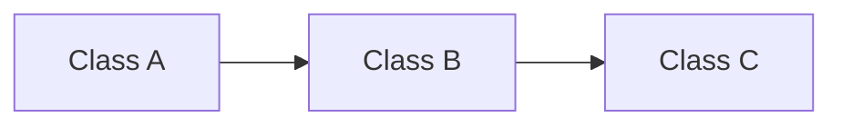

# Reusable Section Detail Guide Template

Use this template when the user asks for a guide that can generate section
detailed designs.

# Section Detailed Design Guide

This guide explains how to generate a **section detailed design** from
`<source-outline-path>`.

It is not the section detailed design itself. Do not pre-fill every class
contract in this guide. Use this guide to produce a separate detailed design
document for one section at a time.

## Guide-Only Boundary

This guide focuses on how to generate section detailed designs. It must not
generate concrete section plans, full class contracts, detailed implementation
plans, or full read-aloud scripts for real classes.

Allowed content:

- generation rules;
- templates;
- section coverage seeds;
- optional coverage lists;
- a small mini example that shows format only.

Not allowed unless the user separately asks for a specific section detailed
design:

- complete section design;
- per-class public API expansion;
- full class implementation plan;
- full read-aloud script for a real class.

## Progress Tracker

- [x] Define the required format for section detailed design documents.
- [x] Define the source-of-truth workflow.
- [x] Map each source section to required and optional class coverage seeds.
- [x] Define the class contract template.
- [x] Define the read-aloud implementation script template.
- [x] Require a high-level class design talk for every section.
- [ ] Generate individual section detailed design documents only when requested.

## Source Of Truth Rule

`<source-outline-path>` defines the section list and learning goals. The live
repo defines implementation truth.

Before writing a section detailed design:

1. Read the target section in `<source-outline-path>`.
2. Inspect the current source files for every class in that section.
3. Use live class names, `extends`, exported fields, signals, public variables,
   and public functions from source code.
4. If outline wording disagrees with source code, use source code and note the
   naming correction.
5. If a class is planned but not implemented, mark it as `planned`.
6. Keep reusable/library code separate from project-specific examples.

## Core Generation Rule

Every section detailed design must start with one high-level class design talk.

The high-level talk must include:

1. `What You Will Build`
2. `High-Level Design`
3. A Mermaid diagram showing class relationships, ownership, or runtime flow.
4. A responsibility table that defines each class's job and main capability.
5. A concrete runtime or gameplay example that explains how the classes work
   together.

For implementation lessons:

```text
One class = one video.
```

Each class video must focus on exactly one required class. It may mention other
classes only as short context. It must not implement, design, or explain
optional classes.

Optional coverage belongs in `Optional Coverage` only. If optional content is
later approved, give it its own optional/support video after required videos.

## Detailed Design Output Template

# Section NN - Section Title Detailed Design

## Source Check

- Source section:
- Source files checked:
- Naming corrections:
- Runtime assumptions:

## Section Goal

## Student-Visible Result

## What You Will Build

## High-Level Class Design

### Mermaid Diagram



### Class Responsibilities

| Class | Responsibility | Main capability | Example in this section |
| --- | --- | --- | --- |

### Concrete Example

## Video Plan

| Video | Type | Class or artifact | Source path | Result |
| --- | --- | --- | --- | --- |
| 1 | support | High-level class design | outline + live source | Students understand what will be built and how the classes connect. |

## Required Class Contracts

### ClassName

- Status:
- Source path:
- Extends:
- Public fields/signals:
- Public functions:
- Private helpers:
- Does not own:

### Read-Aloud Script

## Optional Coverage

Optional coverage is not part of required class videos.

| Optional class/artifact | Why optional | When to include |

## Demo Integration

## Tests Or Verification

## Suggested Commit

## Class Contract Template

```text
### ClassName

Purpose:
Explain the one job of this class in the section.

Status:
current / planned / course-only

Source path:
res://...

Extends:
Exact live source `extends`.

Public fields/signals:
- field_or_signal: type - why students implement it

Public functions:
- function_name(args) -> ReturnType - what it must do

Private helpers:
- helper_name - only include when needed to explain this class's own behavior

Does not own:
- List responsibilities that belong to another class or project content.

Read-aloud script:
Keep it simple. Explain every necessary technical term in plain language, and
attach the explanation to a concrete example from the section.
```

## Read-Aloud Script Rules

- Use simple, direct language first.
- If a technical term is necessary, define it immediately in plain language.
- Explain terms with a concrete example from the project.
- Prefer concrete user/runtime actions over abstract system descriptions.
- Start with the class responsibility.
- Name the source path.
- State the `extends`.
- Add fields before functions.
- Explain each public field and function in implementation order.
- Explain how the class connects to the section's visible result.
- State what the class deliberately does not own.
- Use current source names and paths.

Good:
The command is an intent message. In this lesson, when the player presses Q,
the input script creates a command that says "cast Firebolt". The command does
not cast the spell by itself; it only carries the request to the player entity.

Bad:
The command layer decouples input from domain execution.

## Section Coverage Seeds

For each section:

### Section N - Title

Required class videos:

- `ClassName`

Optional coverage:

- `OptionalClassName`

Minimum detailed design expectation:

- Write section-specific generation constraints here.

## Mini Example

Provide one small example. Do not turn it into a full section design.

## Verification For The Guide Itself

1. Confirm the guide stays generic and does not become a full section design.
2. Confirm the guide does not contain concrete section plans or expanded class
   designs.
3. Confirm every source section has a coverage seed.
4. Confirm source-of-truth rules are explicit.
5. Confirm high-level class design rules are present.
6. Confirm optional coverage is excluded from required class videos.
7. Confirm script rules require simple language, term definitions, and concrete
   examples.
8. Confirm no stale paths appear.
9. Run a markdown whitespace sanity check.
