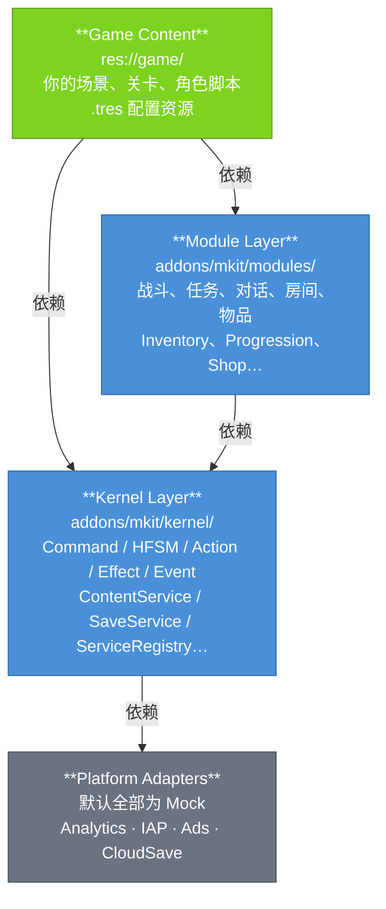

# Architecture

Mkit 的三层模型、依赖规则、ServiceRegistry 模式、实体约定。读完能回答"我的代码放哪层、为什么"。

---

## 层模型



🟢 绿色 = 你实现 / 🔵 蓝色 = mkit 负责

| 层 | 职责 | 路径 |
|----|------|------|
| **Game Content** | 你的游戏逻辑、场景、配置 | `res://game/` |
| **Module Layer** | 可复用的游戏系统（战斗、任务、对话…） | `addons/mkit/modules/` |
| **Kernel Layer** | 框架骨架（管线、服务注册、存档…） | `addons/mkit/kernel/` |
| **Platform Adapters** | 平台接口，开发期用 Mock | `addons/mkit/kernel/services/` |

**依赖只能向下，不能反向。** kernel 不依赖任何 module；modules 不依赖 game。

---

## ServiceRegistry 模式

`ServiceRegistry` 是整个框架唯一的 autoload。所有服务通过它注册和获取：

```gdscript
# 获取服务
var combat := ServiceRegistry.get_service("combat") as CombatService
if combat == null:
    push_error("CombatService not available")
    return

# 检查服务是否存在
if ServiceRegistry.has_service("save"):
    var save := ServiceRegistry.get_service("save") as SaveService

# 注册自定义服务（在 GameBootstrap 子类中 override _register_kernel_services）
ServiceRegistry.register_service("my_service", MyService.new())
```

`GameBootstrap._ready()` 在启动时自动注册所有内置服务，顺序：
1. `_register_kernel_services()` — 创建并注册所有服务
2. `_load_content()` — 将 `resource_databases` 加载进 ContentService
3. `_validate_content()` — 校验所有 ContentDefinition 的合法性
4. `_load_profile()` — 若存档文件存在则自动 load
5. `_enter_initial_scene()` — 切换到 `initial_scene_path`（deferred）

### 完整服务 ID 对照表

| 服务 ID | 类型 | 说明 |
|---------|------|------|
| `"events"` | `EventService` | 领域事件广播与订阅 |
| `"content"` | `ContentService` | ContentDefinition 注册与按 ID 查询 |
| `"random"` | `RandomService` | 有种子随机数，支持复现 |
| `"time"` | `TimeService` | delta / 帧管理 |
| `"actions"` | `ActionService` | GameAction 生命周期管理 |
| `"effects"` | `EffectService` | GameEffect 执行链，含 trace |
| `"commands"` | `CommandService` | GameCommand 路由分发 |
| `"combat"` | `CombatService` | 伤害结算（base → 暴击 → 防御 → final） |
| `"scenes"` | `SceneService` | 场景切换封装 |
| `"pool"` | `PoolService` | 对象池（Node 实例复用） |
| `"save"` | `SaveService` | 存读档，遍历场景树收集所有 `Saveable` 节点并序列化 |
| `"progression"` | `ProgressionService` | 经验、升级、货币 |
| `"quest"` | `QuestService` | 任务接受 / 推进 / 完成 |
| `"shop"` | `ShopService` | 商店购买 |
| `"audio"` | `AudioService` | 音频播放 |
| `"dialogue"` | `DialogueService` | 对话树运行时 |
| `"world"` | `WorldService` | 世界区域 / Zone 管理 |
| `"loot"` | `LootService` | 战利品掷骰与奖励分发 |
| `"analytics"` | `AnalyticsServiceMock` | 数据统计（默认 Mock） |
| `"ads"` | `AdServiceMock` | 广告（默认 Mock） |
| `"iap"` | `IAPServiceMock` | 内购（默认 Mock） |
| `"cloud_save"` | `CloudSaveServiceMock` | 云存档（默认 Mock） |

> `"random"`, `"time"`, `"effects"`, `"combat"` 这四个服务是 `RefCounted`，不在场景树中，其余为 `Node`（`ServiceRegistry` 的子节点）。

---

## Definition / Instance / Controller / System 四分模式

每个游戏系统的对象都遵循同一形状：

| 角色 | 基类 | 生命周期 | 示例 |
|------|------|----------|------|
| **Definition** | `Resource` / `ContentDefinition` | 静态，编辑器配置，保存为 `.tres` | `AbilityDefinition` |
| **Instance** | `RefCounted` | 运行时，每个实体持有一份 | `AbilityInstance` |
| **Controller / Component** | `Node` / `SaveableComponent` | 挂在实体节点树上，生命周期绑定实体 | `AbilityController`, `HealthComponent` |
| **System / Service** | `Node` / `RefCounted` | 全局单例，通过 ServiceRegistry 获取 | `CombatService`, `QuestService` |

```gdscript
# Definition — 编辑器创建，通过 ContentService 查询
var def := ServiceRegistry.get_service("content") as ContentService
var ability_def := def.get_resource("fireball") as AbilityDefinition

# Controller — 从实体节点树查找
var ability_ctrl := owner.get_node("Controllers/AbilityController") as AbilityController

# System — ServiceRegistry 获取
var combat := ServiceRegistry.get_service("combat") as CombatService
```

---

## 实体节点约定

每个游戏实体遵循固定的节点树结构，所有 module 组件都依赖此约定的路径：

```
EntityRoot                   ← 继承 EntityRoot，持有 entity_id
  EntityIdentity             ← 唯一实体 ID（运行时生成）
  Components/                ← 数据组件
    HealthComponent
    StatsComponent
    ResourcePoolComponent
    StatusEffectController
    ExperienceComponent
    InventoryController
    AbilityController
    …
  Controllers/               ← 系统控制器（输入、AI、交互）
    StateMachine
    InteractionComponent
    …
  Presentation/              ← 渲染与动画
    AnimationPlayer          ← Action 播动画的接缝节点（固定路径）
    Sprite2D / …
```

**路径是合约**——module 组件通过 `owner.get_node_or_null("Components/HealthComponent")` 定位兄弟节点。改动节点路径会破坏所有依赖此路径的系统。

```gdscript
# 正确：通过 owner 按约定路径访问
var health := owner.get_node_or_null("Components/HealthComponent") as HealthComponent

# 错误：硬编码绝对路径或依赖节点顺序
var health := get_node("/root/World/Player/Components/HealthComponent")  # 脆弱
```

---

## 扩展 Bootstrap

需要注册自定义服务时，继承 `GameBootstrap` 并 override `_register_kernel_services`：

```gdscript
class_name MyBootstrap
extends GameBootstrap

func _register_kernel_services() -> void:
    super._register_kernel_services()          # 先注册所有内置服务
    var my_svc := MyCustomService.new()
    ServiceRegistry.register_service("my_service", my_svc)
```

> `super()` 必须在自定义服务注册前调用，否则内置服务尚未就绪。
