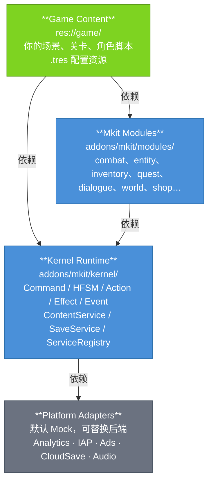

# Architecture

Mkit 的当前分层模型、依赖规则、runtime port 模式、实体契约和启动边界。读完能回答"我的代码放哪层、为什么"。

---

## 当前层模型



🟢 绿色 = 你实现 / 🔵 蓝色 = mkit 负责

| 层 | 职责 | 路径 |
|----|------|------|
| **Game Content** | 你的游戏逻辑、场景、配置 | `res://game/` |
| **Mkit Modules** | 可复用的游戏系统（战斗、任务、对话、世界、商店…） | `addons/mkit/modules/` |
| **Kernel Runtime** | 框架骨架（runtime context、管线、服务注册、内容、存档…） | `addons/mkit/kernel/` |
| **Platform Adapters** | 平台接口，开发期用 Mock | `addons/mkit/kernel/services/` |

**依赖只能向下，不能反向。** kernel 不依赖任何 module；modules 不依赖 game。该规则由 `make layering`（`tools/check_layering.py`）在 CI 中强制：kernel 引用任何 module 类即失败。

模块服务的接入走**组合根**：`GameBootstrap` 只注册 kernel 服务，`ModuleBootstrap`（`addons/mkit/modules/module_bootstrap.gd`）继承它并追加 7 个内置模块服务，游戏模板默认用后者。同样，`EventService` 只提供通用总线，业务事件的类型常量与构造函数住在各模块的事件目录（`CombatEvents`、`QuestEvents`、`WorldEvents`、`DialogueEvents`、`ShopEvents`、`InventoryEvents`、`LootEvents`）。

---

## 大改后已落地的核心边界

当前实现已经从旧的"到处取字符串服务 + 直接找固定节点路径"收敛到以下边界：

| 边界 | 当前实现 | 说明 |
|------|----------|------|
| 服务访问 | `ServiceRegistry.get_port(...)` | `ServiceRegistry` 是唯一 autoload，`get_port` 是带类型检查的统一访问入口 |
| 实体契约 | `EntityRoot` + `EntityContract` | `Components/`、`Controllers/` 是默认布局，模块代码优先通过契约入口取组件 |
| 战斗结算 | `DamageRequest -> DamageIntent -> DamageResolution -> DamageApplication -> DamageResult` | request/result 仍是公开入口，内部已拆成意图、结算、应用装配 |
| 可变资源 | `ResourceSet` | mana/stamina 等当前值与上限查询统一为资源池模型 |
| 货币 | `Wallet` | 货币从普通 Dictionary 语义收敛为离散余额模型 |
| 存档 scope | `SaveService.register_saveable_scope(...)` + `Saveable.get_save_scopes()` | 场景树扫描仍可用，scope provider 支持无完整场景树恢复 |

尚未落地：独立 `MkitModule` 声明文件、模块拓扑装配、拆分式 `EventBus` / `EventCatalog`。文档和代码不要把这些目标写成当前能力。

---

## ServiceRegistry / RuntimeContext 模式

`ServiceRegistry` 是整个框架唯一的 autoload。`GameBootstrap.boot()` 注册 kernel 内置服务，`ModuleBootstrap.boot()` 在此之上追加内置模块服务。新代码统一通过 `ServiceRegistry.get_port(ServiceRegistry.SERVICE_*)` 获取服务：

```gdscript
# 获取服务
var combat := ServiceRegistry.get_port(ServiceRegistry.SERVICE_COMBAT) as CombatService
if combat == null:
    push_error("CombatService not available")
    return

# 检查服务是否存在
if ServiceRegistry.get_port(ServiceRegistry.SERVICE_SAVE) != null:
    var save := ServiceRegistry.get_port(ServiceRegistry.SERVICE_SAVE) as SaveService

# 注册自定义服务（在 GameBootstrap/ModuleBootstrap 子类中 override _build_services）
ServiceRegistry.register_service("my_service", MyService.new())
```

`GameBootstrap._ready()` 在启动时自动注册内置服务，顺序：
1. `_register_kernel_services()` — 按 `_build_services()` 服务表创建并注册服务
2. `_load_content()` — 将 `resource_databases` 加载进 ContentService
3. `_validate_content()` — 校验所有 ContentDefinition 的合法性
4. `_load_profile()` — 若存档文件存在则自动 load
5. `_enter_initial_scene()` — 切换到 `initial_scene_path`（deferred）

### 完整服务 ID 对照表

| 常量名 | 服务 ID | 类型 | 说明 |
|---------|----------|------|------|
| `SERVICE_EVENTS` | `"events"` | `EventService` | 领域事件广播与订阅 |
| `SERVICE_CONTENT` | `"content"` | `ContentService` | ContentDefinition 注册与按 ID 查询 |
| `SERVICE_RANDOM` | `"random"` | `RandomService` | 有种子随机数，支持复现 |
| `SERVICE_TIME` | `"time"` | `TimeService` | delta / 帧管理 |
| `SERVICE_ACTIONS` | `"actions"` | `ActionService` | GameAction 生命周期管理 |
| `SERVICE_EFFECTS` | `"effects"` | `EffectService` | GameEffect 执行链，含 trace |
| `SERVICE_COMMANDS` | `"commands"` | `CommandService` | GameCommand 路由分发 |
| `SERVICE_COMBAT`* | `"combat"` | `CombatService` | 伤害结算（base → 暴击 → 防御 → final） |
| `SERVICE_SCENES` | `"scenes"` | `SceneService` | 场景切换封装 |
| `SERVICE_POOL` | `"pool"` | `PoolService` | 对象池（Node 实例复用） |
| `SERVICE_SAVE` | `"save"` | `SaveService` | 存读档，收集场景树 `Saveable` 并写 `scopes`（支持无场景树恢复） |
| `SERVICE_PROGRESSION`* | `"progression"` | `ProgressionService` | 经验、升级、货币 |
| `SERVICE_QUEST`* | `"quest"` | `QuestService` | 任务接受 / 推进 / 完成 |
| `SERVICE_SHOP`* | `"shop"` | `ShopService` | 商店购买 |
| `SERVICE_AUDIO` | `"audio"` | `AudioService` | 音频播放 |
| `SERVICE_DIALOGUE`* | `"dialogue"` | `DialogueService` | 对话树运行时 |
| `SERVICE_WORLD`* | `"world"` | `WorldService` | 世界区域 / Zone 管理 |
| `SERVICE_LOOT`* | `"loot"` | `LootService` | 战利品掷骰与奖励分发 |
| `SERVICE_ANALYTICS` | `"analytics"` | `AnalyticsServiceMock` | 数据统计（默认 Mock） |
| `SERVICE_ADS` | `"ads"` | `AdServiceMock` | 广告（默认 Mock） |
| `SERVICE_IAP` | `"iap"` | `IAPServiceMock` | 内购（默认 Mock） |
| `SERVICE_CLOUD_SAVE` | `"cloud_save"` | `CloudSaveServiceMock` | 云存档（默认 Mock） |
| `SERVICE_UI` | `"ui"` | `UIManager` | UIManager.open_screen 与 UI 生命周期；由场景中的 UIManager 自注册 |

> 带 `*` 的是模块服务，由 `ModuleBootstrap` 注册；其余 kernel 服务由 `GameBootstrap` 注册。
> `random`、`time`、`effects`、`combat`、`loot` 是 `RefCounted` 风格服务，不作为 `ServiceRegistry` 子节点加入场景树；大多数其他内置服务是 `Node` 并由 `GameBootstrap` 加到 `ServiceRegistry` 下。`ui` 不在 `GameBootstrap._build_services()` / `ModuleBootstrap` 中创建，通常由游戏场景里的 `UIManager` 节点自注册。

---

## Definition / Runtime / Component / Service 四分模式

每个游戏系统的对象都遵循同一形状：

| 角色 | 基类 | 生命周期 | 示例 |
|------|------|----------|------|
| **Definition** | `Resource` / `ContentDefinition` | 静态，编辑器配置，保存为 `.tres` | `AbilityDefinition` |
| **Runtime / Instance** | `RefCounted` | 运行时，每个实体或系统持有一份 | `AbilityInstance`, `DamageIntent`, `Wallet` |
| **Controller / Component** | `Node` / `SaveableComponent` | 挂在实体节点树上，生命周期绑定实体 | `AbilityController`, `HealthComponent` |
| **System / Service** | `Node` / `RefCounted` | 全局单例，通过 ServiceRegistry 获取 | `CombatService`, `QuestService` |

```gdscript
# Definition — 编辑器创建，通过 ContentService 查询
var def := ServiceRegistry.get_port(ServiceRegistry.SERVICE_CONTENT) as ContentService
var ability_def := def.get_resource("fireball") as AbilityDefinition

# Component / Controller — 从 EntityContract 语义入口查找
var ability_ctrl := EntityContract.get_controller(owner, "AbilityController") as AbilityController

# System — ServiceRegistry 获取
var combat := ServiceRegistry.get_port(ServiceRegistry.SERVICE_COMBAT) as CombatService
```

---

## 实体契约与默认节点布局

每个游戏实体仍建议遵循默认节点树结构，但模块间访问的语义入口是 `EntityContract`：

```
EntityRoot                   ← 继承 EntityRoot，持有 entity_id
  EntityIdentity             ← 唯一实体 ID（运行时生成）
  Components/                ← 数据组件
    HealthComponent
    StatsComponent
    ResourcePoolComponent
    ExperienceComponent
    InventoryController
    AbilityController
    …
  Controllers/               ← 系统控制器（输入、AI、交互）
    InteractionComponent
    …
  Presentation/              ← 渲染与动画
    AnimationPlayer          ← Action 播动画的接缝节点（固定路径）
    Sprite2D / …
```

默认布局是可读约定，`EntityContract` 是代码访问合约。新接入代码优先通过 `EntityContract.get_component()` / `get_controller()` 获取组件与控制器，避免直接散落 `owner.get_node_or_null("Components/...")`。

```gdscript
# 推荐：通过 EntityContract 访问
var health := EntityContract.get_component(owner, "HealthComponent") as HealthComponent

# 错误：硬编码绝对路径或依赖节点顺序
var health := get_node("/root/World/Player/Components/HealthComponent")  # 脆弱
```

---

## 扩展 Bootstrap

需要注册自定义服务时，继承 `ModuleBootstrap`（或只要 kernel 服务时继承 `GameBootstrap`）并 override `_build_services`：

```gdscript
class_name MyBootstrap
extends ModuleBootstrap

func _build_services() -> Dictionary:
    var services := super()                    # 先拿内置服务表
    services["my_service"] = MyCustomService.new()
    return services
```

> 服务表有序：`super()` 的表在前，自定义服务追加在后注册。

> 架构目标与当前实现差异以 `spec/architect.md` 为参考；本文描述的是当前代码已实现的运行时形态。
