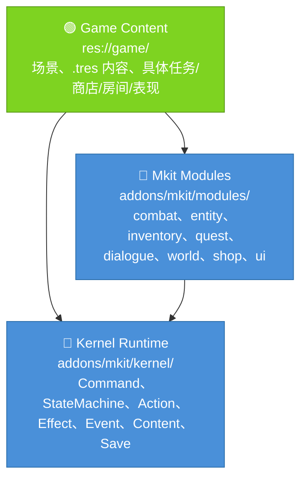
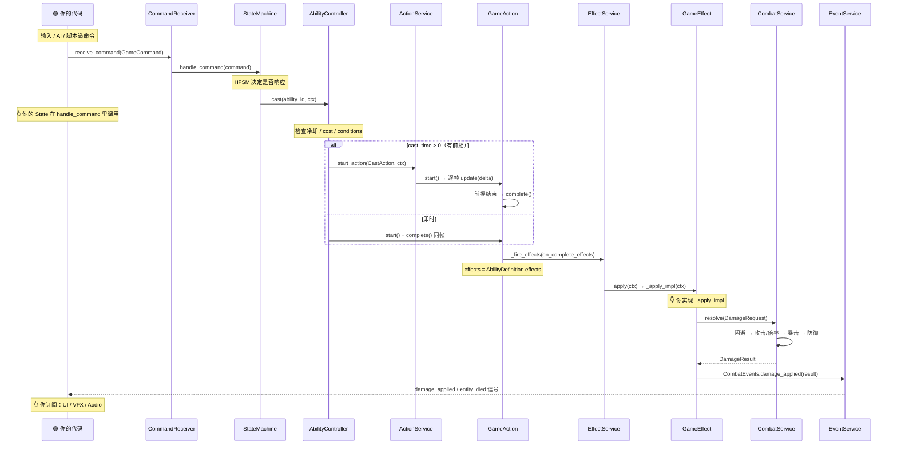
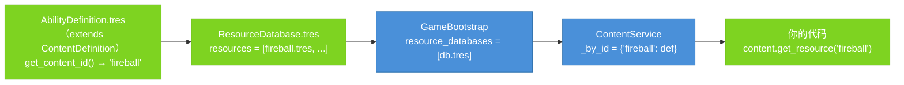

# 核心概念

这一页讲三件事：**大改后的分层**、**mkit 长什么样（大局观）**，以及**一次操作如何在 kernel 里流动（管线）**。

读完你能自信回答：「玩家按下一个键，到屏幕上掉血，中间发生了什么？我负责哪一段、mkit 负责哪一段？」

> 全文配色：🔵 蓝 = mkit 负责（kernel / modules）　🟢 绿 = 你实现或订阅

---

## 一、大改后的分层

当前代码已经落地了大改后的核心分层。模块服务由 `ModuleBootstrap` 显式组合注册；当前没有运行时拓扑加载器或模块清单层。理解当前代码时按下面三层看：



几条硬边界：

| 主题 | 当前代码怎么做 |
|------|----------------|
| 服务访问 | `ServiceRegistry` 是唯一 autoload；`GameBootstrap` 启动时注册全部内置服务；新代码用类型化门面 `Mkit.xxx()` |
| 实体访问 | 默认仍有 `Components/` / `Controllers/`，但代码优先走 `EntityContract` |
| 战斗 | 入口是 `DamageRequest`，`CombatService.resolve()` 直接结算并返回 `DamageResult` |
| 可变数值 | 战斗资源用 `ResourceSet`，账号/货币用 `Wallet`，属性仍由 `StatsComponent` 管 modifier |
| 存档 | `SaveService` 收集场景树 `Saveable` 到 `roots`，收集 `EntitySaveAgent` 到 `entities`，也支持显式注册 save scope provider |

不要把具体 boss、物品、任务、房间、商店价格或 demo 规则写进 `addons/mkit/`。这些属于 `game/`。

---

## 二、大局观：mkit = 可伸缩管线 + 一组服务

mkit 的核心只有一句话：

> **把「意图」变成「游戏效果」：简单需求走最短路径，复杂行为再接入命令、状态、动作、效果、事件。**

常用时先按这三档判断，不要把完整图当作每次必经清单：

| 路径 | 适合需求 | 推荐入口 |
|------|----------|----------|
| Minimal path | 已经有节点引用，只做同步查询、数值变化或事件响应 | 直接调用 component / domain service；需要 condition、trace 或 data-driven 配置时用 `EffectService.execute()` |
| Standard path | 输入、AI、脚本把意图交给本实体状态机处理 | `EntityContract.get_command_receiver(...).receive_command(command)` |
| Advanced path | 只知道目标 id、或行为有前摇、持续、取消、统一 effect 链 | `CommandService.dispatch()`；`GameAction` + `ActionService.start_action()` |

下面这张图展示 standard / advanced path 的完整展开：


两端是绿色——**意图从哪来、结果给谁看，都是你的代码**；中间蓝色部分是 mkit 提供的可选协作层，按需求取用。

管线每一步都由一个对应的**服务（Service）**驱动。服务由唯一 autoload `ServiceRegistry` 持有；新代码用类型化门面 `Mkit.xxx()` 获取，拿到的就是具体服务类型，无需字符串和 cast：

| 管线步骤 | 驱动它的服务 | 一句话 |
|----------|-------------|--------|
| `GameCommand` 路由 | `CommandService`（`"commands"`） | 调用方只知道 `target_id` 时，按目标把命令送到对的实体 |
| `GameAction` 时序 | `ActionService`（`"actions"`） | 逐帧推进有前摇、持续时间或取消窗口的行为 |
| `GameEffect` 执行 | `EffectService`（`"effects"`） | 顺序跑完一串效果，带 trace |
| `DomainEvent` 广播 | `EventService`（`"events"`） | 把结果发给所有订阅者 |

> 还有一批与管线协作的服务：`ContentService`（配置数据）、`CombatService`（伤害结算）、`SaveService`（存档）……完整的服务 ID 表、三层依赖关系、实体节点约定见 [architecture.md](architecture.md)。

**记住这张图的边界：它是完整能力图，不是最小使用步骤。**

---

## 二、五个关键词（先认人，再看戏）

管线由五个名词串成，先用一句话认全它们：

| 关键词 | 是什么 | 类比 |
|--------|--------|------|
| **GameCommand** | 类型化的「想做什么」，可序列化、可回放 | 一张点菜的**订单** |
| **State** | HFSM 里的一个状态，决定此刻合法的操作 | **门卫**，放行或拦下订单 |
| **GameAction** | 带生命周期（start→update→complete）的行为 | **后厨**，照订单按步骤做菜 |
| **GameEffect** | 真正改变世界的最小动作（扣血、加 buff…） | 上桌的**那道菜** |
| **DomainEvent** | 「发生了什么」的广播，解耦表现层 | 餐厅**广播**：3 号桌上菜了 |

外加两个贯穿全程的概念：

- **GameplayContext** —— 沿管线传递的**共享信使**（谁打谁、多少伤害）。详见 [第四节](#四gameplaycontext流水线上的信使)。
- **Service / Port** —— 上面那组干活的机器，优先用类型化门面 `Mkit.xxx()` 取用；`get_port` 是底层访问器，`get_service` 已废弃。

---

## 三、管线全程：从「按 Q」到「掉血」

### 3.1 先讲个故事

玩家按 **Q** 放火球（`fireball`）。整条链是这样的：

1. **你的输入代码**捕获按键，建一个 `GameCommand`（"放 fireball"）并交给玩家实体的 `CommandReceiver`。
2. `CommandReceiver` 把命令送到玩家实体的 `StateMachine`。如果调用方只知道目标 id、没有节点引用，可改用 `CommandService.dispatch` 路由。
3. `StateMachine` 问当前状态「现在能放技能吗」——能 → **你的 State** 在 `handle_command` 里调用 `AbilityController.cast("fireball", ctx)`。
4. `AbilityController` 检查冷却 / 法力 / conditions，通过后建一个 `GameAction`：
   - 火球有 **前摇（`cast_time>0`）**→ 交给 `ActionService` 逐帧推进，前摇走完才继续；
   - 火球**即时**→ 同一帧 `start()` + `complete()`。
5. `GameAction` 完成时，触发它的 `on_complete_effects`——也就是 `AbilityDefinition.effects` 里配好的那串 `GameEffect`。
6. `EffectService` 逐个执行 effect。`DealDamageEffect` 读 `context`（谁打谁、多少），向 `CombatService` 提交 `DamageRequest`；`CombatService` 结算闪避 / 暴击 / 防御后返回 `DamageResult`。
7. effect 通过 `EventService` 把结果广播成 `DomainEvent`（`damage_applied` / `entity_died`）。
8. **你的 UI / 飘血数字 / 音效 / 镜头震动**订阅了这些信号 → 表现层响应。

你只写了**第 1 步**（造命令）、**第 3 步的判断**（State 里调 `cast`）、**第 6 步的 effect 实现**和**第 8 步**（订阅）。其余全是 mkit。

### 3.2 完整技能时序



### 3.3 每一跳为什么这么设计

每个箭头都是一次「解耦」。理解了「为什么交给下一个人」，就理解了整套设计：

| 这一跳 | 产出 | 交给谁 | 为什么这么分 |
|--------|------|--------|--------------|
| 输入 / AI → `GameCommand` | 类型化意图对象 | `CommandReceiver` | 意图与执行解耦；同实体控制器不需要绕一次服务查表 |
| `CommandService` → 实体（可选） | 路由到 `target_id` | `CommandReceiver` | 发送方不持有目标引用、只知道 ID 时使用 |
| `StateMachine` → 状态判断 | 是否放行 | `AbilityController` | HFSM 把「此刻能做什么」的合法性封装进状态 |
| `cast()` → `GameAction` | 带时序的行为 | `ActionService` | 有前摇、持续、取消的行为交给统一生命周期；即时 ability 可同帧完成 |
| `GameAction` 完成 → `_fire_effects` | effect 数组 | `EffectService` | **data-driven**：ability effects 在编辑器配置；普通同步逻辑不必包装成 action |
| `EffectService` → `_apply_impl` | `EffectResult` | 调用链 | 每个 effect 独立可测；condition 检查由 kernel 统一做 |
| `GameEffect` → domain component/service | typed result / state mutation | `HealthComponent`、`QuestService` 等 | effect 只负责把语义效果落到领域对象 |
| domain component/service → `EventService` | `DomainEvent` / typed signal payload | 所有订阅者 | 执行（扣血）与表现（飘字/音效）彻底分离 |

### 3.4 即时 vs 前摇：AbilityController 何时使用 GameAction

`AbilityController` 为了让 `AbilityDefinition.effects` 只配置一次，会把 ability 的 effect 链挂到 `GameAction` 上。即时 ability 不进入 `ActionService`，只是同帧 `start()` + `complete()`：

```gdscript
# AbilityController.cast() 内部（即时分支）
var instant := GameAction.new()
instant.on_complete_effects = definition.effects   # 编辑器配的 effect 链
instant.start(_build_action_context(context, definition))
instant.complete()                                 # 立刻触发 on_complete_effects
```

有前摇时换成 `CastAction`，由 `ActionService` 逐帧 `update`，前摇结束才 `complete()`。两条 ability 路径复用同一组 `AbilityDefinition.effects`，但这不是所有同步逻辑都必须包装成 `GameAction`。

> 普通同步查询或一次性数值变化，可以直接调用 component / domain service；如果需要 condition、trace、编辑器配置的 effect 链，再直接用 `EffectService.execute()` 或挂到 `GameAction` 生命周期上。

---

## 四、GameplayContext：流水线上的信使

管线上每一步都拿到**同一个** `GameplayContext` 对象，读它、改它、传给下一步。它就是那张始终随订单走的小票。

```gdscript
# 从 GameCommand 创建，再补充通用字段和模块 payload
var ctx := GameplayContext.from_command(command, player_node, target_node)
ctx.payload["amount"] = 50.0
ctx.payload["ability_id"] = "fireball"
ctx.tags = ["fire", "aoe"]

# Effect 链中：每个 _apply_impl 都能读写它
func _apply_impl(context: GameplayContext) -> EffectResult:
    var target := context.target       # 谁挨打
    var amount := float(context.get_payload_value("amount", 0.0))
    context.payload["amount"] = amount * 1.5
    return EffectResult.ok(effect_id)
```

**字段一览**（按用途分组）：

| 分组 | 字段 | 类型 | 用途 |
|------|------|------|------|
| 实体 | `source` | `Node` | 发起者（施法者 / 攻击者） |
| | `target` | `Node` | 目标 |
| | `instigator` | `Node` | 最终责任人（如 DoT 的原始施法者） |
| 空间 | `position` | `Vector2` | 世界坐标 |
| | `direction` | `Vector2` | 方向 |
| 语义 | `tags` | `Array[String]` | 标签（"fire"、"crit"…） |
| 扩展 | `payload` | `Dictionary` | 模块私有字段，如 `ability_id` / `item_id` / `status_id` / `room_id` / `run_id` / `amount` |

链式辅助：`with_source()` / `with_target()` / `with_payload_value(k,v)` / `get_payload_value(k, default)` / `has_tag(tag)`。

`ActionContext` 继承自它，额外带 `duration` / `phase`，供 `GameAction` 内部使用。`action_id` 和 `elapsed` 属于 `GameAction` 本身。

> ⚠️ context 每帧可能被多个 effect 传递，**保持轻量**——除 Node 引用外别塞重型对象。

---

## 五、内容从哪来：注册与查询

技能、物品、任务、房间……所有**配置数据**走同一条路：在编辑器里做成 `.tres`，启动时注册，运行时按 ID 查。



**工作流：**

1. 建一个 `AbilityDefinition`（任意 `ContentDefinition` 子类）资源，填 `ability_id = "fireball"`。
2. 把 `.tres` 加进 `ResourceDatabase.resources` 数组。
3. 在 `GameBootstrap` Inspector 里把这个 `ResourceDatabase` 挂到 `resource_databases`。
4. 运行后查询：

```gdscript
var content := Mkit.content()
var def := content.get_resource("fireball") as AbilityDefinition
if def == null:
    push_error("fireball 未注册")
    return

# 按类型批量取。type 名优先使用 class_name
var all_abilities := content.get_all_by_type("AbilityDefinition")
```

**两条规则：**

- `get_content_id()` 必须返回**非空且全局唯一**的字符串。
- **重复 ID 在注册时（`register_resource`）就被拒绝**并跳过；`validate_all()` 在 bootstrap 末尾跑一次，检查空 ID 与 null 资源。
- `get_all_by_type()` 的类型名优先使用脚本 `class_name`（如 `"AbilityDefinition"`）。为了兼容旧内容，脚本文件名去扩展名（如 `"ability_definition"`）也会注册为别名。

---

## 六、存档：roots / entities + scope provider

存档同样建立在「你只 override 两个方法，mkit 负责协调」之上。区别只在**谁来收集你**：

| 契约 | 基类 | 存档键 | 谁收集它 |
|------|------|--------|----------|
| `Saveable` | `Node` | `save_id`（空则回退到 `owner.name` / `name`） | **`SaveService` 自动收集到 `roots`，并支持 `save_scope` 场景外恢复** |
| `EntitySaveAgent` | `Node` | `entity_id` | **`SaveService` 自动收集到 `entities`，负责聚合该实体下的组件** |
| `SaveableComponent` | `Node` | 节点 `name`（实体内唯一） | **不作为全局 root 收集**——由所属实体的 `EntitySaveAgent` 收集到 `components` |

选择规则按所有权来定：全局系统状态用 `Saveable`，实体局部状态用 `EntitySaveAgent` 聚合，跨场景但缺少稳定场景根的系统切片才注册 save scope。不要为玩家或敌人再写一个外部 `Saveable` 手动收集整棵实体树；位置、姿态、临时模式这类特殊实体状态应做成实体内的 `SaveableComponent` 或 duck participant。

`Saveable` 和 `SaveableComponent` 都只需实现序列化的两个方法：

```gdscript
class_name PlayerSave
extends Saveable        # 全局状态根节点，SaveService 会自动找到它

func to_save_data() -> Dictionary:
    return {"gold": gold, "level": level}

func from_save_data(data: Dictionary) -> void:
    gold = int(data.get("gold", 0))
    level = int(data.get("level", 1))
```

> 关键区别：`SaveService.save_game(root)` 会收集场景树中的 **`Saveable`** 节点写入 `roots`，收集 **`EntitySaveAgent`** 写入 `entities`。`SaveableComponent`（如 `AbilityController`）提供相同序列化接口，但必须挂在某个 entity agent 的实体根下。`RunDirector` / `WorldService` 这类需要脱离完整场景树恢复的对象，可以通过 `SaveService.register_saveable_scope(provider)` 显式注册 scope provider。完整时序见 [generated/html/classes/SaveService.html](generated/html/classes/SaveService.html)。

---

## 七、你写什么 / mkit 管什么

最后一张「分工地图」。蓝色基类由 mkit 提供，你继承绿色那侧、只填关键方法：

```mermaid
flowchart TB
    subgraph mkit ["🔵 mkit 内部（kernel + modules）"]
        GE_base["GameEffect\n（抽象基类）"]
        GA_base["GameAction\n（抽象基类）"]
        ST_base["State\n（抽象基类）"]
        BR_base["Brain\n（抽象基类）"]
        IA_base["Interactable\n（抽象基类）"]
        CD_base["ContentDefinition\n（抽象基类）"]
        SV_base["Saveable /\nSaveableComponent"]
        SR["ServiceRegistry"]
        GB["GameBootstrap"]
    end

    subgraph you ["🟢 你实现"]
        GE_impl["MyEffect\nextends GameEffect\n_apply_impl(ctx)"]
        GA_impl["MyAction\nextends GameAction\n_on_start/update/complete/cancel\non_start/complete/cancel_effects\n_resolve_effects(ctx) 可选"]
        ST_impl["MyState\nextends State\nenter/exit/update\nhandle_command\ncan_enter/can_exit"]
        BR_impl["MyBrain\nextends Brain\nthink(entity, delta)"]
        IA_impl["MyInteractable\nextends Interactable\n_interact_impl(interactor)"]
        CD_impl["MyDefinition\nextends ContentDefinition\nget_content_id()"]
        SV_impl["MySave\nextends Saveable\nto_save_data / from_save_data"]
        SVC_impl["MyService\n任意类\n自定义逻辑"]
        BS_impl["MyBootstrap\nextends GameBootstrap\n_register_kernel_services override"]
    end

    GE_base --> GE_impl
    GA_base --> GA_impl
    ST_base --> ST_impl
    BR_base --> BR_impl
    IA_base --> IA_impl
    CD_base --> CD_impl
    SV_base --> SV_impl
    SR --> SVC_impl
    GB --> BS_impl

    classDef mkitCore fill:#4A90D9,color:#fff,stroke:#2C6FAC
    classDef userOwned fill:#7ED321,color:#fff,stroke:#5A9A18
    class GE_base,GA_base,ST_base,BR_base,IA_base,CD_base,SV_base,SR,GB mkitCore
    class GE_impl,GA_impl,ST_impl,BR_impl,IA_impl,CD_impl,SV_impl,SVC_impl,BS_impl userOwned
```



| 扩展点 | 你继承 | 你实现的方法 | mkit 负责 |
|--------|--------|--------------|-----------|
| 自定义效果 | `GameEffect` | `_apply_impl(ctx)` | condition 检查、`EffectResult` 包装、执行链调度 |
| 自定义动作 | `GameAction` | `_on_start/update/cancel/complete`；声明 `on_start/complete/cancel_effects`；可 override `_resolve_effects(ctx)` 动态追加 | 生命周期管理、钩子后自动 `_fire_effects`、`completed`/`cancelled` 信号 |
| 自定义状态 | `State` | `enter/exit/update/handle_command/can_enter/can_exit` | 层级结构、transition 路由、blackboard 注入 |
| 自定义 AI | `Brain` | `think(entity, delta)` | 被 AI 系统每帧调用 |
| 自定义交互 | `Interactable` | `_interact_impl(interactor)` | 交互检测、触发时机 |
| 自定义内容 | `ContentDefinition` | `get_content_id()` + `@export` 字段 | 注册、校验、按 ID 查询 |
| 自定义存档 | `Saveable` / `SaveableComponent` | `to_save_data()` / `from_save_data()` | 序列化协调与场景重建 |
| 自定义服务 | 任意类 | 服务逻辑 | `ServiceRegistry` 持有引用，按 ID 取用 |
| Bootstrap 扩展 | `GameBootstrap` | override `_register_kernel_services` / `_load_profile` | 其余启动步骤 |

---

## 接下来

| 想深入… | 去 |
|---------|-----|
| 三层依赖、完整服务 ID 表、实体节点约定 | [architecture.md](architecture.md) |
| 每一条管线的完整时序与代码 | [pipeline.md](pipeline.md) |
| 照着步骤搭一个完整 RPG | [cookbook/01_bootstrap.md](cookbook/01_bootstrap.md) |
| 查某个术语 | [glossary.md](glossary.md) |
