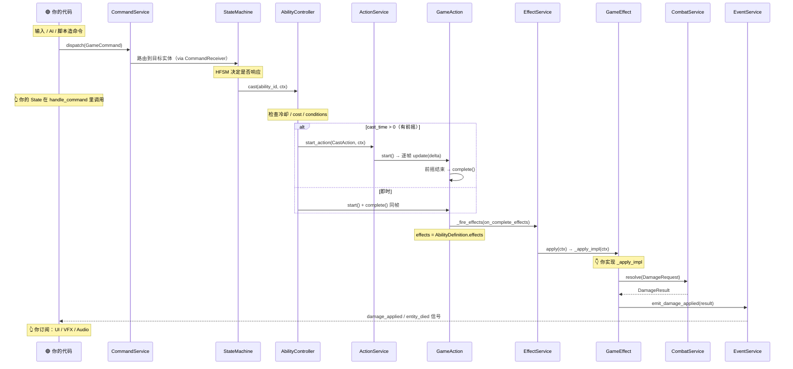
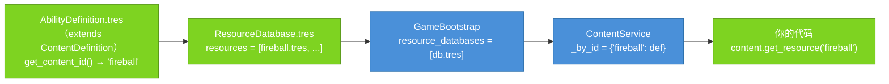

# 核心概念

这一页只讲两件事：**mkit 长什么样（大局观）**，以及**一次操作如何在 kernel 里流动（管线）**。

读完你能自信回答：「玩家按下一个键，到屏幕上掉血，中间发生了什么？我负责哪一段、mkit 负责哪一段？」

> 全文配色：🔵 蓝 = mkit 负责（kernel / modules）　🟢 绿 = 你实现或订阅

---

## 一、大局观：mkit = 一条管线 + 一组服务

mkit 的核心只有一句话：

> **把「意图」变成「游戏效果」，全程走同一条流水线；流水线每一步背后都有一个随取随用的服务在干活。**


两端是绿色——**意图从哪来、结果给谁看，都是你的代码**；中间整条管线是蓝色——**mkit 包办**。

管线每一步都由一个对应的**服务（Service）**驱动，所有服务由唯一的 autoload `ServiceRegistry` 持有，按字符串 ID 随取随用：

| 管线步骤 | 驱动它的服务 | 一句话 |
|----------|-------------|--------|
| `GameCommand` 路由 | `CommandService`（`"commands"`） | 按目标把命令送到对的实体 |
| `GameAction` 时序 | `ActionService`（`"actions"`） | 逐帧推进有前摇/持续的行为 |
| `GameEffect` 执行 | `EffectService`（`"effects"`） | 顺序跑完一串效果，带 trace |
| `DomainEvent` 广播 | `EventService`（`"events"`） | 把结果发给所有订阅者 |

> 还有一批与管线协作的服务：`ContentService`（配置数据）、`CombatService`（伤害结算）、`SaveService`（存档）……完整的服务 ID 表、三层依赖关系、实体节点约定见 [architecture.md](architecture.md)。

**记住这一张图，后面全是它的放大。**

---

## 二、五个关键词（先认人，再看戏）

管线由五个名词串成，先用一句话认全它们：

| 关键词 | 是什么 | 类比 |
|--------|--------|------|
| **GameCommand** | 类型化的「想做什么」，可序列化、可回放 | 一张点菜的**订单** |
| **State** | HFSM 里的一个状态，决定此刻合法的操作 | **门卫**，放行或拦下订单 |
| **GameAction** | 带生命周期（start→update→complete）的行为 | **后厨**，照订单按步骤做菜 |
| **GameEffect** | 真正改变世界的最小动作（扣血、加 buff…） | 上桌的**那道菜** |
| **DomainEvent** | 「发生了什么」的广播，解耦表现层 | 餐厅**广播**：3 号桌上菜了 |

外加两个贯穿全程的概念：

- **GameplayContext** —— 沿管线传递的**共享信使**（谁打谁、多少伤害）。详见 [第四节](#四gameplaycontext流水线上的信使)。
- **Service** —— 上面那组干活的机器，优先 `ServiceRegistry.get_port(ServiceRegistry.SERVICE_*)` 取用；`get_service` 保留兼容。

---

## 三、管线全程：从「按 Q」到「掉血」

### 3.1 先讲个故事

玩家按 **Q** 放火球（`fireball`）。整条链是这样的：

1. **你的输入代码**捕获按键，建一个 `GameCommand`（"放 fireball"）并 `dispatch`。
2. `CommandService` 按 `target_id` 把命令送到玩家实体的 `StateMachine`。
3. `StateMachine` 问当前状态「现在能放技能吗」——能 → **你的 State** 在 `handle_command` 里调用 `AbilityController.cast("fireball", ctx)`。
4. `AbilityController` 检查冷却 / 法力 / conditions，通过后建一个 `GameAction`：
   - 火球有 **前摇（`cast_time>0`）**→ 交给 `ActionService` 逐帧推进，前摇走完才继续；
   - 火球**即时**→ 同一帧 `start()` + `complete()`。
5. `GameAction` 完成时，触发它的 `on_complete_effects`——也就是 `AbilityDefinition.effects` 里配好的那串 `GameEffect`。
6. `EffectService` 逐个执行 effect。`DealDamageEffect` 读 `context`（谁打谁、多少），向 `CombatService` 提交 `DamageRequest`，拿回 `DamageResult`。
7. effect 通过 `EventService` 把结果广播成 `DomainEvent`（`damage_applied` / `entity_died`）。
8. **你的 UI / 飘血数字 / 音效 / 镜头震动**订阅了这些信号 → 表现层响应。

你只写了**第 1 步**（造命令）、**第 3 步的判断**（State 里调 `cast`）、**第 6 步的 effect 实现**和**第 8 步**（订阅）。其余全是 mkit。

### 3.2 完整时序



### 3.3 每一跳为什么这么设计

每个箭头都是一次「解耦」。理解了「为什么交给下一个人」，就理解了整套设计：

| 这一跳 | 产出 | 交给谁 | 为什么这么分 |
|--------|------|--------|--------------|
| 输入 → `GameCommand` | 类型化意图对象 | `CommandService` | 意图与执行解耦；命令可序列化、可回放、可联网广播 |
| `CommandService` → 实体 | 路由到 `target_id` | `StateMachine` | 发送方不必持有目标引用，只需知道 ID |
| `StateMachine` → 状态判断 | 是否放行 | `AbilityController` | HFSM 把「此刻能做什么」的合法性封装进状态 |
| `cast()` → `GameAction` | 带时序的行为 | `ActionService` | 即时逻辑与有前摇/持续的行为统一成一个接口 |
| `GameAction` 完成 → `_fire_effects` | effect 数组 | `EffectService` | **data-driven**：effects 在编辑器配置，无需写代码手动调用 |
| `EffectService` → `_apply_impl` | `EffectResult` | 调用链 | 每个 effect 独立可测；condition 检查由 kernel 统一做 |
| `GameEffect` → `EventService` | `DomainEvent` | 所有订阅者 | 执行（扣血）与表现（飘字/音效）彻底分离 |

### 3.4 即时 vs 前摇：为什么都包成 GameAction

近战平 A 是即时的，火球有 0.5s 前摇——但它们**走同一条路**。秘诀是：哪怕即时技能，`AbilityController` 也把它包成一个 `GameAction`，只是同帧 `start()` + `complete()`：

```gdscript
# AbilityController.cast() 内部（即时分支）
var instant := GameAction.new()
instant.on_complete_effects = definition.effects   # 编辑器配的 effect 链
instant.start(_build_action_context(context, definition))
instant.complete()                                 # 立刻触发 on_complete_effects
```

有前摇时换成 `CastAction`，由 `ActionService` 逐帧 `update`，前摇结束才 `complete()`——**触发 effect 的代码一字不差**。

> 这就是为什么 effect 不再由谁「手动调用」：`GameAction` 在 `start` / `complete` / `cancel` 三个时机各自触发 `on_start_effects` / `on_complete_effects` / `on_cancel_effects`。你只要把 effect 填进对应数组（通常来自 `AbilityDefinition.effects`）。

---

## 四、GameplayContext：流水线上的信使

管线上每一步都拿到**同一个** `GameplayContext` 对象，读它、改它、传给下一步。它就是那张始终随订单走的小票。

```gdscript
# 从 GameCommand 创建，再补充字段
var ctx := GameplayContext.from_command(command, player_node, target_node)
ctx.amount = 50.0
ctx.tags = ["fire", "aoe"]

# Effect 链中：每个 _apply_impl 都能读写它
func _apply_impl(context: GameplayContext) -> EffectResult:
    var target := context.target       # 谁挨打
    context.amount *= 1.5              # 改一下，下一个 effect 接着用
    return EffectResult.ok(effect_id)
```

**字段一览**（按用途分组）：

| 分组 | 字段 | 类型 | 用途 |
|------|------|------|------|
| 实体 | `source` | `Node` | 发起者（施法者 / 攻击者） |
| | `target` | `Node` | 目标 |
| | `instigator` | `Node` | 最终责任人（如 DoT 的原始施法者） |
| 关联 ID | `ability_id` | `String` | 触发的技能 |
| | `item_id` | `String` | 关联物品 |
| | `status_id` | `String` | 关联状态效果 |
| | `room_id` / `run_id` | `String` | 关联房间 / 一局 Run |
| 空间 | `position` | `Vector2` | 世界坐标 |
| | `direction` | `Vector2` | 方向 |
| 数值 | `amount` | `float` | 当前数值（伤害、治疗量…） |
| 语义 | `tags` | `Array[String]` | 标签（"fire"、"crit"…） |
| 自由 | `payload` | `Dictionary` | 任意扩展字段 |

链式辅助：`with_source()` / `with_target()` / `with_payload_value(k,v)` / `get_payload_value(k, default)` / `has_tag(tag)`。

`ActionContext` 继承自它，额外带 `action_id` / `duration` / `elapsed` / `phase`，供 `GameAction` 内部使用。

> ⚠️ context 每帧可能被多个 effect 传递，**保持轻量**——除 Node 引用外别塞重型对象。

---

## 五、内容从哪来：注册与查询

技能、物品、任务、房间……所有**配置数据**走同一条路：在编辑器里做成 `.tres`，启动时注册，运行时按 ID 查。



**工作流：**

1. 建一个 `AbilityDefinition`（任意 `ContentDefinition` 子类）资源，填 `ability_id = "fireball"`。
2. 把 `.tres` 加进 `ResourceDatabase.resources` 数组。
3. 在 `GameBootstrap` Inspector 里把这个 `ResourceDatabase` 挂到 `resource_databases`。
4. 运行后查询：

```gdscript
var content := ServiceRegistry.get_port(ServiceRegistry.SERVICE_CONTENT) as ContentService
var def := content.get_resource("fireball") as AbilityDefinition
if def == null:
    push_error("fireball 未注册")
    return

# 按类型批量取。注意：type 名是「脚本文件名去扩展名」（snake_case）
var all_abilities := content.get_all_by_type("ability_definition")
```

**两条规则：**

- `get_content_id()` 必须返回**非空且全局唯一**的字符串。
- **重复 ID 在注册时（`register_resource`）就被拒绝**并跳过；`validate_all()` 在 bootstrap 末尾跑一次，检查空 ID 与 null 资源。

> `get_all_by_type` 的类型名 = 资源脚本的**文件名去掉扩展名**（如 `ability_definition.gd` → `"ability_definition"`），**不是** `class_name`。

---

## 六、存档：两条契约

存档同样建立在「你只 override 两个方法，mkit 负责协调」之上。区别只在**谁来收集你**：

| 契约 | 基类 | 存档键 | 谁收集它 |
|------|------|--------|----------|
| `Saveable` | `Node` | `save_id`（空则回退到 `owner.name` / `name`） | **`SaveService` 自动收集场景树节点，并支持 `save_scope` 场景外恢复** |
| `SaveableComponent` | `Node` | 节点 `name`（实体内唯一） | **不自动收集**——由所属实体（一个 `Saveable`）负责收集并序列化 |

两者接口相同，都只需实现序列化的两个方法：

```gdscript
class_name PlayerSave
extends Saveable        # 全局状态根节点，SaveService 会自动找到它

func to_save_data() -> Dictionary:
    return {"gold": gold, "level": level}

func from_save_data(data: Dictionary) -> void:
    gold = int(data.get("gold", 0))
    level = int(data.get("level", 1))
```

> 关键区别：`SaveService.save_game(root)` 会收集场景树中的 **`Saveable`** 节点，并保留 `save_scope` 字段用于场景树外恢复。`SaveableComponent`（如 `AbilityController`）提供了相同的序列化接口，但要被持久化，必须由它所属的 `Saveable` 实体主动收集——单独挂一个 `SaveableComponent` 不会自动进存档。完整时序见 [ref/kernel/SaveService.md](ref/kernel/SaveService.md)。

---

## 七、你写什么 / mkit 管什么

最后一张「分工地图」。蓝色基类由 mkit 提供，你继承绿色那侧、只填关键方法：

```mermaid
flowchart TB
    subgraph mkit ["🔵 mkit 内部（kernel + modules）"]
        GE_base["GameEffect\n（抽象基类）"]
        GA_base["GameAction\n（抽象基类）"]
        ST_base["State\n（抽象基类）"]
        BR_base["Brain\n（抽象基类）"]
        IA_base["Interactable\n（抽象基类）"]
        CD_base["ContentDefinition\n（抽象基类）"]
        SV_base["Saveable /\nSaveableComponent"]
        SR["ServiceRegistry"]
        GB["GameBootstrap"]
    end

    subgraph you ["🟢 你实现"]
        GE_impl["MyEffect\nextends GameEffect\n_apply_impl(ctx)"]
        GA_impl["MyAction\nextends GameAction\n_on_start/update/complete/cancel\non_start/complete/cancel_effects\n_resolve_effects(ctx) 可选"]
        ST_impl["MyState\nextends State\nenter/exit/update\nhandle_command\ncan_enter/can_exit"]
        BR_impl["MyBrain\nextends Brain\nthink(entity, delta)"]
        IA_impl["MyInteractable\nextends Interactable\n_interact_impl(interactor)"]
        CD_impl["MyDefinition\nextends ContentDefinition\nget_content_id()"]
        SV_impl["MySave\nextends Saveable\nto_save_data / from_save_data"]
        SVC_impl["MyService\n任意类\n自定义逻辑"]
        BS_impl["MyBootstrap\nextends GameBootstrap\n_register_kernel_services override"]
    end

    GE_base --> GE_impl
    GA_base --> GA_impl
    ST_base --> ST_impl
    BR_base --> BR_impl
    IA_base --> IA_impl
    CD_base --> CD_impl
    SV_base --> SV_impl
    SR --> SVC_impl
    GB --> BS_impl

    classDef mkitCore fill:#4A90D9,color:#fff,stroke:#2C6FAC
    classDef userOwned fill:#7ED321,color:#fff,stroke:#5A9A18
    class GE_base,GA_base,ST_base,BR_base,IA_base,CD_base,SV_base,SR,GB mkitCore
    class GE_impl,GA_impl,ST_impl,BR_impl,IA_impl,CD_impl,SV_impl,SVC_impl,BS_impl userOwned
```



| 扩展点 | 你继承 | 你实现的方法 | mkit 负责 |
|--------|--------|--------------|-----------|
| 自定义效果 | `GameEffect` | `_apply_impl(ctx)` | condition 检查、`EffectResult` 包装、执行链调度 |
| 自定义动作 | `GameAction` | `_on_start/update/cancel/complete`；声明 `on_start/complete/cancel_effects`；可 override `_resolve_effects(ctx)` 动态追加 | 生命周期管理、钩子后自动 `_fire_effects`、`completed`/`cancelled` 信号 |
| 自定义状态 | `State` | `enter/exit/update/handle_command/can_enter/can_exit` | 层级结构、transition 路由、blackboard 注入 |
| 自定义 AI | `Brain` | `think(entity, delta)` | 被 AI 系统每帧调用 |
| 自定义交互 | `Interactable` | `_interact_impl(interactor)` | 交互检测、触发时机 |
| 自定义内容 | `ContentDefinition` | `get_content_id()` + `@export` 字段 | 注册、校验、按 ID 查询 |
| 自定义存档 | `Saveable` / `SaveableComponent` | `to_save_data()` / `from_save_data()` | 序列化协调、版本迁移调度 |
| 自定义服务 | 任意类 | 服务逻辑 | `ServiceRegistry` 持有引用，按 ID 取用 |
| Bootstrap 扩展 | `GameBootstrap` | override `_register_kernel_services` / `_load_profile` | 其余启动步骤 |

---

## 接下来

| 想深入… | 去 |
|---------|-----|
| 三层依赖、完整服务 ID 表、实体节点约定 | [architecture.md](architecture.md) |
| 每一条管线的完整时序与代码 | [pipeline.md](pipeline.md) |
| 照着步骤搭一个完整 RPG | [cookbook/01_bootstrap.md](cookbook/01_bootstrap.md) |
| 查某个术语 | [glossary.md](glossary.md) |
