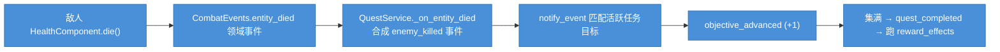

# Recipe 10：任务接受 / 推进 / 完成  ·  难度 ★★★  ·  预计 25 分钟

## 本篇结束后，你的项目新增了什么

对话里多了一个"我来帮忙"选项，点它就**接下一个任务**（击杀 3 只野兽）。之后你每杀一只敌人，任务目标自动 +1——不用写任何推进代码，`QuestService` 监听领域事件自动计数。集满 3 只后任务自动完成并发放奖励（永久 +攻击力）。

## 前置

- 需完成：[Recipe 09](09_npc_dialogue.md)（对话选项可挂 effect）、[Recipe 07](07_room.md)（有会死的敌人）
- 用到的概念：[concepts.md — 模型 1：标准管线](../concepts.md#模型-1标准管线时序图)（事件驱动）

## 你负责 / mkit 负责

| 你写的 | mkit 处理的 |
|--------|------------|
| 创建 `QuestDefinition` (.tres)：目标 + 奖励 | `QuestService` 注册、校验、按 id 查询 |
| 在对话选项挂 `AcceptQuestEffect` | `accept_quest()` 校验前置/条件，创建 `QuestState`，发 `quest_accepted` |
| 把目标的 `event_type` 对准某个领域事件 | `QuestService` 监听 `domain_event_emitted`，自动匹配并推进目标 |
| （可选）监听 `quest_completed` / `quest_turned_in` 做 UI | 目标集满后自动完成；`auto_complete` 时自动上交并跑 `reward_effects` |

## 它如何"自动"推进

`QuestService` 在 `_ready()` 时连上了 `EventService.domain_event_emitted` 和 `entity_died`。敌人死亡时，它会合成一个 `"enemy_killed"` 事件，payload 携带死者的 `faction` / `tags` / `definition_id`。每个活跃任务的目标若 `event_type` 与之匹配、`match_key`/`match_value` 也对得上，就自动 +1。**所以"杀 3 只敌人"这种目标完全不需要你手动调用推进接口。**


> 🔵 全程由 mkit 处理，你只负责配置目标和接受任务。

## 步骤

### 步骤 1：创建 QuestDefinition

新建 Resource → `QuestDefinition`，存为 `res://data/quests/cull_beasts.tres`：

| 字段 | 值 |
|------|----|
| `quest_id` | `"quest.cull_beasts"` |
| `display_name` | `"清剿野兽"` |
| `description` | `"消灭 3 只野兽。"` |
| `quest_type` | `"side"` |
| `objectives` | 见下（1 个 `QuestObjectiveDefinition`）|
| `auto_complete` | `true`（集满即自动完成并上交）|
| `reward_effects` | `[res://data/effects/quest_reward_atk.tres]` |

`objectives` 里建一个 `QuestObjectiveDefinition`：

```
objective_id      = "kill_beasts"
description        = "消灭野兽"
event_type        = "enemy_killed"     # ← 对准 QuestService 合成的事件
match_key         = "faction"          # 看事件 payload 的哪个字段
match_value       = "enemy"            # 字段值要等于它
count_payload_key = ""                 # 留空 → 每个匹配事件计 +1
required_count    = 3
optional          = false
```

> 想"只统计某种敌人"，把 `match_key` 改成 `"definition_id"`、`match_value` 改成 `"enemy.field_beast"`；想按标签，用 `match_key="tags"`（payload 里 `tags` 是数组，会用 `has()` 匹配）。

`quest_reward_atk.tres` 用 `ApplyStatModifierEffect`：
- `stat_id` = `"attack_power"`, `operation` = `FLAT_ADD`, `value` = `3.0`
- `duration` = `-1.0`（永久）, `apply_to_source` = `true`（作用于接任务的玩家）

把 `cull_beasts.tres` 加入 `ResourceDatabase.resources`。

### 步骤 2：在对话选项上挂 AcceptQuestEffect

回到 [Recipe 09](09_npc_dialogue.md) 的 `elder_intro.tres`，给 `greet` 节点加一个新选项 `choice_help`：

```
choice_help:
  text         = "我来帮忙。"
  next_node_id = "info"
  conditions   = []
  effects      = [AcceptQuestEffect(quest_id = "quest.cull_beasts")]
```

`AcceptQuestEffect` 是带 `@export var quest_id` 的 effect，可直接在 Inspector 里内联到 `choices[].effects`。玩家点这个选项时，effect 以对话上下文执行（`source` = 玩家），`QuestService.accept_quest()` 记录该上下文，之后发奖励时作用回玩家身上。

### 步骤 3：（可选）监听任务信号做反馈

任务推进/完成都有信号，可接 UI 或打 log：

```gdscript
# 主场景 _ready 中
func _ready() -> void:
    var quest := ServiceRegistry.get_port(ServiceRegistry.SERVICE_QUEST) as QuestService
    if quest == null:
        return
    quest.quest_accepted.connect(func(id: String):
        print("接受任务: %s" % id)
    )
    quest.objective_advanced.connect(func(qid: String, oid: String, cur: int, req: int):
        print("目标推进 %s/%s: %d/%d" % [qid, oid, cur, req])
    )
    quest.quest_completed.connect(func(id: String):
        print("任务完成: %s" % id)
    )
    quest.quest_turned_in.connect(func(id: String):
        print("任务上交（已发奖励）: %s" % id)
    )
```

### 步骤 4：（可选）用 QuestLogUI 显示任务列表

内置 `QuestLogUI`（`extends Control`）能渲染当前所有任务及进度。搭一个带 `QuestContainer`（VBoxContainer）子节点的场景，在 `_ready` 里 `bind(quest_service)` 即可，它会自动随信号刷新。

### 步骤 5：（可选）改成"回去交任务"而非自动完成

把 `QuestDefinition.auto_complete` 设为 `false`，则集满目标只触发 `quest_completed`（状态变 `completed`），需要玩家回 NPC 处用一个挂了 `CompleteQuestEffect`（`turn_in = true`）的对话选项才上交、发奖励。`CompleteQuestEffect` 会在 `completed` 状态下自动走 `turn_in_quest()`。

## 运行验证

1. 与 NPC 对话，点"我来帮忙" → 控制台 `接受任务: quest.cull_beasts`
2. 进房间杀敌人，每杀一只 → `目标推进 .../kill_beasts: 1/3`、`2/3`、`3/3`
3. 第 3 只死亡 → `任务完成` + `任务上交（已发奖励）`
4. 玩家 `StatsComponent.get_stat_value("attack_power")` 增加了 3
5. `EventService.recent_events` 里有 `quest_accepted` / `quest_objective_advanced` / `quest_completed` / `quest_turned_in`

## 常见错误

| 现象 | 原因 | 修复 |
|------|------|------|
| 接不了任务 | `can_accept` 失败：前置任务未交、`accept_conditions` 不满足、已接过且不可重复 | 检查 `prerequisite_quest_ids` / `accept_conditions` / `repeatable` |
| 杀敌不推进 | 目标 `event_type` / `match_key` / `match_value` 对不上事件 payload | 击杀用 `event_type="enemy_killed"`；敌人 `EntityIdentity.faction` 要等于 `match_value` |
| 推进了但不完成 | 还有非 `optional` 目标没满，或 `auto_complete=false` | 确认所有必做目标达标；要自动完成则设 `auto_complete=true` |
| 完成了没发奖励 | `reward_effects` 为空，或某 effect 失败 | `turn_in` 要求所有 reward effect 成功；看 `EffectService.recent_results` |
| 奖励作用错对象 | reward effect 用 `apply_to_source=false`（默认对 target）| 任务奖励一般 `apply_to_source=true` / `give_to_source=true` |

## 延伸阅读

- [QuestService ref](../ref/modules/QuestService.md) — accept_quest / advance_objective / complete_quest / turn_in_quest
- [QuestDefinition ref](../ref/modules/QuestDefinition.md) · [QuestObjectiveDefinition ref](../ref/modules/QuestObjectiveDefinition.md)
- [AcceptQuestEffect ref](../ref/modules/AcceptQuestEffect.md) · [AdvanceObjectiveEffect ref](../ref/modules/AdvanceObjectiveEffect.md) · [CompleteQuestEffect ref](../ref/modules/CompleteQuestEffect.md)
- [pipeline.md — Quest Lifecycle](../pipeline.md#12-quest-lifecycle)
- [cookbook/11_progression_and_save.md](11_progression_and_save.md) — 任务/击杀给 XP，并把进度存档
