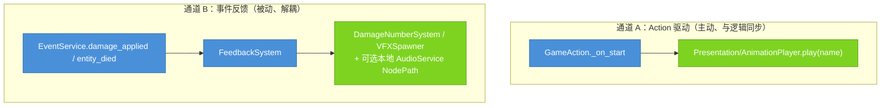

# Recipe 13：动画接入（Action 驱动 + 事件 VFX）  ·  难度 ★★☆  ·  预计 20 分钟  ·  [扩展]

## 本篇结束后，你的项目新增了什么

实体会动了：攻击时播攻击动画，受击时弹出浮动伤害数字 + 命中特效 + 音效，死亡时播死亡特效。mkit 用**两条独立通道**接动画/表现，互不耦合——理解这两条通道是本篇的核心。

## 前置

- 需完成：[Recipe 04](04_attack_action.md)（有 `TimedAttackAction` 在跑）
- 用到的概念：[concepts.md — 模型 1：标准管线](../concepts.md#模型-1标准管线时序图)（最后一跳：表现层订阅事件）

## 你负责 / mkit 负责

| 你写的 | mkit 处理的 |
|--------|------------|
| 在实体 `Presentation/AnimationPlayer` 上创建 `attack` / `cast` / `idle` / `move` 等动画 | `TimedAttackAction` / `CastAction` 在生命周期钩子里按约定播放动作动画 |
| 搭建 `FeedbackSystem`、`DamageNumberSystem`、`VFXSpawner` 节点并配置路径 / 资源表 | `EventService` 发出伤害与死亡事件，`FeedbackSystem` 将事件转发给表现子系统 |
| 提供浮动数字、命中特效、死亡特效和音效资源 | `DamageNumberSystem` / `VFXSpawner` / `AudioService` 负责实例化、播放和自动清理 |

## 两条通道


> 🔵 mkit 提供接缝与分发 / 🟢 你提供 AnimationPlayer 动画与 VFX/SFX 资源
>
> **通道 A** 由动作主动驱动，时序与逻辑严格对齐（攻击动画的挥砍帧 = Hitbox 激活窗口）。**通道 B** 由事件被动触发，谁受伤就在谁身上冒数字，发出者完全不知道有谁在听。

## 步骤

### 步骤 1：通道 A — 加 Presentation/AnimationPlayer

mkit 的动作约定在 `源实体/Presentation/AnimationPlayer` 上播动画。给实体补上这个接缝：

```
PlayerEntity  (EntityRoot)
└── Presentation/
    ├── Sprite2D
    └── AnimationPlayer        # 节点名必须是 "AnimationPlayer"
```

在 `AnimationPlayer` 里建动画，**名字要和动作播放的名字一致**：
- `"attack"` — `TimedAttackAction._on_start()` 会 `play("attack")`
- `"cast"` — `CastAction` 会 `play("cast")`
- `"idle"` / `"move"` — 由你在状态里播（见下）

动作播放前会 `has_animation(name)` 检查，**没有同名动画就静默跳过**——所以缺动画不报错，但也不会动。

### 步骤 2：在状态里播 idle / move 动画

`TimedAttackAction` 自带播 `"attack"`，但移动/待机得你在 State 里播：

```gdscript
# PlayerMoveState.enter 里
func enter(context: Dictionary = {}) -> void:
    _direction = context.get("direction", Vector2.ZERO)
    var anim := EntityContract.get_contract_node(owner_entity, "Presentation", "AnimationPlayer") as AnimationPlayer
    if anim != null and anim.has_animation("move"):
        anim.play("move")
```

> 自定义动作也一样：在你的 `GameAction._on_start()` 里用 `EntityContract.get_contract_node(context.source, "Presentation", "AnimationPlayer")` 取动画节点然后 `play()`。

### 步骤 3：通道 B — 搭 FeedbackSystem + 子系统

`FeedbackSystem` 监听 `EventService`，把伤害/死亡事件转成表现。搭这样一组节点（通常挂在一个常驻的 CanvasLayer/Node 下）：

```
Feedback  (Node)
├── FeedbackSystem      (FeedbackSystem)
├── DamageNumbers       (DamageNumberSystem)
└── Vfx                 (VFXSpawner)
```

配置 `FeedbackSystem` 的路径导出：
- `damage_number_system_path` = `"../DamageNumbers"`
- `vfx_spawner_path` = `"../Vfx"`
- `audio_manager_path` = 留空使用全局 `"audio"` 服务，或指向一个同场景可访问的 `AudioService` 节点
- `damage_screen_shake_strength` = `4.0`（可选，>0 时受击请求震屏）

`FeedbackSystem._ready()` 自动连上 `events.damage_applied` 和 `events.entity_died`。

### 步骤 4：配 DamageNumberSystem 与 VFXSpawner

`DamageNumberSystem`：
- `damage_number_scene_path` = `"res://game/ui/damage_number.tscn"`（一个带 `setup(amount, critical)` 方法、会自己飘起+淡出的小场景）
- `default_offset` = `Vector2(0, -24)`

`VFXSpawner`：
- `vfx_scene_map` = `{"hit": "res://game/vfx/hit.tscn", "death": "res://game/vfx/death.tscn"}`
- `auto_free_seconds` = `2.0`

`FeedbackSystem._on_damage_applied()` 会调 `damage_numbers.show_number(pos, final_amount, was_critical)` + `vfx.spawn("hit", pos)`；`_on_entity_died()` 调 `vfx.spawn("death", pos)`。VFX id（`"hit"` / `"death"`）就是你在 `vfx_scene_map` 里的键。

### 步骤 5：（可选）音效

给 `ResourceDatabase` 加两个 `AudioDefinition(kind=SFX)`，`audio_id` 分别是 `"hit"` 和 `"death"`，`stream` 指向你的音效文件。`GameBootstrap` 会把它们注册到全局 `"audio"` 服务；受击/死亡时 `FeedbackSystem` 会 `play_sfx("hit"/"death")`。

如果你把 `audio_manager_path` 指向本地 `AudioService` 节点，也可以直接在那个本地服务上配置 `sfx_map`，但项目级音效推荐走 `AudioDefinition`。

## 运行验证

1. 玩家攻击 → 播放 `"attack"` 动画，挥砍帧与 Hitbox 激活窗口对齐
2. 命中敌人 → 敌人头顶冒出伤害数字 + `hit` 特效，（配了音效则）响一声
3. 暴击伤害数字样式不同（`show_number` 第三参 `critical=true`）
4. 敌人死亡 → 播 `death` 特效

## 常见错误

| 现象 | 原因 | 修复 |
|------|------|------|
| 攻击不播动画 | 没有 `Presentation/AnimationPlayer` 或没有名为 `attack` 的动画 | 补节点与同名动画；`has_animation` 失败会静默跳过 |
| 伤害数字不出现 | `FeedbackSystem` 路径没配，或没连上事件 | 检查 `damage_number_system_path`；确认伤害走了 `EventService.emit_damage_applied` |
| 特效不出现 | `vfx_scene_map` 缺对应 id | 键必须是 `"hit"` / `"death"`（或你在代码里 spawn 的 id）|
| 数字位置不对 | `result.target` 不是 Node2D | 浮动数字用 `target.global_position`，目标需是 2D 节点 |
| 动画与逻辑不同步 | 想用通道 B 驱动逻辑 | 命中判定走通道 A（动作时序），通道 B 只做表现 |

## 延伸阅读

- [FeedbackSystem ref](../ref/modules/FeedbackSystem.md) · [VFXSpawner ref](../ref/modules/VFXSpawner.md) · [DamageNumberSystem ref](../ref/modules/DamageNumberSystem.md)
- [pipeline.md — Animation（两通道）](../pipeline.md#10-animation--action-驱动通道)
- [GameAction ref](../ref/kernel/GameAction.md) — 生命周期钩子里播动画
