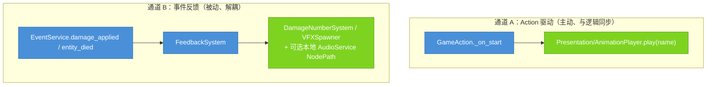

# Recipe 13：动画接入（Action 驱动 + 事件 VFX）  ·  难度 ★★☆  ·  预计 20 分钟  ·  [扩展]

## 本篇结束后，你的项目新增了什么

实体会动了：攻击时播攻击动画，受击时弹出浮动伤害数字 + 命中特效 + 音效，死亡时播死亡特效。mkit 用**两条独立通道**接动画/表现，互不耦合——理解这两条通道是本篇的核心。

## 前置

- 需完成：[Recipe 04](04_attack_action.md)（有 `TimedAttackAction` 在跑）
- 用到的概念：[concepts.md — 模型 1：标准管线](../concepts.md#模型-1标准管线时序图)（最后一跳：表现层订阅事件）

## 你负责 / mkit 负责

| 你写的 | mkit 处理的 |
|--------|------------|
| 在实体 `Presentation/AnimationPlayer` 上创建 `attack` / `cast` / `idle` / `move` 等动画 | `TimedAttackAction` / `CastAction` 在生命周期钩子里按约定播放动作动画 |
| 搭建 `FeedbackSystem`、`DamageNumberSystem`、`VFXSpawner` 节点并配置路径 / 资源表 | `EventService` 发出伤害与死亡事件，`FeedbackSystem` 将事件转发给表现子系统 |
| 提供浮动数字、命中特效、死亡特效和音效资源 | `DamageNumberSystem` / `VFXSpawner` / `AudioService` 负责实例化、播放和自动清理 |

## 本篇路径

### Minimal path：即时表现直接播动画

1. 在玩家或敌人实体下创建 `Presentation/AnimationPlayer`，并在 `AnimationPlayer` 里建好 `"idle"` 和 `"move"` 动画。
2. 在临时脚本或 state 里取动画播放器：

```gdscript
var anim := EntityContract.get_contract_node(entity, "Presentation", "AnimationPlayer") as AnimationPlayer
```

3. 即时表现直接播放：

```gdscript
if anim != null and anim.has_animation("idle"):
    anim.play("idle")
```

4. 运行后实体能播放 idle / move，即说明表现接缝正确。
5. 这条路径只是表现更新，不发命令，也不需要 `GameAction`。

### Standard path：输入 / AI 进入状态后由状态播动画

1. 输入或 AI 仍然按 Recipe 02 / 06 发 `move`、`stop_move`、`attack` 命令。
2. 在 `PlayerMoveState.enter()` 里播放 `"move"`：

```gdscript
var anim := EntityContract.get_contract_node(owner_entity, "Presentation", "AnimationPlayer") as AnimationPlayer
if anim != null and anim.has_animation("move"):
    anim.play("move")
```

3. 在 `PlayerIdleState.enter()` 里播放 `"idle"`。
4. 运行后按 WASD，状态切换和动画切换应同步出现。
5. 调用方已持有实体时不要绕到 `CommandService`；只知道 `target_id` 的外部脚本才需要命令路由。

### Advanced path：攻击 / 施法表现跟随 GameAction

1. 攻击动画要和 hitbox active 窗口对齐时，继续使用 Recipe 04 的 `TimedAttackAction`。
2. 在 action `_on_start(context)` 或自定义 action 开始处播放 `"attack"`：

```gdscript
var anim := EntityContract.get_contract_node(context.source, "Presentation", "AnimationPlayer") as AnimationPlayer
if anim != null and anim.has_animation("attack"):
    anim.play("attack")
```

3. 让 action 控制 hitbox startup / active / recovery，动画长度按这三段时间制作。
4. 在 action complete / cancel 时播放 `"idle"` 或交给 state 切回 idle。
5. 验证方式：按攻击键时动画开始，命中帧和 hitbox active 窗口一致，被取消时不会继续完成表现。

## 两条通道


> 🔵 mkit 提供接缝与分发 / 🟢 你提供 AnimationPlayer 动画与 VFX/SFX 资源
>
> **通道 A** 由动作主动驱动，时序与逻辑严格对齐（攻击动画的挥砍帧 = Hitbox 激活窗口）。**通道 B** 由事件被动触发，谁受伤就在谁身上冒数字，发出者完全不知道有谁在听。

## 步骤

### 步骤 1：通道 A — 加 Presentation/AnimationPlayer

mkit 的动作约定在 `源实体/Presentation/AnimationPlayer` 上播动画。给实体补上这个接缝：

```
PlayerEntity  (EntityRoot)
└── Presentation/
    ├── Sprite2D
    └── AnimationPlayer        # 节点名必须是 "AnimationPlayer"
```

在 `AnimationPlayer` 里建动画，**名字要和动作播放的名字一致**：
- `"attack"` — `TimedAttackAction._on_start()` 会 `play("attack")`
- `"cast"` — `CastAction` 会 `play("cast")`
- `"idle"` / `"move"` — 由你在状态里播（见下）

动作播放前会 `has_animation(name)` 检查，**没有同名动画就静默跳过**——所以缺动画不报错，但也不会动。

### 步骤 2：在状态里播 idle / move 动画

`TimedAttackAction` 自带播 `"attack"`，但移动/待机得你在 State 里播：

```gdscript
# PlayerMoveState.enter 里
func enter(context: Dictionary = {}) -> void:
    _direction = context.get("direction", Vector2.ZERO)
    var anim := EntityContract.get_contract_node(owner_entity, "Presentation", "AnimationPlayer") as AnimationPlayer
    if anim != null and anim.has_animation("move"):
        anim.play("move")
```

> 自定义动作也一样：在你的 `GameAction._on_start()` 里用 `EntityContract.get_contract_node(context.source, "Presentation", "AnimationPlayer")` 取动画节点然后 `play()`。

### 步骤 3：通道 B — 搭 FeedbackSystem + 子系统

`FeedbackSystem` 监听 `EventService`，把伤害/死亡事件转成表现。搭这样一组节点（通常挂在一个常驻的 CanvasLayer/Node 下）：

```
Feedback  (Node)
├── FeedbackSystem      (FeedbackSystem)
├── DamageNumbers       (DamageNumberSystem)
└── Vfx                 (VFXSpawner)
```

配置 `FeedbackSystem` 的路径导出：
- `damage_number_system_path` = `"../DamageNumbers"`
- `vfx_spawner_path` = `"../Vfx"`
- `audio_manager_path` = 留空使用全局 `"audio"` 服务，或指向一个同场景可访问的 `AudioService` 节点
- `damage_screen_shake_strength` = `4.0`（可选，>0 时受击请求震屏）

`FeedbackSystem._ready()` 自动订阅 `CombatEvents.DAMAGE_APPLIED` 和 `CombatEvents.ENTITY_DIED`。

### 步骤 4：配 DamageNumberSystem 与 VFXSpawner

`DamageNumberSystem`：
- `damage_number_scene_path` = `"res://game/ui/damage_number.tscn"`（一个带 `setup(amount, critical)` 方法、会自己飘起+淡出的小场景）
- `default_offset` = `Vector2(0, -24)`

`VFXSpawner`：
- `vfx_scene_map` = `{"hit": "res://game/vfx/hit.tscn", "death": "res://game/vfx/death.tscn"}`
- `auto_free_seconds` = `2.0`

`FeedbackSystem._on_damage_applied()` 会调 `damage_numbers.show_number(pos, final_amount, was_critical)` + `vfx.spawn("hit", pos)`；`_on_entity_died()` 调 `vfx.spawn("death", pos)`。VFX id（`"hit"` / `"death"`）就是你在 `vfx_scene_map` 里的键。

### 步骤 5：（可选）音效

给 `ResourceDatabase` 加两个 `AudioDefinition(kind=SFX)`，`audio_id` 分别是 `"hit"` 和 `"death"`，`stream` 指向你的音效文件。`GameBootstrap` 会把它们注册到全局 `"audio"` 服务；受击/死亡时 `FeedbackSystem` 会 `play_sfx("hit"/"death")`。

如果你把 `audio_manager_path` 指向本地 `AudioService` 节点，也可以直接在那个本地服务上配置 `sfx_map`，但项目级音效推荐走 `AudioDefinition`。

### 步骤 6：（可选）BGM 与音频总线路径

音效和 BGM 走同一个 `AudioService`，但注册表不同：

```text
AudioDefinition(kind=SFX)   -> AudioService.sfx_map   -> play_sfx("hit")
AudioDefinition(kind=MUSIC) -> AudioService.music_map -> play_music("forest_theme")
ZoneDefinition.bgm_id       -> WorldService           -> play_music(bgm_id)
```

区域 BGM 的完整接线见 [Recipe 15](15_world_zone_transition.md#步骤-3给区域配置-bgm可选)：`ZoneDefinition.bgm_id` 必须匹配一个 `AudioDefinition(kind=MUSIC).audio_id`。`GameBootstrap` 启动时会把已注册的 `AudioDefinition` 分流进 `sfx_map` / `music_map`；`WorldService` 进入区域后读取 `bgm_id` 并调用 `AudioService.play_music()`。

`sfx_bus` / `music_bus` 是 Godot Audio Bus 名称，需和 Project Settings 里的总线一致。`music_fade_floor_db` 是淡出时压到的最低音量；`WorldService` 默认无淡入淡出，若你在游戏代码里手动 `play_music(id, 0.5)`，这个值会影响交叉淡出的底线。

### 步骤 7：（可选）用 effect 生成 VFX / 打调试事件

如果 VFX 是技能、状态、任务或物品效果链的一部分，可以直接用内置 effect，而不是只靠 `FeedbackSystem` 监听事件：

```gdscript
var hit_vfx := SpawnSceneEffect.new()
hit_vfx.effect_id = "spawn_hit_vfx"
hit_vfx.scene_path = "res://game/vfx/hit.tscn"
hit_vfx.spawn_at_target = true
hit_vfx.use_pool = true

var trace := LogEffect.new()
trace.effect_id = "trace_hit_vfx"
trace.message = "hit vfx spawned"
trace.event_type = "debug.vfx"
```

`SpawnSceneEffect` 会把场景加到当前场景树；`spawn_at_target=true` 时落在 `context.target.global_position`，否则优先落在 `context.source.global_position`。`use_pool=true` 时优先通过 `PoolService.acquire(scene_path, parent)` 复用实例，适合命中特效、弹道残影这类频繁出现的短生命周期场景。

`LogEffect` 会 `print()` 一行日志，并通过 `EventService` 发出一个 `DomainEvent`：`event_type` 是事件名，payload 里包含 `message`。它适合临时验证 effect 链顺序，也适合让 DebugOverlay 或测试订阅调试事件。

## 字段参考

### AudioService

| 字段 | 类型/默认 | 含义 | 什么时候改 |
|------|----------|------|-----------|
| `sfx_map` | Dictionary = `{}` | 音效 id 到 `AudioStream` 的注册表；`play_sfx(audio_id)` 按它查找一次性音效 | 项目级音效通常由 `AudioDefinition(kind=SFX)` 自动填；本地 `AudioService` 可手动填 |
| `music_map` | Dictionary = `{}` | 音乐 id 到 `AudioStream` 的注册表；`play_music(music_id)` 按它查找 BGM | `ZoneDefinition.bgm_id` 要匹配这里的 key；见 Recipe 15 |
| `sfx_bus` | String = `"SFX"` | 一次性音效播放到的 Godot Audio Bus | 项目总线名不是 `"SFX"` 时改 |
| `music_bus` | String = `"Music"` | BGM 播放器使用的 Godot Audio Bus | 项目总线名不是 `"Music"` 时改 |
| `music_fade_floor_db` | float = `-80.0` | 音乐淡出或交叉淡出时压到的最低分贝 | 想让淡出保留一点环境底噪时调高；通常保持默认 |

### SpawnSceneEffect

| 字段 | 类型/默认 | 含义 | 什么时候改 |
|------|----------|------|-----------|
| `scene_path` | String = `""` | 要实例化的 `.tscn` 路径；为空会返回 `missing_scene_path` | 每个 VFX / 投射物 / 场景生成 effect 都要填 |
| `spawn_at_target` | bool = `false` | `true` 时使用 target 位置；`false` 时优先使用 source 位置，再回退到 context position | 命中特效、治疗数字这类落在目标身上的效果设 `true` |
| `use_pool` | bool = `false` | 是否通过 `PoolService` 复用场景实例；没有 pool 或关闭时直接实例化 | 高频短效场景设 `true`，一次性剧情物件保持 `false` |

### LogEffect

| 字段 | 类型/默认 | 含义 | 什么时候改 |
|------|----------|------|-----------|
| `message` | String = `"log"` | 打印到 Output、同时写入事件 payload 的调试文本 | 验证 effect 链是否执行到某一步时填 |
| `event_type` | String = `"log"` | 发出的 `DomainEvent.event_type` | 需要测试、DebugOverlay 或录制工具订阅特定调试事件时改 |

## 运行验证

1. 玩家攻击 → 播放 `"attack"` 动画，挥砍帧与 Hitbox 激活窗口对齐
2. 命中敌人 → 敌人头顶冒出伤害数字 + `hit` 特效，（配了音效则）响一声
3. 暴击伤害数字样式不同（`show_number` 第三参 `critical=true`）
4. 敌人死亡 → 播 `death` 特效

## 常见错误

| 现象 | 原因 | 修复 |
|------|------|------|
| 攻击不播动画 | 没有 `Presentation/AnimationPlayer` 或没有名为 `attack` 的动画 | 补节点与同名动画；`has_animation` 失败会静默跳过 |
| 伤害数字不出现 | `FeedbackSystem` 路径没配，或没连上事件 | 检查 `damage_number_system_path`；确认伤害广播了 `CombatEvents.damage_applied` 领域事件 |
| 特效不出现 | `vfx_scene_map` 缺对应 id | 键必须是 `"hit"` / `"death"`（或你在代码里 spawn 的 id）|
| 数字位置不对 | `result.target` 不是 Node2D | 浮动数字用 `target.global_position`，目标需是 2D 节点 |
| 动画与逻辑不同步 | 想用通道 B 驱动逻辑 | 命中判定走通道 A（动作时序），通道 B 只做表现 |

## 延伸阅读

- [pipeline.md — Animation（两通道）](../pipeline.md#10-animation--action-驱动通道)
- [GameAction ref](../generated/html/classes/GameAction.html) — 生命周期钩子里播动画
