# Cookbook

Cookbook 是一条**单一项目的累进构建主线**。每篇 Recipe 在上一篇已有场景的基础上新增一层，做完 Recipe 01–11 就得到一个完整可玩的 RPG loop。Recipe 12–23 是独立扩展，可按需选做。

---

## 通用开发流程

为 mkit 游戏添加一个新系统时，先按需求选择最短可用路径；每篇具体 Recipe 都在 `## 本篇路径` 里给出本篇可直接跟做的步骤。这里仅保留判断规则：

- **Minimal path**：你已经有节点引用，只做一次同步查询、数值变化或事件响应。直接调用 component / domain service；需要 condition、trace 或 data-driven effect 时用 `EffectService.execute()`。
- **Standard path**：输入、AI 或脚本要让本实体状态机处理意图。把 `GameCommand` 交给本实体 `CommandReceiver.receive_command(command)`。
- **Advanced path**：只有调用方只知道 `target_id` 时才用 `CommandService` 路由；只有行为需要跨帧、可取消或统一 start / complete / cancel effects 时才用 `GameAction` + `ActionService`。

下面是完整路径的展开图，用作复杂系统的参考，不是每个功能都必须走完的清单：

```mermaid
flowchart LR
    A["① 定义数据\nContentDefinition\n(.tres)"]:::userOwned -->
    B["② 注册内容\nResourceDatabase\n挂到 GameBootstrap"]:::userOwned -->
    C["③ 启动 / Boot\nGameBootstrap 注册 services\n加载并校验内容"]:::mkitCore -->
    D["④ 构建实体\nEntityRoot 默认布局\nEntityContract 访问组件/控制器"]:::userOwned -->
    E["⑤ 发出命令\nGameCommand\n→ CommandReceiver"]:::userOwned -->
    F["⑥ 状态决策\nStateMachine\nState.handle_command"]:::mkitCore -->
    G["⑦ 执行动作\nGameAction\n_on_start/_on_complete"]:::userOwned -->
    H["⑧ 触发效果\nGameEffect\n_apply_impl"]:::userOwned -->
    I["⑨ 广播事件\nEventService\nUI / Audio / VFX 订阅"]:::mkitCore

    classDef mkitCore  fill:#4A90D9,color:#fff,stroke:#2C6FAC
    classDef userOwned fill:#7ED321,color:#fff,stroke:#5A9A18
```



> 🔵 蓝色 = mkit 负责 / 🟢 绿色 = 你实现

**每一步做什么：**

| 步骤 | 你做什么 | mkit 做什么 |
|------|----------|------------|
| ① 定义数据 | 继承 `ContentDefinition`，加 `@export` 字段，设 `get_content_id()` | — |
| ② 注册内容 | 把 `.tres` 文件放入 `ResourceDatabase.resources` | — |
| ③ Boot | 挂好 `GameBootstrap` 并设 `resource_databases` | 注册全部内置服务，加载内容，校验 ID 唯一性 |
| ④ 构建实体 | 在场景树搭 EntityRoot / Components / Controllers | `EntityContract` / `EntityRoot` 提供组件和控制器语义入口 |
| ⑤ 发出命令 | 同实体控制器调用 `CommandReceiver.receive_command`；只知道目标 id 时才用 `CommandService.dispatch` | 将命令交给目标实体的状态机入口 |
| ⑥ 状态决策 | 在 `State.handle_command` 返回 `true`/`false`，决定是否响应 | HFSM 从叶往根冒泡找第一个处理者 |
| ⑦ 执行动作 | 有前摇、持续、取消时继承 `GameAction`，override `_on_start/_on_update/_on_complete` | `ActionService` 管理跨帧生命周期，钩子后自动 `_fire_effects` |
| ⑧ 触发效果 | 继承 `GameEffect`，override `_apply_impl`，修改组件数据 | `EffectService` 检查 conditions，包装 `EffectResult` |
| ⑨ 广播事件 | 调用 `EventService.emit_*` | 通过信号通知所有订阅者（UI、Audio、VFX）|

**最精简的路径（不需要全部步骤）：**
- 只需一个同步数值变化？直接调用 component / domain service；需要 condition、trace 或 data-driven 配置时再用 `EffectService.execute(effect, ctx)`
- 只需要本实体响应输入？直接把 `GameCommand` 交给 `CommandReceiver.receive_command()`；只有跨实体按 id 发命令时才走 `CommandService`
- 只需前摇、持续或取消？再把行为包装成 `GameAction` 并交给 `ActionService`
- 只需一个 AI 命令？Brain 直接调 `issue_command()`，跳过输入层
- 只需监听事件？订阅 `EventService` 信号，不需要任何实体

---

## 主线路径

```
Recipe 01  → 游戏启动，services 在线                    ★☆☆  约 15 min
Recipe 02  → 玩家实体出现在场景，可以移动               ★★☆  约 30 min
Recipe 03  → 玩家有血量/属性，可以被伤害和死亡          ★★☆  约 25 min
Recipe 04  → 玩家有攻击动作，能命中区域造成伤害         ★★★  约 30 min
Recipe 05  → 玩家有可配置技能（AbilityDefinition），可 cast  ★★★  约 30 min
Recipe 06  → 敌人实体上场，有 AI，会主动攻击玩家        ★★★  约 25 min
Recipe 07  → 战斗发生在房间里，房间清空后推进           ★★★  约 35 min
Recipe 08  → 房间清空触发奖励选择（Loot + UI）           ★★★  约 30 min
Recipe 09  → NPC 可以对话，对话结束后接受任务           ★★★  约 30 min
Recipe 10  → 击杀敌人推进任务目标，完成任务领奖励       ★★★  约 25 min
Recipe 11  → 击杀/完成任务获得 XP，升级，全局存读档     ★★★  约 35 min
           ↑ 完整 RPG loop
Recipe 12  → 为技能添加状态效果（DOT / buff）            ★★☆  约 20 min  [扩展]
Recipe 13  → 为实体接入动画（Action 驱动 + 事件 VFX）   ★★☆  约 20 min  [扩展]
Recipe 14  → 在房间之间开放商店购买物品                 ★★☆  约 20 min  [扩展]
Recipe 15  → 用 Portal 在世界区域之间跳转               ★★☆  约 25 min  [扩展]
Recipe 16  → 物品定义 → 入背包 → 使用 → 装备             ★★☆  约 25 min  [扩展]
Recipe 17  → 通用交互区域（靠近 → 提示 → 触发 X）        ★★☆  约 20 min  [扩展]
Recipe 18  → 常驻 HUD 与 UIManager 面板                  ★★☆  约 25 min  [扩展]
Recipe 19  → XP 曲线与花货币的升级树配置                 ★★☆  约 20 min  [扩展]
Recipe 20  → 自定义服务 + 事件目录 + bootstrap 注册      ★★★  约 30 min  [扩展]
Recipe 21  → 条件门禁（Condition）横切所有内容入口       ★★☆  约 20 min  [扩展]
Recipe 22  → 杀死敌人触发掉落（DeathLootRule）           ★★☆  约 20 min  [扩展]
Recipe 23  → 房间清空后的升级三选一 reward               ★★☆  约 25 min  [扩展]
```

---

## 前置条件

所有主线 Recipe 都假设你已经完成了 [getting_started.md](../getting_started.md) 的步骤：
- Godot 4.x 项目
- `addons/mkit/` 已复制并启用插件
- `ServiceRegistry` 已加为 autoload

---

## 相关文档

- [架构层模型](../architecture.md) — 理解 Game Content / Mkit Modules / Kernel Runtime 分层
- [核心心智模型](../concepts.md) — 5 个模型，读完再开始
- [管线参考](../pipeline.md) — 每条管线的完整调用序列
- [调试工具](../debugging.md) — 遇到问题时的第一查阅点
