# Pipeline 参考

每条管线描述一个完整流程的调用序列——从触发点到最终输出。

---

## P0-1：Runtime Bootstrap

**触发点：** `GameBootstrap._ready()`  
**涉及系统：** `GameBootstrap`、`ServiceRegistry`、`ContentService`、`SaveService`、`SceneService`  
**输出：** 所有服务在线，内容已注册，存档已加载，初始场景已切换

### 流程

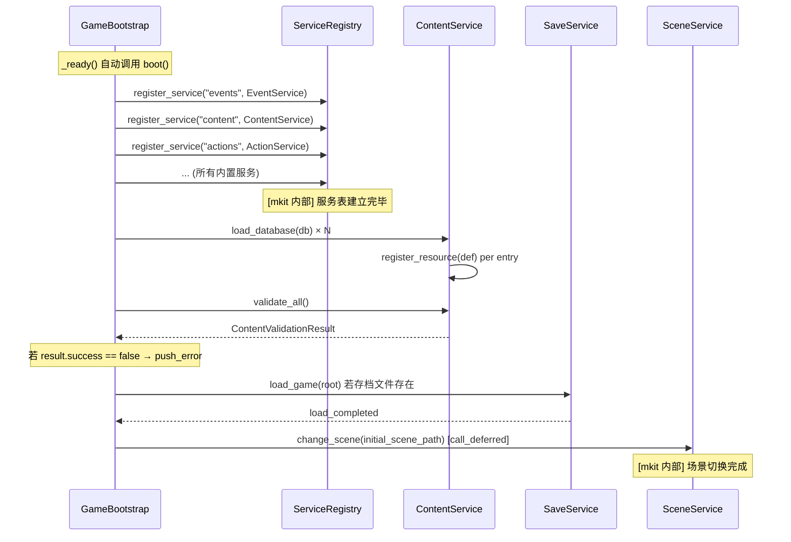
```mermaid
sequenceDiagram
    participant GB as GameBootstrap
    participant SR as ServiceRegistry
    participant CS as ContentService
    participant SS as SaveService
    participant SC as SceneService

    Note over GB: _ready() 自动调用 boot()
    GB->>SR: register_service("events", EventService)
    GB->>SR: register_service("content", ContentService)
    GB->>SR: register_service("actions", ActionService)
    GB->>SR: ... (所有内置服务)
    Note over SR: [mkit 内部] 服务表建立完毕
    GB->>CS: load_database(db) × N
    CS->>CS: register_resource(def) per entry
    GB->>CS: validate_all()
    CS-->>GB: ContentValidationResult
    Note over GB: 若 result.success == false → push_error
    GB->>SS: load_game(root) 若存档文件存在
    SS-->>GB: load_completed
    GB->>SC: change_scene(initial_scene_path)  [call_deferred]
    Note over SC: [mkit 内部] 场景切换完成
```

### 关键代码

```gdscript
# 最小 Bootstrap 场景脚本（无需修改，Inspector 配置即可）
# 节点：Node → 挂 GameBootstrap script
# Inspector：
#   resource_databases = [res://game/content/content_db.tres]
#   initial_scene_path = "res://game/scenes/main.tscn"

# 验证服务在线（在任意节点的 _ready 中）
func _ready() -> void:
    if ServiceRegistry.get_port(ServiceRegistry.SERVICE_CONTENT) == null:
        push_error("Bootstrap has not run yet")
        return
    var content := ServiceRegistry.get_port(ServiceRegistry.SERVICE_CONTENT) as ContentService
    print("Registered content IDs: ", content.get_all_by_type("ability_definition"))
```

```gdscript
# 自定义服务注册（继承 GameBootstrap，override _register_kernel_services）
class_name MyBootstrap
extends GameBootstrap

func _register_kernel_services() -> void:
    super._register_kernel_services()    # 先注册所有内置服务
    var my_svc := MyGameService.new()
    ServiceRegistry.register_service("my_game", my_svc)
```

### 相关文档

→ [architecture.md — ServiceRegistry 模式](architecture.md#serviceregistry-模式)  
→ [cookbook/01_bootstrap.md](cookbook/01_bootstrap.md)  
→ [ref/kernel/GameBootstrap.md](ref/kernel/GameBootstrap.md)

---

## P0-2：Main Gameplay Loop（每帧）

**触发点：** Godot `_process(delta)`  
**涉及系统：** `StateMachine`、`State`、`ActionService`、`AbilityController`  
**输出：** 状态 update、action 推进（含完成检测）、冷却 tick

### 流程

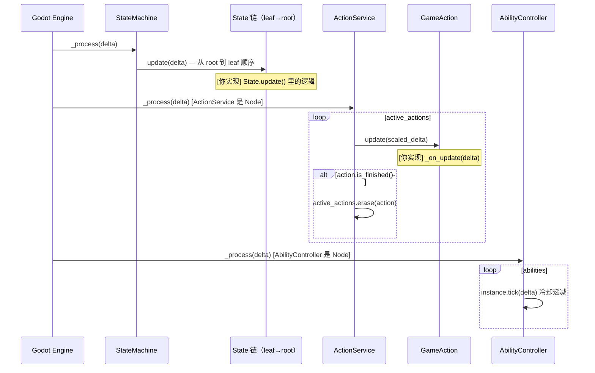
```mermaid
sequenceDiagram
    participant Godot as Godot Engine
    participant SM as StateMachine
    participant Chain as State 链（leaf→root）
    participant AS as ActionService
    participant GA as GameAction
    participant AC as AbilityController

    Godot->>SM: _process(delta)
    SM->>Chain: update(delta) — 从 root 到 leaf 顺序
    Note over Chain: [你实现] State.update() 里的逻辑
    Godot->>AS: _process(delta)  [ActionService 是 Node]
    loop active_actions
        AS->>GA: update(scaled_delta)
        Note over GA: [你实现] _on_update(delta)
        alt action.is_finished()
            AS->>AS: active_actions.erase(action)
        end
    end
    Godot->>AC: _process(delta)  [AbilityController 是 Node]
    loop abilities
        AC->>AC: instance.tick(delta)  冷却递减
    end
```

**注意：** `ActionService._process` 使用 `TimeService.get_scaled_delta`，时间缩放（慢动作、暂停）通过 `TimeService` 统一控制，不直接修改 Godot Engine 时间缩放。

### 关键代码

```gdscript
# State.update 中根据逻辑主动完成 action（以 TimedAttackAction 为例）
class_name AttackState
extends State

var _action: TimedAttackAction = null

func enter(context: Dictionary = {}) -> void:
    _action = TimedAttackAction.new()
    _action.startup_time = 0.1
    _action.active_time = 0.2
    _action.recovery_time = 0.3
    _action.completed.connect(_on_attack_done)
    var as_svc := ServiceRegistry.get_port(ServiceRegistry.SERVICE_ACTIONS) as ActionService
    var ctx := ActionContext.new()
    ctx.source = owner_entity
    as_svc.start_action(_action, ctx)

func _on_attack_done(_action: GameAction) -> void:
    request_transition("Root/Idle", {"reason": "attack_finished"})
```

### 相关文档

→ [concepts.md — 模型 1](concepts.md#模型-1标准管线)  
→ [ref/kernel/ActionService.md](ref/kernel/ActionService.md)  
→ [ref/kernel/StateMachine.md](ref/kernel/StateMachine.md)

---

## P1-3：Command Dispatch

**触发点：** 任意代码发出 `GameCommand`（玩家输入处理、AI Brain、脚本事件）  
**涉及系统：** `CommandService`、`CommandReceiver`、`StateMachine`、`State`  
**输出：** 目标实体的 State 处理命令，或命令被拒绝并发 `command_failed`

### 流程

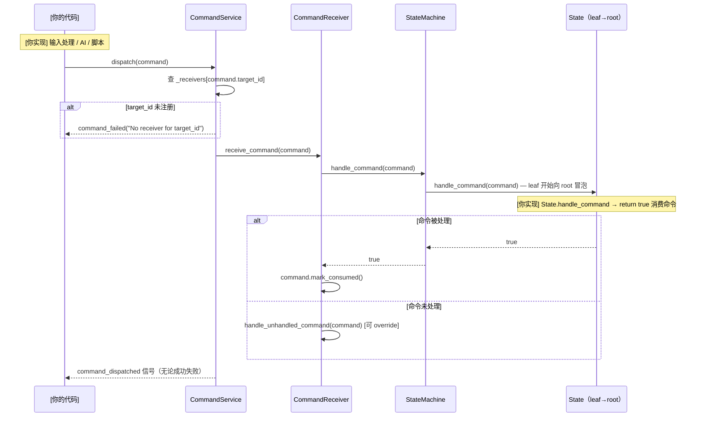
```mermaid
sequenceDiagram
    participant You as [你的代码]
    participant CS as CommandService
    participant CR as CommandReceiver
    participant SM as StateMachine
    participant S as State（leaf→root）

    Note over You: [你实现] 输入处理 / AI / 脚本
    You->>CS: dispatch(command)
    CS->>CS: 查 _receivers[command.target_id]
    alt target_id 未注册
        CS-->>You: command_failed("No receiver for target_id")
    end
    CS->>CR: receive_command(command)
    CR->>SM: handle_command(command)
    SM->>S: handle_command(command) — leaf 开始向 root 冒泡
    Note over S: [你实现] State.handle_command → return true 消费命令
    alt 命令被处理
        S-->>SM: true
        SM-->>CR: true
        CR->>CR: command.mark_consumed()
    else 命令未处理
        CR->>CR: handle_unhandled_command(command)  [可 override]
    end
    CS-->>You: command_dispatched 信号（无论成功失败）
```

### 关键代码

```gdscript
# 发送命令（玩家输入处理器）
func _unhandled_input(event: InputEvent) -> void:
    if event.is_action_pressed("attack"):
        var cmd := GameCommand.create("attack", "player_01", "player_01")
        cmd.payload["direction"] = get_global_mouse_position() - owner.global_position
        var svc := ServiceRegistry.get_port(ServiceRegistry.SERVICE_COMMANDS) as CommandService
        if not svc.dispatch(cmd):
            push_warning("attack command not handled")
```

```gdscript
# State 处理命令
class_name IdleState
extends State

func handle_command(command: GameCommand) -> bool:
    if command.command_type == "attack":
        request_transition("Root/Combat/Attack", {"reason": "attack_command"})
        return true   # 消费命令，阻止向父状态冒泡
    if command.command_type == "move":
        request_transition("Root/Move", {"reason": "move_command"})
        return true
    return false      # 不处理，向父状态冒泡
```

### 相关文档

→ [concepts.md — 模型 1](concepts.md#模型-1标准管线)  
→ [ref/kernel/CommandService.md](ref/kernel/CommandService.md)  
→ [ref/kernel/GameCommand.md](ref/kernel/GameCommand.md)  
→ [cookbook/02_player_entity.md](cookbook/02_player_entity.md)

---

## P1-4：HFSM Transition

**触发点：** `State.request_transition(path)` 或 `StateMachine.transition_to(path)`  
**涉及系统：** `StateMachine`、`State`（当前链 + 目标链）  
**输出：** 当前状态链 exit，目标状态链 enter，`state_changed` 信号

### 流程

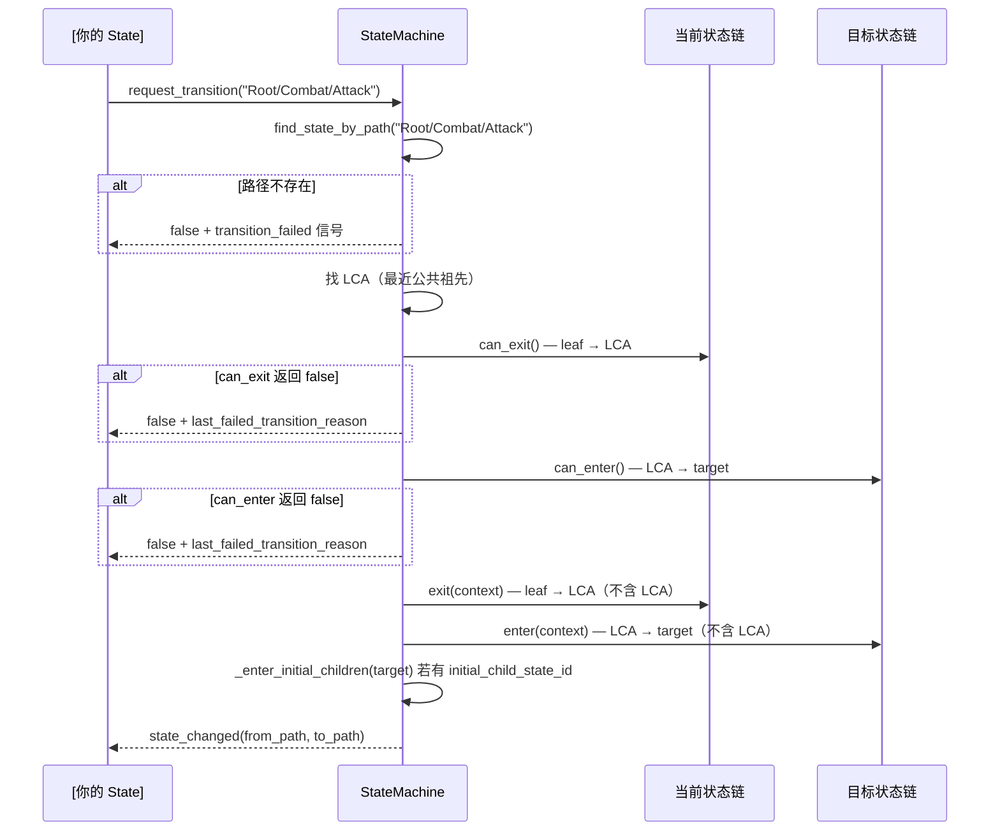
```mermaid
sequenceDiagram
    participant S as [你的 State]
    participant SM as StateMachine
    participant From as 当前状态链
    participant To as 目标状态链

    S->>SM: request_transition("Root/Combat/Attack")
    SM->>SM: find_state_by_path("Root/Combat/Attack")
    alt 路径不存在
        SM-->>S: false + transition_failed 信号
    end
    SM->>SM: 找 LCA（最近公共祖先）
    SM->>From: can_exit() — leaf → LCA
    alt can_exit 返回 false
        SM-->>S: false + last_failed_transition_reason
    end
    SM->>To: can_enter() — LCA → target
    alt can_enter 返回 false
        SM-->>S: false + last_failed_transition_reason
    end
    SM->>From: exit(context) — leaf → LCA（不含 LCA）
    SM->>To: enter(context) — LCA → target（不含 LCA）
    SM->>SM: _enter_initial_children(target)  若有 initial_child_state_id
    SM-->>S: state_changed(from_path, to_path)
```

### 关键代码

```gdscript
# State 实现 can_enter / can_exit 守卫
class_name DashState
extends State

func can_enter(context: Dictionary = {}) -> bool:
    var health := owner_entity.get_node_or_null("Components/HealthComponent") as HealthComponent
    if health == null or health.current_hp <= 0.0:
        return false   # 死亡时不能进入 Dash
    return true

func enter(context: Dictionary = {}) -> void:
    blackboard.set_value("dash_start_pos", owner_entity.global_position)

func exit(context: Dictionary = {}) -> void:
    blackboard.erase_value("dash_start_pos")
```

```gdscript
# 监听 transition 失败
var sm := entity.get_node("StateMachine") as StateMachine
sm.transition_failed.connect(func(from: String, to: String, reason: String) -> void:
    print("TRANSITION FAILED: %s → %s  [%s]" % [from, to, reason])
)
```

### 相关文档

→ [ref/kernel/StateMachine.md](ref/kernel/StateMachine.md)  
→ [ref/kernel/State.md](ref/kernel/State.md)  
→ [debugging.md — 状态没切换](debugging.md#常见问题速查表)

---

## P1-5：Ability Cast

**触发点：** `AbilityController.cast(ability_id, context)`  
**涉及系统：** `AbilityController`、`ActionService`、`GameAction`/`CastAction`、`EffectService`  
**输出：** 效果链执行，冷却开始，`ability_cast_finished` 信号

### 流程

```mermaid
sequenceDiagram
    participant AC as AbilityController
    participant CS as ContentService
    participant AI as AbilityInstance
    participant AS as ActionService
    participant GA as GameAction / CastAction
    participant ES as EffectService

    Note over AC: [mkit 内部] cast(ability_id, ctx)
    AC->>AC: get_cast_failure_reason(ability_id, ctx)
    Note over AC: 检查：已注册、enabled、冷却、cost、conditions
    alt 检查失败
        AC-->>: ability_failed(reason)
    end
    AC->>AC: _pay_cost(definition)
    AC-->>: ability_cast_started(ability_id)

    alt cast_time > 0
        AC->>AS: start_action(CastAction, ctx)
        AS->>GA: start(ctx) → _on_start() 播 "cast" 动画
        loop 每帧 update
            GA->>GA: elapsed >= duration → complete()
        end
        GA->>ES: _fire_effects(on_complete_effects)
    else instant（cast_time == 0）
        AC->>GA: new GameAction; on_complete_effects = definition.effects
        GA->>GA: start(ctx) + complete()
        GA->>ES: _fire_effects(on_complete_effects)
    end

    Note over ES: [mkit 内部] execute_many(effects, ctx)
    ES-->>: EffectResult[]
    AC->>AI: start_cooldown(definition, cdr)
    AC-->>: ability_cast_finished(ability_id)
    AC-->>: cooldown_started(ability_id, duration)
```

**两条路径的关键区别：**
- `cast_time > 0`：`CastAction` 被 `ActionService` 管理，可被 `cancel_tags`（"stun"、"death"、"silence"）打断
- `cast_time == 0`：同帧完成，不进入 `ActionService`，不可被打断

### 关键代码

```gdscript
# State 中触发技能施法
class_name CombatState
extends State

func handle_command(command: GameCommand) -> bool:
    if command.command_type != "cast_ability":
        return false
    var ability_id := command.get_string("ability_id")
    var ac := owner_entity.get_node_or_null("Controllers/AbilityController") as AbilityController
    if ac == null:
        return false
    var ctx := GameplayContext.from_command(command, owner_entity, null)
    if not ac.cast(ability_id, ctx):
        # get_cast_failure_reason 已由 cast() 内部记录并 emit ability_failed
        return false
    request_transition("Root/Combat/Casting", {"reason": "ability_cast"})
    return true
```

```gdscript
# 监听技能失败原因
var ac := entity.get_node("Controllers/AbilityController") as AbilityController
ac.ability_failed.connect(func(id: String, reason: String) -> void:
    print("ability FAILED: %s  reason=%s" % [id, reason])
    # 常见 reason：on_cooldown、insufficient_mana、not_registered
)
```

### 相关文档

→ [concepts.md — 模型 1](concepts.md#模型-1标准管线)  
→ [ref/modules/AbilityController.md](ref/modules/AbilityController.md)  
→ [ref/modules/AbilityDefinition.md](ref/modules/AbilityDefinition.md)  
→ [cookbook/05_ability.md](cookbook/05_ability.md)

---

## P1-6：Effect Execution

**触发点：** `EffectService.execute(effect, context)` 或 `execute_many(effects, context)`（通常由 `GameAction._fire_effects` 调用）  
**涉及系统：** `EffectService`、`GameEffect`、`Condition`/`ConditionEvaluator`  
**输出：** `EffectResult`（success/fail + payload）

### 流程

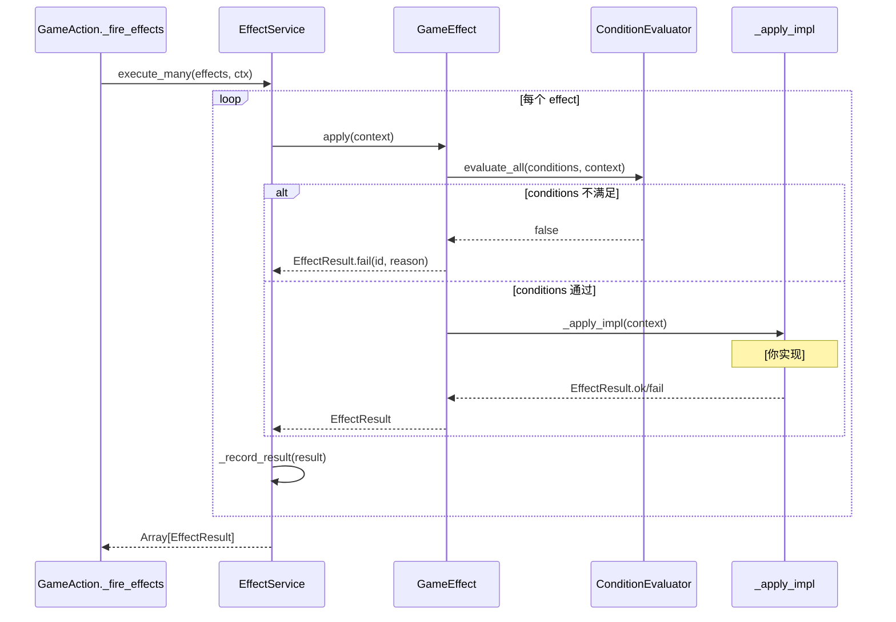
```mermaid
sequenceDiagram
    participant Caller as GameAction._fire_effects
    participant ES as EffectService
    participant GE as GameEffect
    participant CE as ConditionEvaluator
    participant Impl as _apply_impl

    Caller->>ES: execute_many(effects, ctx)
    loop 每个 effect
        ES->>GE: apply(context)
        GE->>CE: evaluate_all(conditions, context)
        alt conditions 不满足
            CE-->>GE: false
            GE-->>ES: EffectResult.fail(id, reason)
        else conditions 通过
            GE->>Impl: _apply_impl(context)
            Note over Impl: [你实现]
            Impl-->>GE: EffectResult.ok/fail
            GE-->>ES: EffectResult
        end
        ES->>ES: _record_result(result)
    end
    ES-->>Caller: Array[EffectResult]
```

### 关键代码

```gdscript
# 自定义 Effect（继承 GameEffect）
class_name HealOnKillEffect
extends GameEffect

func _apply_impl(context: GameplayContext) -> EffectResult:
    var source := context.source
    if source == null:
        return EffectResult.fail(effect_id, "no_source")
    var health := source.get_node_or_null("Components/HealthComponent") as HealthComponent
    if health == null:
        return EffectResult.fail(effect_id, "no_health_component")
    health.heal(25.0)
    return EffectResult.ok(effect_id, {"healed": 25.0})
```

```gdscript
# 手动执行（不经由 GameAction；少数情况下需要直接触发）
var svc := ServiceRegistry.get_service("effects") as EffectService
var ctx := GameplayContext.new()
ctx.source = player
ctx.target = enemy
var result := svc.execute(my_effect, ctx)
if not result.success:
    print("effect failed: %s" % result.failure_reason)
```

```gdscript
# 给 Effect 添加条件（Inspector 或代码配置均可）
var effect := DealDamageEffect.new()
effect.base_amount = 30.0
var cond := TargetInRangeCondition.new()
cond.max_range = 200.0
effect.conditions = [cond]   # 目标超出 200px 时 effect 自动 skip
```

### 相关文档

→ [ref/kernel/GameEffect.md](ref/kernel/GameEffect.md)  
→ [ref/kernel/EffectService.md](ref/kernel/EffectService.md)  
→ [ref/kernel/EffectResult.md](ref/kernel/EffectResult.md)  
→ [debugging.md — Effect 执行了但没效果](debugging.md#常见问题速查表)

---

## P1-7：Damage Resolution

**触发点：** `DealDamageEffect._apply_impl(context)` 构建 `DamageRequest` 并调用 `CombatService.resolve()`  
**涉及系统：** `DealDamageEffect`、`CombatService`、`HealthComponent`、`EventService`  
**输出：** HP 减少，`damage_applied` 信号，若 HP 归零则 `entity_died` 信号

### 流程

```mermaid
sequenceDiagram
    participant DDE as DealDamageEffect
    participant CS as CombatService
    participant HS as HealthComponent
    participant EV as EventService

    Note over DDE: [mkit modules] _apply_impl(ctx)
    DDE->>DDE: 构建 DamageRequest（base_amount、damage_type、can_crit…）
    DDE->>CS: resolve(request)
    Note over CS: [mkit modules] 伤害计算管线
    CS->>CS: base + attack_power
    CS->>CS: × damage_multiplier
    CS->>CS: 暴击判定（crit_chance / crit_damage）
    CS->>CS: max(0, amount - defense)
    CS->>CS: 闪避判定（evade_chance）
    CS->>CS: _roll_on_hit_statuses (on_hit_statuses)
    CS-->>DDE: DamageResult（final_amount、was_critical、was_evaded、trace）
    DDE->>HS: apply_damage(result)
    Note over HS: [mkit modules] current_hp -= final_amount
    alt hp <= 0
        HS->>EV: emit_entity_died(entity_id, entity_ref)
        EV-->>: entity_died 信号
    end
    HS->>EV: emit_damage_applied(result)
    EV-->>: damage_applied 信号
```

**`DamageResult.trace` 字段（调试用）：**

```
{
  "base": 20.0,
  "after_attack_power": 35.0,
  "after_damage_multiplier": 35.0,
  "after_crit": 52.5,          # was_critical = true 时
  "after_defense": 42.5,
  "evaded": true                # was_evaded = true 时
}
```

### 关键代码

```gdscript
# 订阅伤害事件（UI / VFX / 任务推进等）
var events := ServiceRegistry.get_service("events") as EventService
events.damage_applied.connect(func(result: DamageResult) -> void:
    if result.was_critical:
        spawn_crit_vfx(result.target)
    update_damage_number_ui(result.final_amount, result.target)
)
events.entity_died.connect(func(entity_id: String, entity_ref: Node) -> void:
    # 推进击杀任务、触发掉落……
    var quest := ServiceRegistry.get_service("quest") as QuestService
    quest.advance_objective_for_entity(entity_id)
))
```

```gdscript
# 手动构建 DealDamageEffect（在技能 effects 数组中配置，或代码创建）
var dmg := DealDamageEffect.new()
dmg.effect_id = "basic_attack_hit"
dmg.base_amount = 25.0
dmg.damage_type = "physical"
dmg.can_crit = true
dmg.hit_tags = ["melee"]
# 可选：on_hit_statuses = [{"status_id": "bleed", "chance": 0.3, "stacks": 1, "duration": 5.0}]
```

### 相关文档

→ [ref/modules/CombatService.md](ref/modules/CombatService.md)  
→ [ref/modules/DealDamageEffect.md](ref/modules/DealDamageEffect.md)  
→ [ref/modules/HealthComponent.md](ref/modules/HealthComponent.md)  
→ [cookbook/03_health_and_stats.md](cookbook/03_health_and_stats.md)

---

## P2-8：Event Notification

**触发点：** 任意 `EventService.emit_*()`  
**涉及系统：** `EventService`、`DomainEvent`、订阅方（`FeedbackSystem`、`QuestService`、UI、`RoomController` …）  
**输出：** 类型化信号广播 + `recent_events` 入队，所有订阅者收到通知

### 流程

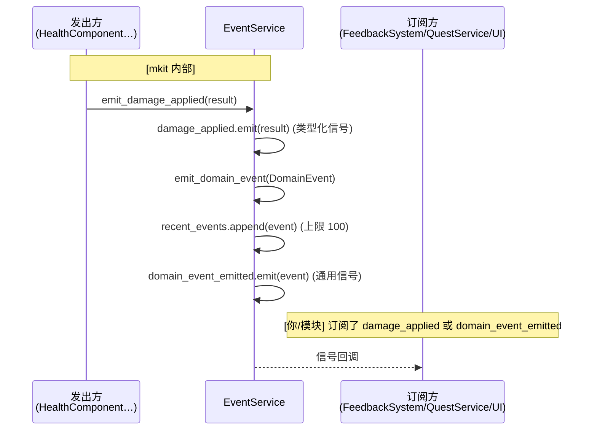
```mermaid
sequenceDiagram
    participant Caller as 发出方<br/>(HealthComponent…)
    participant ES as EventService
    participant Sub as 订阅方<br/>(FeedbackSystem/QuestService/UI)

    Note over Caller,ES: [mkit 内部]
    Caller->>ES: emit_damage_applied(result)
    ES->>ES: damage_applied.emit(result)  (类型化信号)
    ES->>ES: emit_domain_event(DomainEvent)
    ES->>ES: recent_events.append(event)  (上限 100)
    ES->>ES: domain_event_emitted.emit(event)  (通用信号)
    Note over Sub: [你/模块] 订阅了 damage_applied 或 domain_event_emitted
    ES-->>Sub: 信号回调
```

**设计要点：** 每个 `emit_*` 都做两件事——发一个**类型化信号**（`damage_applied`）给精确订阅者，再发一个**通用信号**（`domain_event_emitted`）给"什么都想听"的订阅者（如 `QuestService` 靠它统计目标）。发出方完全不知道谁在听，这是表现层与逻辑层解耦的关键。

### 关键代码

```gdscript
# 精确订阅：只关心伤害
var events := ServiceRegistry.get_service("events") as EventService
events.damage_applied.connect(func(result: DamageResult) -> void:
    print("命中 %.0f（暴击=%s）" % [result.final_amount, result.was_critical])
)

# 通用订阅：监听一切领域事件（调试 / 统计 / 任务）
events.domain_event_emitted.connect(func(event: DomainEvent) -> void:
    print("[%s] %s → %s" % [event.event_type, event.source_id, event.target_id])
)
```

### 相关文档

→ [ref/kernel/EventService.md](ref/kernel/EventService.md) · [ref/kernel/DomainEvent.md](ref/kernel/DomainEvent.md)  
→ [concepts.md — 模型 1：标准管线](concepts.md#模型-1标准管线时序图)（最后一跳）  
→ [debugging.md](debugging.md)（recent_events 回放）

---

## P2-9：Entity Spawn

**触发点：** `EntitySpawner.spawn_entity(definition_id, parent, position)`  
**涉及系统：** `EntitySpawner`、`EntityDefinition`、`EntityIdentity`、`CommandReceiver`、`StatsComponent`、`AbilityController`  
**输出：** 一个已注入身份/属性/技能并挂入场景树的实体节点

### 流程

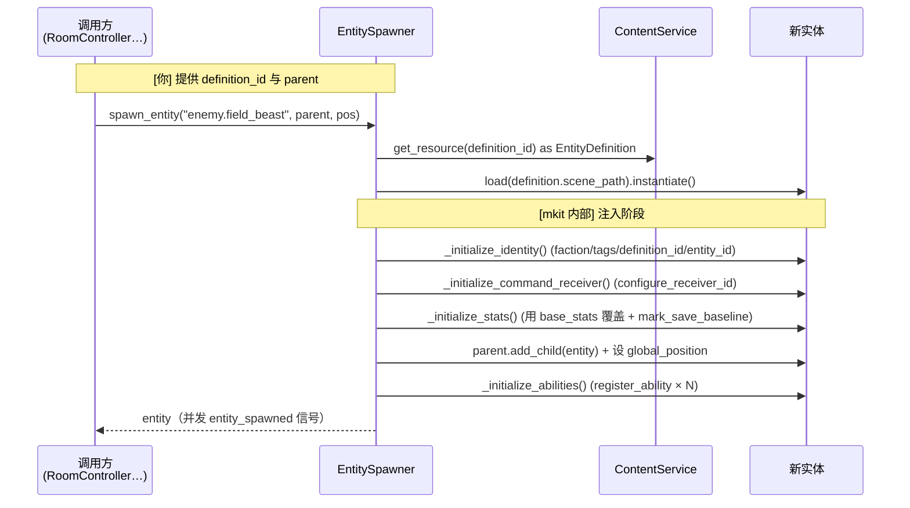
```mermaid
sequenceDiagram
    participant Caller as 调用方<br/>(RoomController…)
    participant SP as EntitySpawner
    participant CS as ContentService
    participant E as 新实体

    Note over Caller,SP: [你] 提供 definition_id 与 parent
    Caller->>SP: spawn_entity("enemy.field_beast", parent, pos)
    SP->>CS: get_resource(definition_id) as EntityDefinition
    SP->>E: load(definition.scene_path).instantiate()
    Note over SP,E: [mkit 内部] 注入阶段
    SP->>E: _initialize_identity()  (faction/tags/definition_id/entity_id)
    SP->>E: _initialize_command_receiver()  (configure_receiver_id)
    SP->>E: _initialize_stats()  (用 base_stats 覆盖 + mark_save_baseline)
    SP->>E: parent.add_child(entity) + 设 global_position
    SP->>E: _initialize_abilities()  (register_ability × N)
    SP-->>Caller: entity（并发 entity_spawned 信号）
```

### 关键代码

```gdscript
var spawner := $EntitySpawner as EntitySpawner
spawner.entity_spawn_failed.connect(func(def_id: String, reason: String) -> void:
    push_warning("spawn 失败 %s：%s" % [def_id, reason])  # missing_definition / missing_scene_path …
)
var enemy := spawner.spawn_entity("enemy.field_beast", $Enemies, Vector2(120, 80))
if enemy != null:
    print("spawned: %s" % (enemy.get_node("EntityIdentity") as EntityIdentity).entity_id)
```

### 相关文档

→ [ref/modules/EntitySpawner.md](ref/modules/EntitySpawner.md) · [ref/modules/EntityDefinition.md](ref/modules/EntityDefinition.md)  
→ [cookbook/07_room.md](cookbook/07_room.md)

---

## P2-10：Animation — Action 驱动通道

**触发点：** `GameAction._on_start()` / `_on_update()`  
**涉及系统：** `GameAction`（及子类）、`Presentation/AnimationPlayer`、`HitboxComponent`  
**输出：** 动画播放，且逻辑（Hitbox 开关）与动画时序严格对齐

### 流程

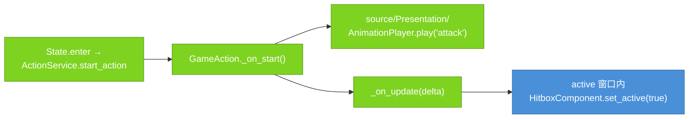
```mermaid
flowchart LR
    A["State.enter →<br/>ActionService.start_action"]:::userOwned -->
    B["GameAction._on_start()"]:::userOwned -->
    C["source/Presentation/<br/>AnimationPlayer.play('attack')"]:::userOwned
    B --> D["_on_update(delta)"]:::userOwned -->
    E["active 窗口内<br/>HitboxComponent.set_active(true)"]:::mkitCore

    classDef mkitCore  fill:#4A90D9,color:#fff,stroke:#2C6FAC
    classDef userOwned fill:#7ED321,color:#fff,stroke:#5A9A18
```
> 🔵 mkit 提供动作生命周期与 Hitbox / 🟢 你提供 AnimationPlayer 动画

**要点：** 动作先 `has_animation(name)` 再 `play`，缺动画静默跳过（不报错）。命中窗口由 `_on_update` 中 `elapsed` 与 startup/active/recovery 时长比较得出——动画与判定共用同一条时间线。

### 关键代码

```gdscript
# 自定义动作里播动画
class_name SpinAttackAction
extends GameAction

func _on_start() -> void:
    action_id = "spin"
    var anim := context.source.get_node_or_null("Presentation/AnimationPlayer") as AnimationPlayer
    if anim != null and anim.has_animation("spin"):
        anim.play("spin")
```

### 相关文档

→ [ref/kernel/GameAction.md](ref/kernel/GameAction.md) · [ref/modules/TimedAttackAction.md](ref/modules/TimedAttackAction.md)  
→ [cookbook/13_animation.md](cookbook/13_animation.md)（通道 A）

---

## P2-11：Animation — 事件反馈通道

**触发点：** `EventService.damage_applied` / `entity_died`  
**涉及系统：** `EventService`、`FeedbackSystem`、`DamageNumberSystem`、`VFXSpawner`、`AudioService`  
**输出：** 浮动伤害数字 + 命中/死亡特效 + 音效（被动触发，与发出方解耦）

### 流程

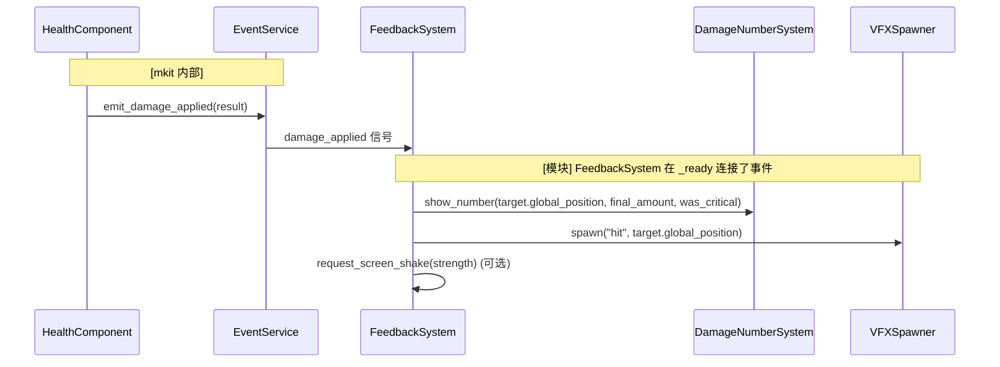
```mermaid
sequenceDiagram
    participant H as HealthComponent
    participant ES as EventService
    participant FS as FeedbackSystem
    participant DN as DamageNumberSystem
    participant VFX as VFXSpawner

    Note over H,ES: [mkit 内部]
    H->>ES: emit_damage_applied(result)
    ES->>FS: damage_applied 信号
    Note over FS,VFX: [模块] FeedbackSystem 在 _ready 连接了事件
    FS->>DN: show_number(target.global_position, final_amount, was_critical)
    FS->>VFX: spawn("hit", target.global_position)
    FS->>FS: request_screen_shake(strength)  (可选)
```

### 关键代码

```gdscript
# FeedbackSystem 全部在 Inspector 配路径，无需写代码：
#   damage_number_system_path = "../DamageNumbers"
#   vfx_spawner_path          = "../Vfx"
# VFXSpawner.vfx_scene_map = {"hit": "...", "death": "..."}

# 想自己监听做别的表现：
var events := ServiceRegistry.get_service("events") as EventService
events.entity_died.connect(func(_id: String, ref: Node) -> void:
    if ref is Node2D:
        ($Vfx as VFXSpawner).spawn("death", (ref as Node2D).global_position)
)
```

### 相关文档

→ [ref/modules/FeedbackSystem.md](ref/modules/FeedbackSystem.md) · [ref/modules/VFXSpawner.md](ref/modules/VFXSpawner.md) · [ref/modules/DamageNumberSystem.md](ref/modules/DamageNumberSystem.md)  
→ [cookbook/13_animation.md](cookbook/13_animation.md)（通道 B）

---

## P3-12：Quest Lifecycle

**触发点：** `AcceptQuestEffect`（接受）/ 任意领域事件（推进）  
**涉及系统：** `QuestService`、`QuestDefinition`、`QuestState`、`EventService`、`AcceptQuestEffect` / `AdvanceObjectiveEffect` / `CompleteQuestEffect`  
**输出：** 任务从 `available → active → completed → turned_in`，达成时跑 `reward_effects`

### 流程

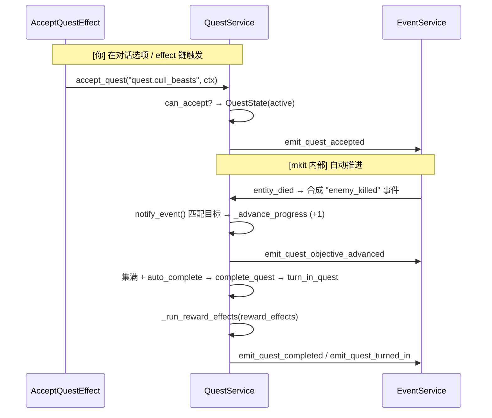
```mermaid
sequenceDiagram
    participant Eff as AcceptQuestEffect
    participant QS as QuestService
    participant ES as EventService

    Note over Eff,QS: [你] 在对话选项 / effect 链触发
    Eff->>QS: accept_quest("quest.cull_beasts", ctx)
    QS->>QS: can_accept? → QuestState(active)
    QS->>ES: emit_quest_accepted
    Note over ES,QS: [mkit 内部] 自动推进
    ES->>QS: entity_died → 合成 "enemy_killed" 事件
    QS->>QS: notify_event() 匹配目标 → _advance_progress (+1)
    QS->>ES: emit_quest_objective_advanced
    QS->>QS: 集满 + auto_complete → complete_quest → turn_in_quest
    QS->>QS: _run_reward_effects(reward_effects)
    QS->>ES: emit_quest_completed / emit_quest_turned_in
```

### 关键代码

```gdscript
# 目标配置（QuestObjectiveDefinition）：对准 QuestService 合成的事件
#   event_type = "enemy_killed"   match_key = "faction"   match_value = "enemy"   required_count = 3
# 手动推进非击杀类目标（如"对话 N 次"）：
var quest := ServiceRegistry.get_service("quest") as QuestService
quest.advance_objective("quest.talk_villagers", "talk", 1)
```

### 相关文档

→ [ref/modules/QuestService.md](ref/modules/QuestService.md) · [ref/modules/QuestDefinition.md](ref/modules/QuestDefinition.md)  
→ [cookbook/10_quest.md](cookbook/10_quest.md)

---

## P3-13：Save / Load

**触发点：** `SaveService.save_game(root)` / `load_game(root)`  
**涉及系统：** `SaveService`、`Saveable`、`SaveableComponent`、`SaveMigration`  
**输出：** 所有 `Saveable` 序列化为 JSON 写盘 / 反序列化恢复

### 流程

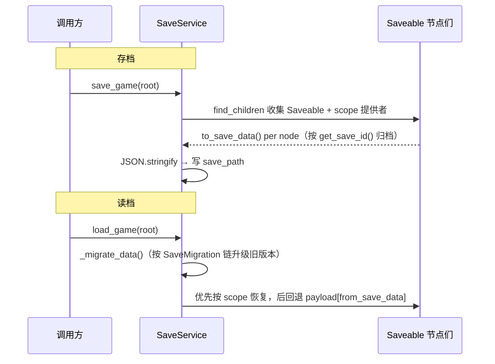
```mermaid
sequenceDiagram
    participant Caller as 调用方
    participant SV as SaveService
    participant N as Saveable 节点们

    Note over Caller,SV: 存档
    Caller->>SV: save_game(root)
    SV->>N: find_children 收集 Saveable + scope 提供者
    N-->>SV: to_save_data() per node（按 get_save_id() 归档）
    SV->>SV: JSON.stringify → 写 save_path

    Note over Caller,SV: 读档
    Caller->>SV: load_game(root)
    SV->>SV: _migrate_data()（按 SaveMigration 链升级旧版本）
    SV->>N: 优先按 scope 恢复，后回退 payload[from_save_data]
```

> **关键：** `SaveService` 默认收集场景树 `Saveable`，并在 scope 注册情况下可按 scope 恢复；`SaveableComponent`（HealthComponent、InventoryController…）仍需由 `Saveable` 代理主动收集——见 [cookbook/11](cookbook/11_progression_and_save.md) 步骤 4。

### 关键代码

```gdscript
var save := ServiceRegistry.get_port(ServiceRegistry.SERVICE_SAVE) as SaveService
save.save_completed.connect(func(path: String): print("已存 → %s" % path))
if not save.save_game(get_tree().root):
    push_error("存档失败")
```

### 相关文档

→ [ref/kernel/SaveService.md](ref/kernel/SaveService.md) · [ref/kernel/Saveable.md](ref/kernel/Saveable.md) · [ref/kernel/SaveableComponent.md](ref/kernel/SaveableComponent.md)  
→ [concepts.md — 模型 4：两条存档契约](concepts.md#模型-4两条存档契约) · [cookbook/11_progression_and_save.md](cookbook/11_progression_and_save.md)

---

## P3-14：Loot Roll

**触发点：** `LootService.roll_table(table_id, ctx)` 或 `generate_options(pool_ids, count, ctx)`  
**涉及系统：** `LootService`、`LootTableDefinition`、`LootEntry`、`LootRollResult`、`RewardSystem`、`RandomService`  
**输出：** 掉落物 `LootRollResult.item_instances` 或可选奖励 `Array[RewardOption]`

### 流程

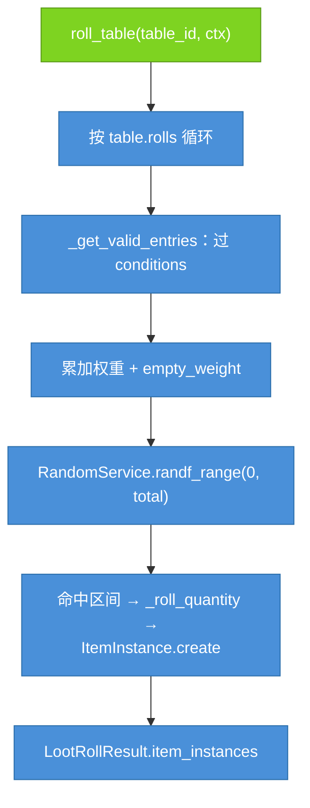
```mermaid
flowchart TB
    A["roll_table(table_id, ctx)"]:::userOwned -->
    B["按 table.rolls 循环"]:::mkitCore -->
    C["_get_valid_entries：过 conditions"]:::mkitCore -->
    D["累加权重 + empty_weight"]:::mkitCore -->
    E["RandomService.randf_range(0, total)"]:::mkitCore -->
    F["命中区间 → _roll_quantity →<br/>ItemInstance.create"]:::mkitCore -->
    G["LootRollResult.item_instances"]:::mkitCore

    classDef mkitCore  fill:#4A90D9,color:#fff,stroke:#2C6FAC
    classDef userOwned fill:#7ED321,color:#fff,stroke:#5A9A18
```

**两个入口：** `roll_table` 走掉落表（权重 + 数量 + 可空）；`generate_options` 走 `RewardSystem`，从 `RewardDefinition` 池**无放回**加权抽 `count` 个 `RewardOption`（房间清空奖励用这条）。`apply_selected(option, ctx)` 再执行选中项的 effect 链。

### 关键代码

```gdscript
var loot := ServiceRegistry.get_service("loot") as LootService
var ctx := GameplayContext.new()
ctx.source = $Player
var result := loot.roll_table("loot.beast_drop", ctx)
for item in result.item_instances:
    print("掉落 %s × %d" % [item.definition_id, item.quantity])
```

### 相关文档

→ [ref/modules/LootService.md](ref/modules/LootService.md) · [ref/modules/LootTableDefinition.md](ref/modules/LootTableDefinition.md) · [ref/modules/RewardSystem.md](ref/modules/RewardSystem.md)  
→ [cookbook/08_loot_and_rewards.md](cookbook/08_loot_and_rewards.md)

---

## P3-15：Dialogue

**触发点：** `DialogueService.start(dialogue_id, ctx)`  
**涉及系统：** `DialogueService`、`DialogueDefinition`、`DialogueNode`、`DialogueChoice`、`DialogueRuntime`  
**输出：** 节点推进、选项求值、节点/选项 effect 触发，结束发 `dialogue_ended`

### 流程

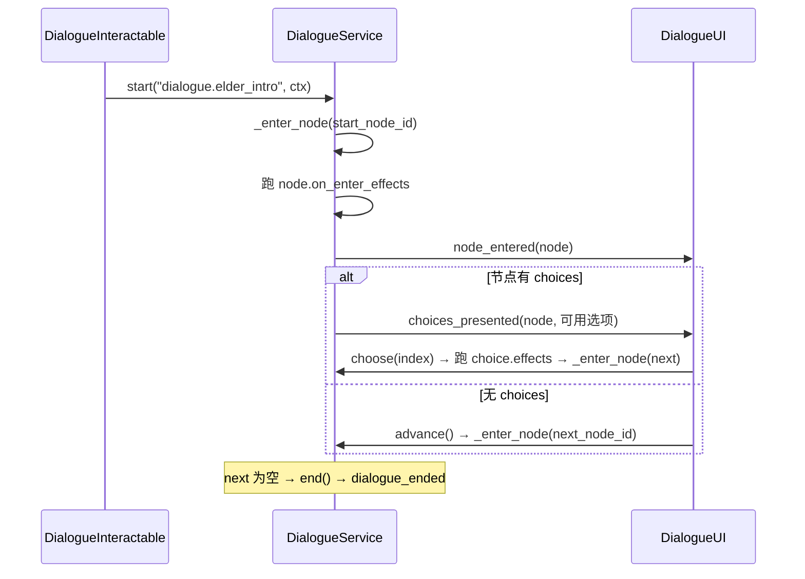
```mermaid
sequenceDiagram
    participant Caller as DialogueInteractable
    participant DS as DialogueService
    participant UI as DialogueUI

    Caller->>DS: start("dialogue.elder_intro", ctx)
    DS->>DS: _enter_node(start_node_id)
    DS->>DS: 跑 node.on_enter_effects
    DS->>UI: node_entered(node)
    alt 节点有 choices
        DS->>UI: choices_presented(node, 可用选项)
        UI->>DS: choose(index) → 跑 choice.effects → _enter_node(next)
    else 无 choices
        UI->>DS: advance() → _enter_node(next_node_id)
    end
    Note over DS: next 为空 → end() → dialogue_ended
```

> 选项的 `conditions` 决定是否在 UI 出现（`get_available_choices` 过滤）；`choose(index)` 的 index 是**可用选项**的下标，不是原始下标。

### 关键代码

```gdscript
var dialogue := ServiceRegistry.get_service("dialogue") as DialogueService
dialogue.dialogue_ended.connect(func(id: String): print("对话结束: %s" % id))
var ctx := GameplayContext.new()
ctx.source = $Player
dialogue.start("dialogue.elder_intro", ctx)   # 已有对话进行中则返回 false
```

### 相关文档

→ [ref/modules/DialogueService.md](ref/modules/DialogueService.md) · [ref/modules/DialogueDefinition.md](ref/modules/DialogueDefinition.md)  
→ [cookbook/09_npc_dialogue.md](cookbook/09_npc_dialogue.md)

---

## P3-16：Shop Purchase

**触发点：** `ShopService.buy(item_id, quantity, buyer)`  
**涉及系统：** `ShopService`、`ShopDefinition`、`ShopEntry`、`SpendCurrencyEffect`、`InventoryController`、`ProgressionService`  
**输出：** 扣货币、物品入包、库存减少，发 `item_purchased`

### 流程

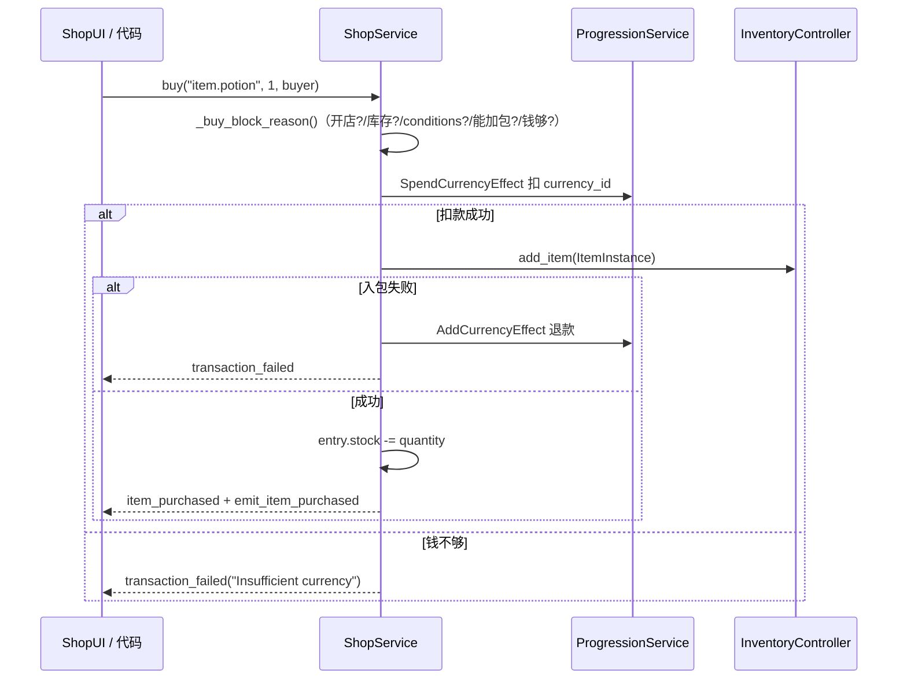
```mermaid
sequenceDiagram
    participant Caller as ShopUI / 代码
    participant SH as ShopService
    participant Prog as ProgressionService
    participant Inv as InventoryController

    Caller->>SH: buy("item.potion", 1, buyer)
    SH->>SH: _buy_block_reason()（开店?/库存?/conditions?/能加包?/钱够?）
    SH->>Prog: SpendCurrencyEffect 扣 currency_id
    alt 扣款成功
        SH->>Inv: add_item(ItemInstance)
        alt 入包失败
            SH->>Prog: AddCurrencyEffect 退款
            SH-->>Caller: transaction_failed
        else 成功
            SH->>SH: entry.stock -= quantity
            SH-->>Caller: item_purchased + emit_item_purchased
        end
    else 钱不够
        SH-->>Caller: transaction_failed("Insufficient currency")
    end
```

> **货币在 `ProgressionService`，不是实体的 `ResourcePoolComponent`。** 买家必须有 `Controllers/InventoryController`。

### 关键代码

```gdscript
var shop := ServiceRegistry.get_service("shop") as ShopService
shop.open_shop("shop.village")
shop.transaction_failed.connect(func(id: String, reason: String): print("失败 %s: %s" % [id, reason]))
if shop.can_buy("item.potion", 1, $Player):
    shop.buy("item.potion", 1, $Player)
```

### 相关文档

→ [ref/modules/ShopService.md](ref/modules/ShopService.md) · [ref/modules/ShopDefinition.md](ref/modules/ShopDefinition.md)  
→ [cookbook/14_shop.md](cookbook/14_shop.md)

---

## P4-17：Progression / Level Up

**触发点：** `ExperienceComponent.add_xp(amount)` / `ProgressionService.unlock_or_level_up(id)`  
**涉及系统：** `ExperienceComponent`、`ExperienceCurve`、`ProgressionService`、`UpgradeDefinition`  
**输出：** 等级提升（`level_up`）/ 永久升级解锁（`upgrade_level_changed`）

### 流程

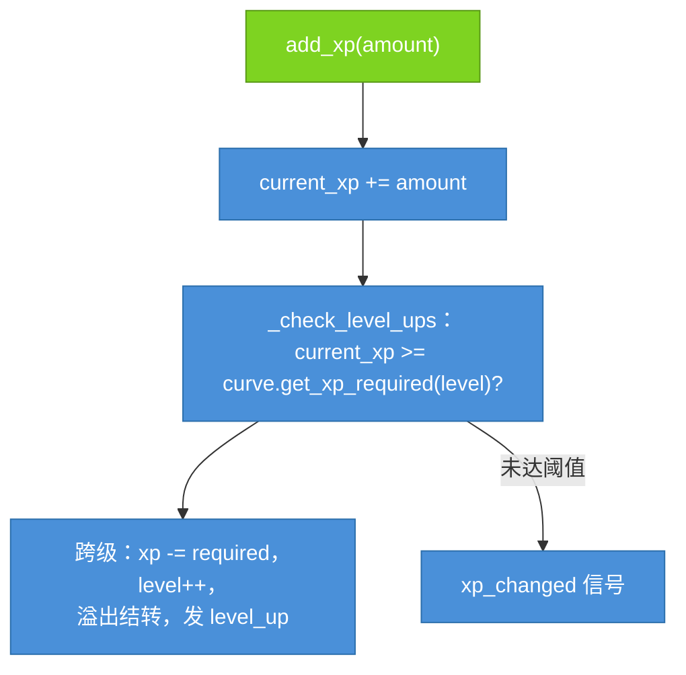
```mermaid
flowchart TB
    A["add_xp(amount)"]:::userOwned -->
    B["current_xp += amount"]:::mkitCore -->
    C["_check_level_ups：<br/>current_xp >= curve.get_xp_required(level)?"]:::mkitCore -->
    D["跨级：xp -= required，level++，<br/>溢出结转，发 level_up"]:::mkitCore
    C -->|未达阈值| E["xp_changed 信号"]:::mkitCore

    classDef mkitCore  fill:#4A90D9,color:#fff,stroke:#2C6FAC
    classDef userOwned fill:#7ED321,color:#fff,stroke:#5A9A18
```

**两套并行系统：** `ExperienceComponent`（实体局内等级，是 `Saveable`）与 `ProgressionService`（全局货币/元升级，也是 `Saveable`）。`unlock_or_level_up` 会校验前置、扣 `currency_id`、跑 `UpgradeDefinition.effects`。

### 关键代码

```gdscript
# 击杀给 XP（自己接线）
events.entity_died.connect(func(_id: String, ref: Node) -> void:
    var idn := ref.get_node_or_null("EntityIdentity") as EntityIdentity if ref != null else null
    if idn != null and idn.faction == "enemy":
        ($Player/ExperienceComponent as ExperienceComponent).add_xp(20)
)

# 花元货币升级
var prog := ServiceRegistry.get_service("progression") as ProgressionService
if prog.can_unlock("upgrade.max_hp"):
    prog.unlock_or_level_up("upgrade.max_hp")
```

### 相关文档

→ [ref/modules/ExperienceComponent.md](ref/modules/ExperienceComponent.md) · [ref/modules/ProgressionService.md](ref/modules/ProgressionService.md)  
→ [cookbook/11_progression_and_save.md](cookbook/11_progression_and_save.md)

---

## P4-18：Room / Run

**触发点：** `RunDirector.start_run(seed)`  
**涉及系统：** `RunDirector`、`DungeonGenerator`、`RoomGraph`、`RoomLoader`、`RoomController`、`RunState`、`EventService`  
**输出：** 线性房间序列逐个加载、清空、推进，直到 `run_finished`

### 流程

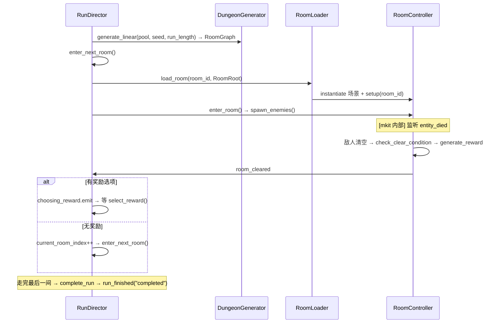
```mermaid
sequenceDiagram
    participant RD as RunDirector
    participant DG as DungeonGenerator
    participant RL as RoomLoader
    participant RC as RoomController

    RD->>DG: generate_linear(pool, seed, run_length) → RoomGraph
    RD->>RD: enter_next_room()
    RD->>RL: load_room(room_id, RoomRoot)
    RL->>RC: instantiate 场景 + setup(room_id)
    RD->>RC: enter_room() → spawn_enemies()
    Note over RC: [mkit 内部] 监听 entity_died
    RC->>RC: 敌人清空 → check_clear_condition → generate_reward
    RC->>RD: room_cleared
    alt 有奖励选项
        RD->>RD: choosing_reward.emit → 等 select_reward()
    else 无奖励
        RD->>RD: current_room_index++ → enter_next_room()
    end
    Note over RD: 走完最后一间 → complete_run → run_finished("completed")
```

> 玩家死亡（`entity_died` 命中 `player_entity_id`）→ `fail_run("player_died")` → `run_finished("failed:player_died")`。

### 关键代码

```gdscript
var director := $RunDirector as RunDirector
director.run_finished.connect(func(result: String): print("Run: %s" % result))
director.choosing_reward.connect(func(opts: Array[RewardOption]):
    # 显示 UI；玩家选定后：
    if not opts.is_empty():
        director.select_reward(opts[0])
)
director.start_run(12345)
```

### 相关文档

→ [ref/modules/RunDirector.md](ref/modules/RunDirector.md) · [ref/modules/RoomController.md](ref/modules/RoomController.md) · [ref/modules/DungeonGenerator.md](ref/modules/DungeonGenerator.md)  
→ [cookbook/07_room.md](cookbook/07_room.md) · [cookbook/08_loot_and_rewards.md](cookbook/08_loot_and_rewards.md)

---

## P4-19：Status Effect Tick

**触发点：** `StatusEffectController._process(delta)`（每帧）  
**涉及系统：** `StatusEffectController`、`StatusEffectInstance`、`StatusEffectDefinition`、`StatsComponent`  
**输出：** 周期触发 `effects_on_tick`，到期移除并卸下属性加成

### 流程

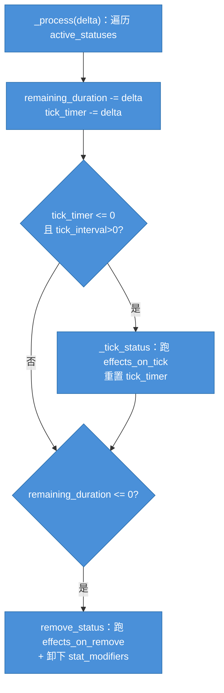
```mermaid
flowchart TB
    A["_process(delta)：遍历 active_statuses"]:::mkitCore -->
    B["remaining_duration -= delta<br/>tick_timer -= delta"]:::mkitCore -->
    C{"tick_timer <= 0<br/>且 tick_interval>0?"}:::mkitCore
    C -->|是| D["_tick_status：跑 effects_on_tick<br/>重置 tick_timer"]:::mkitCore
    C -->|否| E{"remaining_duration <= 0?"}:::mkitCore
    D --> E
    E -->|是| F["remove_status：跑 effects_on_remove<br/>+ 卸下 stat_modifiers"]:::mkitCore

    classDef mkitCore fill:#4A90D9,color:#fff,stroke:#2C6FAC
```

**施加入口有两条：** `ApplyStatusEffect`（effect 链显式施加）或伤害的 `on_hit_statuses`（`CombatService` 掷骰 → `DamageResult.status_applications` → `HealthComponent` 转交）。两者最终都落到 `StatusEffectController.apply_status()`，按 `stack_rule` 叠加。

### 关键代码

```gdscript
# 直接施加（绕过技能）
var ctrl := $Enemy/Controllers/StatusEffectController as StatusEffectController
ctrl.apply_status("status.poison", $Player, 1, -1.0)   # source, stacks, duration_override
ctrl.status_removed.connect(func(id: String): print("状态结束: %s" % id))
```

### 相关文档

→ [ref/modules/StatusEffectController.md](ref/modules/StatusEffectController.md) · [ref/modules/StatusEffectDefinition.md](ref/modules/StatusEffectDefinition.md)  
→ [cookbook/12_status_effects.md](cookbook/12_status_effects.md)

---

## P4-20：Scene / Zone Transition

**触发点：** `SceneService.change_scene(path)` 或 `WorldService.go_to_zone(zone_id, spawn_id)`  
**涉及系统：** `SceneService`、`WorldService`、`ZoneDefinition`、`SpawnPoint`、`Portal`  
**输出：** 场景切换，玩家落到目标出生点，发 `zone_changed`

### 流程

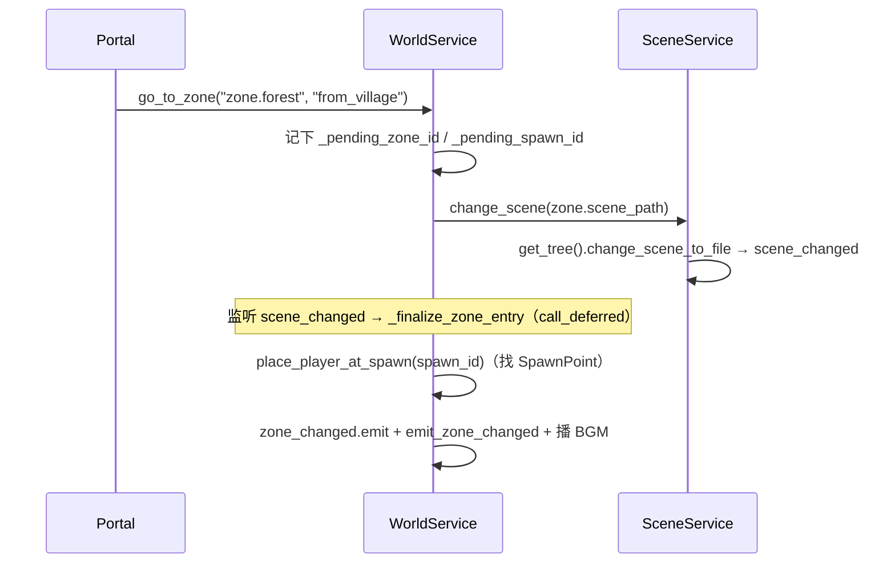
```mermaid
sequenceDiagram
    participant P as Portal
    participant WS as WorldService
    participant SC as SceneService

    P->>WS: go_to_zone("zone.forest", "from_village")
    WS->>WS: 记下 _pending_zone_id / _pending_spawn_id
    WS->>SC: change_scene(zone.scene_path)
    SC->>SC: get_tree().change_scene_to_file → scene_changed
    Note over WS: 监听 scene_changed → _finalize_zone_entry（call_deferred）
    WS->>WS: place_player_at_spawn(spawn_id)（找 SpawnPoint）
    WS->>WS: zone_changed.emit + emit_zone_changed + 播 BGM
```

> 纯换场景用 `SceneService.change_scene`（带 `transition_locked` 防重入）；带"区域 + 出生点 + BGM"语义用 `WorldService.go_to_zone`，目标场景里要有 `spawn_id` 匹配的 `SpawnPoint`。

### 关键代码

```gdscript
# Portal 是 Interactable 子类，交互即跳转，无需写代码：
#   target_zone_id = "zone.forest"   target_spawn_id = "from_village"

# 代码直接换场景：
var scenes := ServiceRegistry.get_service("scenes") as SceneService
if not scenes.change_scene("res://game/scenes/forest.tscn"):
    push_error("场景切换失败")
```

### 相关文档

→ [ref/kernel/SceneService.md](ref/kernel/SceneService.md) · [ref/modules/WorldService.md](ref/modules/WorldService.md) · [ref/modules/Portal.md](ref/modules/Portal.md) · [ref/modules/SpawnPoint.md](ref/modules/SpawnPoint.md)
