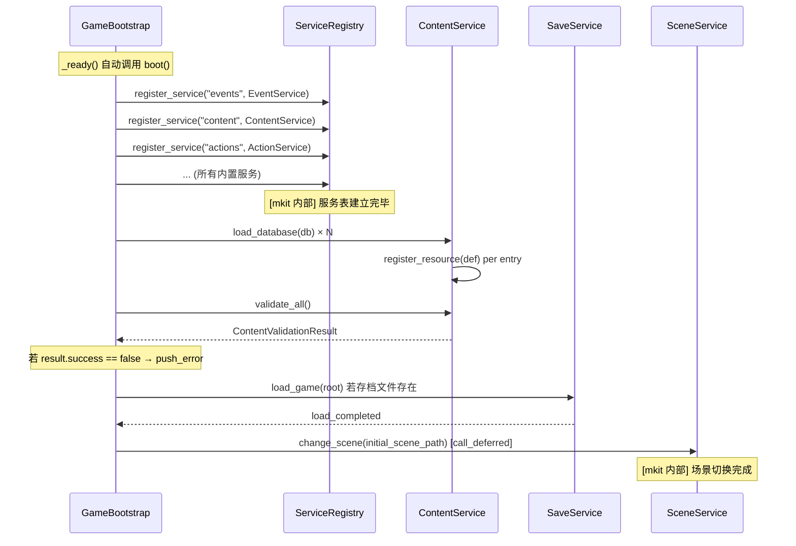
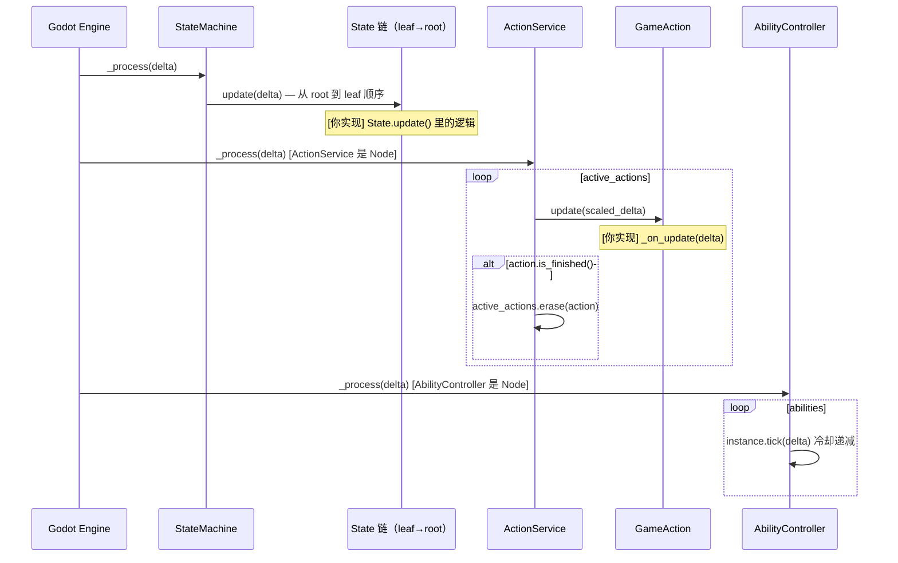
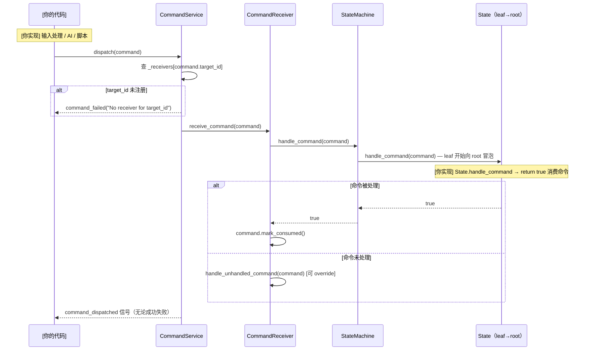
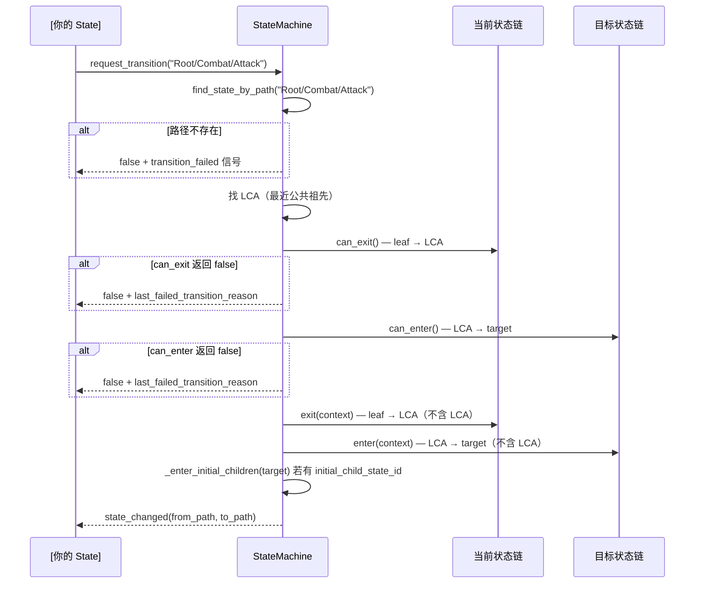
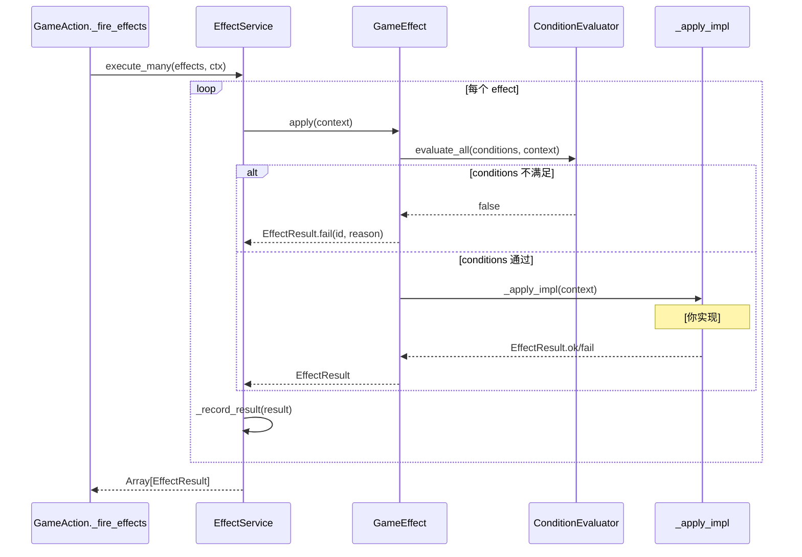

# Pipeline 参考

每条管线描述一个完整流程的调用序列——从触发点到最终输出。

---

## P0-1：Runtime Bootstrap

**触发点：** `GameBootstrap._ready()`  
**涉及系统：** `GameBootstrap`、`ServiceRegistry`、`ContentService`、`SaveService`、`SceneService`  
**输出：** 所有服务在线，内容已注册，存档已加载，初始场景已切换

### 流程



### 关键代码

```gdscript
# 最小 Bootstrap 场景脚本（无需修改，Inspector 配置即可）
# 节点：Node → 挂 GameBootstrap script
# Inspector：
#   resource_databases = [res://game/content/content_db.tres]
#   initial_scene_path = "res://game/scenes/main.tscn"

# 验证服务在线（在任意节点的 _ready 中）
func _ready() -> void:
    if not ServiceRegistry.has_service("content"):
        push_error("Bootstrap has not run yet")
        return
    var content := ServiceRegistry.get_service("content") as ContentService
    print("Registered content IDs: ", content.get_all_by_type("ability_definition"))
```

```gdscript
# 自定义服务注册（继承 GameBootstrap，override _register_kernel_services）
class_name MyBootstrap
extends GameBootstrap

func _register_kernel_services() -> void:
    super._register_kernel_services()    # 先注册所有内置服务
    var my_svc := MyGameService.new()
    ServiceRegistry.register_service("my_game", my_svc)
```

### 相关文档

→ [architecture.md — ServiceRegistry 模式](architecture.md#serviceregistry-模式)  
→ [cookbook/01_bootstrap.md](cookbook/01_bootstrap.md)  
→ [ref/kernel/GameBootstrap.md](ref/kernel/GameBootstrap.md)

---

## P0-2：Main Gameplay Loop（每帧）

**触发点：** Godot `_process(delta)`  
**涉及系统：** `StateMachine`、`State`、`ActionService`、`AbilityController`  
**输出：** 状态 update、action 推进（含完成检测）、冷却 tick

### 流程



**注意：** `ActionService._process` 使用 `TimeService.get_scaled_delta`，时间缩放（慢动作、暂停）通过 `TimeService` 统一控制，不直接修改 Godot Engine 时间缩放。

### 关键代码

```gdscript
# State.update 中根据逻辑主动完成 action（以 TimedAttackAction 为例）
class_name AttackState
extends State

var _action: TimedAttackAction = null

func enter(context: Dictionary = {}) -> void:
    _action = TimedAttackAction.new()
    _action.startup_time = 0.1
    _action.active_time = 0.2
    _action.recovery_time = 0.3
    _action.completed.connect(_on_attack_done)
    var as_svc := ServiceRegistry.get_service("actions") as ActionService
    var ctx := ActionContext.new()
    ctx.source = owner_entity
    as_svc.start_action(_action, ctx)

func _on_attack_done(_action: GameAction) -> void:
    request_transition("Root/Idle", {"reason": "attack_finished"})
```

### 相关文档

→ [concepts.md — 模型 1](concepts.md#模型-1标准管线)  
→ [ref/kernel/ActionService.md](ref/kernel/ActionService.md)  
→ [ref/kernel/StateMachine.md](ref/kernel/StateMachine.md)

---

## P1-3：Command Dispatch

**触发点：** 任意代码发出 `GameCommand`（玩家输入处理、AI Brain、脚本事件）  
**涉及系统：** `CommandService`、`CommandReceiver`、`StateMachine`、`State`  
**输出：** 目标实体的 State 处理命令，或命令被拒绝并发 `command_failed`

### 流程



### 关键代码

```gdscript
# 发送命令（玩家输入处理器）
func _unhandled_input(event: InputEvent) -> void:
    if event.is_action_pressed("attack"):
        var cmd := GameCommand.create("attack", "player_01", "player_01")
        cmd.payload["direction"] = get_global_mouse_position() - owner.global_position
        var svc := ServiceRegistry.get_service("commands") as CommandService
        if not svc.dispatch(cmd):
            push_warning("attack command not handled")
```

```gdscript
# State 处理命令
class_name IdleState
extends State

func handle_command(command: GameCommand) -> bool:
    if command.command_type == "attack":
        request_transition("Root/Combat/Attack", {"reason": "attack_command"})
        return true   # 消费命令，阻止向父状态冒泡
    if command.command_type == "move":
        request_transition("Root/Move", {"reason": "move_command"})
        return true
    return false      # 不处理，向父状态冒泡
```

### 相关文档

→ [concepts.md — 模型 1](concepts.md#模型-1标准管线)  
→ [ref/kernel/CommandService.md](ref/kernel/CommandService.md)  
→ [ref/kernel/GameCommand.md](ref/kernel/GameCommand.md)  
→ [cookbook/02_player_entity.md](cookbook/02_player_entity.md)

---

## P1-4：HFSM Transition

**触发点：** `State.request_transition(path)` 或 `StateMachine.transition_to(path)`  
**涉及系统：** `StateMachine`、`State`（当前链 + 目标链）  
**输出：** 当前状态链 exit，目标状态链 enter，`state_changed` 信号

### 流程



### 关键代码

```gdscript
# State 实现 can_enter / can_exit 守卫
class_name DashState
extends State

func can_enter(context: Dictionary = {}) -> bool:
    var health := owner_entity.get_node_or_null("Components/HealthComponent") as HealthComponent
    if health == null or health.current_hp <= 0.0:
        return false   # 死亡时不能进入 Dash
    return true

func enter(context: Dictionary = {}) -> void:
    blackboard.set_value("dash_start_pos", owner_entity.global_position)

func exit(context: Dictionary = {}) -> void:
    blackboard.erase_value("dash_start_pos")
```

```gdscript
# 监听 transition 失败
var sm := entity.get_node("StateMachine") as StateMachine
sm.transition_failed.connect(func(from: String, to: String, reason: String) -> void:
    print("TRANSITION FAILED: %s → %s  [%s]" % [from, to, reason])
)
```

### 相关文档

→ [ref/kernel/StateMachine.md](ref/kernel/StateMachine.md)  
→ [ref/kernel/State.md](ref/kernel/State.md)  
→ [debugging.md — 状态没切换](debugging.md#常见问题速查表)

---

## P1-5：Ability Cast

**触发点：** `AbilityController.cast(ability_id, context)`  
**涉及系统：** `AbilityController`、`ActionService`、`GameAction`/`CastAction`、`EffectService`  
**输出：** 效果链执行，冷却开始，`ability_cast_finished` 信号

### 流程

```mermaid
sequenceDiagram
    participant AC as AbilityController
    participant CS as ContentService
    participant AI as AbilityInstance
    participant AS as ActionService
    participant GA as GameAction / CastAction
    participant ES as EffectService

    Note over AC: [mkit 内部] cast(ability_id, ctx)
    AC->>AC: get_cast_failure_reason(ability_id, ctx)
    Note over AC: 检查：已注册、enabled、冷却、cost、conditions
    alt 检查失败
        AC-->>: ability_failed(reason)
    end
    AC->>AC: _pay_cost(definition)
    AC-->>: ability_cast_started(ability_id)

    alt cast_time > 0
        AC->>AS: start_action(CastAction, ctx)
        AS->>GA: start(ctx) → _on_start() 播 "cast" 动画
        loop 每帧 update
            GA->>GA: elapsed >= duration → complete()
        end
        GA->>ES: _fire_effects(on_complete_effects)
    else instant（cast_time == 0）
        AC->>GA: new GameAction; on_complete_effects = definition.effects
        GA->>GA: start(ctx) + complete()
        GA->>ES: _fire_effects(on_complete_effects)
    end

    Note over ES: [mkit 内部] execute_many(effects, ctx)
    ES-->>: EffectResult[]
    AC->>AI: start_cooldown(definition, cdr)
    AC-->>: ability_cast_finished(ability_id)
    AC-->>: cooldown_started(ability_id, duration)
```

**两条路径的关键区别：**
- `cast_time > 0`：`CastAction` 被 `ActionService` 管理，可被 `cancel_tags`（"stun"、"death"、"silence"）打断
- `cast_time == 0`：同帧完成，不进入 `ActionService`，不可被打断

### 关键代码

```gdscript
# State 中触发技能施法
class_name CombatState
extends State

func handle_command(command: GameCommand) -> bool:
    if command.command_type != "cast_ability":
        return false
    var ability_id := command.get_string("ability_id")
    var ac := owner_entity.get_node_or_null("Controllers/AbilityController") as AbilityController
    if ac == null:
        return false
    var ctx := GameplayContext.from_command(command, owner_entity, null)
    if not ac.cast(ability_id, ctx):
        # get_cast_failure_reason 已由 cast() 内部记录并 emit ability_failed
        return false
    request_transition("Root/Combat/Casting", {"reason": "ability_cast"})
    return true
```

```gdscript
# 监听技能失败原因
var ac := entity.get_node("Controllers/AbilityController") as AbilityController
ac.ability_failed.connect(func(id: String, reason: String) -> void:
    print("ability FAILED: %s  reason=%s" % [id, reason])
    # 常见 reason：on_cooldown、insufficient_mana、not_registered
)
```

### 相关文档

→ [concepts.md — 模型 1](concepts.md#模型-1标准管线)  
→ [ref/modules/AbilityController.md](ref/modules/AbilityController.md)  
→ [ref/modules/AbilityDefinition.md](ref/modules/AbilityDefinition.md)  
→ [cookbook/05_ability.md](cookbook/05_ability.md)

---

## P1-6：Effect Execution

**触发点：** `EffectService.execute(effect, context)` 或 `execute_many(effects, context)`（通常由 `GameAction._fire_effects` 调用）  
**涉及系统：** `EffectService`、`GameEffect`、`Condition`/`ConditionEvaluator`  
**输出：** `EffectResult`（success/fail + payload）

### 流程



### 关键代码

```gdscript
# 自定义 Effect（继承 GameEffect）
class_name HealOnKillEffect
extends GameEffect

func _apply_impl(context: GameplayContext) -> EffectResult:
    var source := context.source
    if source == null:
        return EffectResult.fail(effect_id, "no_source")
    var health := source.get_node_or_null("Components/HealthComponent") as HealthComponent
    if health == null:
        return EffectResult.fail(effect_id, "no_health_component")
    health.heal(25.0)
    return EffectResult.ok(effect_id, {"healed": 25.0})
```

```gdscript
# 手动执行（不经由 GameAction；少数情况下需要直接触发）
var svc := ServiceRegistry.get_service("effects") as EffectService
var ctx := GameplayContext.new()
ctx.source = player
ctx.target = enemy
var result := svc.execute(my_effect, ctx)
if not result.success:
    print("effect failed: %s" % result.failure_reason)
```

```gdscript
# 给 Effect 添加条件（Inspector 或代码配置均可）
var effect := DealDamageEffect.new()
effect.base_amount = 30.0
var cond := TargetInRangeCondition.new()
cond.max_range = 200.0
effect.conditions = [cond]   # 目标超出 200px 时 effect 自动 skip
```

### 相关文档

→ [ref/kernel/GameEffect.md](ref/kernel/GameEffect.md)  
→ [ref/kernel/EffectService.md](ref/kernel/EffectService.md)  
→ [ref/kernel/EffectResult.md](ref/kernel/EffectResult.md)  
→ [debugging.md — Effect 执行了但没效果](debugging.md#常见问题速查表)

---

## P1-7：Damage Resolution

**触发点：** `DealDamageEffect._apply_impl(context)` 构建 `DamageRequest` 并调用 `CombatService.resolve()`  
**涉及系统：** `DealDamageEffect`、`CombatService`、`HealthComponent`、`EventService`  
**输出：** HP 减少，`damage_applied` 信号，若 HP 归零则 `entity_died` 信号

### 流程

```mermaid
sequenceDiagram
    participant DDE as DealDamageEffect
    participant CS as CombatService
    participant HS as HealthComponent
    participant EV as EventService

    Note over DDE: [mkit modules] _apply_impl(ctx)
    DDE->>DDE: 构建 DamageRequest（base_amount、damage_type、can_crit…）
    DDE->>CS: resolve(request)
    Note over CS: [mkit modules] 伤害计算管线
    CS->>CS: base + attack_power
    CS->>CS: × damage_multiplier
    CS->>CS: 暴击判定（crit_chance / crit_damage）
    CS->>CS: max(0, amount - defense)
    CS->>CS: 闪避判定（evade_chance）
    CS->>CS: _roll_on_hit_statuses (on_hit_statuses)
    CS-->>DDE: DamageResult（final_amount、was_critical、was_evaded、trace）
    DDE->>HS: apply_damage(result)
    Note over HS: [mkit modules] current_hp -= final_amount
    alt hp <= 0
        HS->>EV: emit_entity_died(entity_id, entity_ref)
        EV-->>: entity_died 信号
    end
    HS->>EV: emit_damage_applied(result)
    EV-->>: damage_applied 信号
```

**`DamageResult.trace` 字段（调试用）：**

```
{
  "base": 20.0,
  "after_attack_power": 35.0,
  "after_damage_multiplier": 35.0,
  "after_crit": 52.5,          # was_critical = true 时
  "after_defense": 42.5,
  "evaded": true                # was_evaded = true 时
}
```

### 关键代码

```gdscript
# 订阅伤害事件（UI / VFX / 任务推进等）
var events := ServiceRegistry.get_service("events") as EventService
events.damage_applied.connect(func(result: DamageResult) -> void:
    if result.was_critical:
        spawn_crit_vfx(result.target)
    update_damage_number_ui(result.final_amount, result.target)
)
events.entity_died.connect(func(entity_id: String, entity_ref: Node) -> void:
    # 推进击杀任务、触发掉落……
    var quest := ServiceRegistry.get_service("quest") as QuestService
    quest.advance_objective_for_entity(entity_id)
))
```

```gdscript
# 手动构建 DealDamageEffect（在技能 effects 数组中配置，或代码创建）
var dmg := DealDamageEffect.new()
dmg.effect_id = "basic_attack_hit"
dmg.base_amount = 25.0
dmg.damage_type = "physical"
dmg.can_crit = true
dmg.hit_tags = ["melee"]
# 可选：on_hit_statuses = [{"status_id": "bleed", "chance": 0.3, "stacks": 1, "duration": 5.0}]
```

### 相关文档

→ [ref/modules/CombatService.md](ref/modules/CombatService.md)  
→ [ref/modules/DealDamageEffect.md](ref/modules/DealDamageEffect.md)  
→ [ref/modules/HealthComponent.md](ref/modules/HealthComponent.md)  
→ [cookbook/03_health_and_stats.md](cookbook/03_health_and_stats.md)
