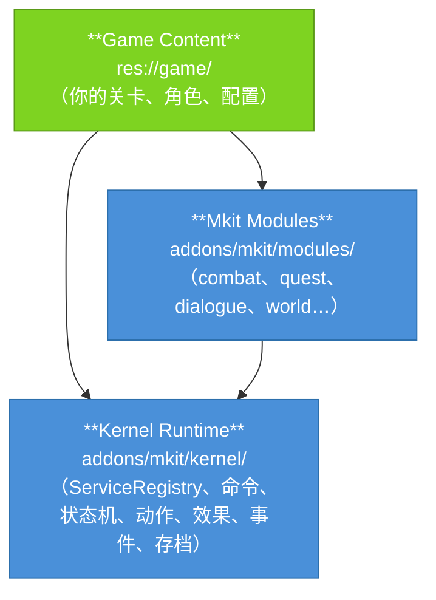
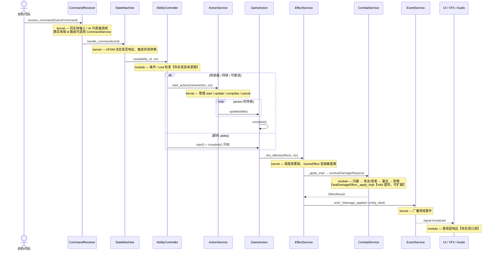

# Mkit

Mkit 是一个面向 Godot 4.6.3 stable 的可复用游戏运行时框架，专为 2D roguelike / RPG 设计。它提供可按需组合的轻路径与命令→状态→动作→效果→事件管线，以及战斗、对话、任务、存档、房间、商店、世界与战利品等可复用游戏系统。

---

## 层架构



🟢 绿色 = 你实现 / 🔵 蓝色 = mkit 负责

**依赖规则：** 依赖只能向下流动。`game/` 可以依赖 modules + kernel；modules 只依赖 kernel；kernel 不依赖任何上层。具体 boss、物品、房间、任务、商店价格、经济规则等内容必须留在 `game/`。

当前代码已经完成大改后的核心分层：`ServiceRegistry` 是唯一 autoload，`GameBootstrap` 启动时把所有内置服务注册进它；实体访问走 `EntityContract`；战斗结算由 `CombatService.resolve()` 一步完成（`DamageRequest` → `DamageResult`）；资源与货币分别由 `ResourceSet` / `Wallet` 承载；存档支持显式 save scope。

---

## 标准管线与短路径

一次玩家输入或 AI 决策从触发到产生游戏效果时，可以按需求选择路径：

| 需求 | 推荐路径 |
|------|----------|
| 已持有目标节点，只做同步变化 | 直接调用 component / domain service；需要 condition 或 trace 时用 `EffectService.execute()` |
| 本实体输入或 AI 命令 | `CommandReceiver.receive_command()` |
| 只知道目标 id | `CommandService.dispatch()` |
| 有前摇、持续、取消或统一 effect 链 | `GameAction` + `ActionService` |

下面是带状态、ability 和 effect 链的标准/高级路径展开：



**kernel 是管线骨架**（Command / HFSM / Action / Effect / Event / Save 均在 kernel）。`GameEffect._apply_impl` 是 effect 落到具体领域的正规接缝；game/module 新代码优先通过 `Mkit.xxx()`，kernel 内部通过 `ServiceRegistry.get_port(XxxService.SERVICE_ID)`，并结合 `EntityContract`、typed context/result 对象访问领域系统，避免散落硬编码 service 字符串和绝对节点路径。

---

## 目录结构

```
addons/mkit/
    kernel/
    bootstrap/        # GameBootstrap — 启动编排，注册所有服务
    services/         # ServiceRegistry, TimeService, RandomService,
                      # SceneService, PoolService, AudioService
    events/           # DomainEvent, EventService
    commands/         # GameCommand, CommandService, CommandReceiver, BuiltinCommands
    context/          # GameplayContext, Blackboard, ActionContext
    registry/         # ContentDefinition, ContentService, ResourceDatabase
    state_machine/    # State, StateMachine (HFSM with LCA transitions)
    actions/          # GameAction, ActionService
    conditions/       # Condition, ConditionEvaluator, builtin conditions
    effects/          # GameEffect, EffectService, EffectResult, builtin effects
    save/             # Saveable, EntitySaveAgent, SaveableComponent, SaveService
    debug/            # DebugOverlay
  modules/
    ai/               # Brain, SimpleAIEnemyBrain
    combat/           # CombatService, DamageRequest/Result,
                      # ResourceSet, HealthComponent, StatsComponent,
                      # AbilityController, HitboxComponent, StatusEffectController…
    entity/           # EntityRoot, EntityContract, EntityIdentity, EntitySpawner
    dialogue/         # DialogueService, DialogueDefinition, DialogueRuntime…
    quest/            # QuestService, QuestDefinition, QuestState…
    loot/             # LootService, DeathLootService, LootTableDefinition, RewardSystem…
    inventory/        # InventoryController, InventoryModel, ItemDefinition…
    progression/      # ProgressionService, Wallet, ExperienceComponent, ExperienceCurve…
    shop/             # ShopService, ShopDefinition…
    world/            # WorldService, ZoneDefinition, DungeonGenerator, RunDirector…
    interaction/      # Interactable, InteractionComponent
    ui/               # UIManager（屏幕栈机制；具体 UI 屏幕属于游戏侧代码）

res://game/           # 你的游戏内容（场景、配置 .tres、脚本）
```

---

## 快速导航

| 我想做… | 去看… |
|---------|-------|
| 第一次接触，跑起来 | [getting_started.md](getting_started.md) |
| 理解三层架构和依赖规则 | [architecture.md](architecture.md) |
| 理解整条管线的"为什么" | [concepts.md](concepts.md) |
| 查某个类的字段/方法 | [Generated API Reference](generated/html/index.html) |
| 按步骤做一个完整 RPG | [cookbook/index.md](cookbook/index.md) |
| 系统不按预期运行 | [debugging.md](debugging.md) |
| 查看当前限制和后续路线 | [roadmap.md](roadmap.md) |
| 查所有管线调用序列 | [pipeline.md](pipeline.md) |
| 查公共事件 payload key | [event_payloads.md](event_payloads.md) |
| 查术语定义 | [glossary.md](glossary.md) |

API reference 由 Godot doctool XML 生成，入口是 [generated/html/index.html](generated/html/index.html)。修改公开 API 或 `##` doc comment 后运行 `make docs-api`，不要直接手写生成页。

## 常用任务入口

| 任务 | 先看 | 关联 Reference |
|------|------|----------------|
| 做一个技能 | [cookbook/05_ability.md](cookbook/05_ability.md) | [AbilityDefinition](generated/html/classes/AbilityDefinition.html), [AbilityController](generated/html/classes/AbilityController.html), [CastAction](generated/html/classes/CastAction.html) |
| 做一个任务 | [cookbook/10_quest.md](cookbook/10_quest.md) | [QuestDefinition](generated/html/classes/QuestDefinition.html), [QuestService](generated/html/classes/QuestService.html), [AdvanceObjectiveEffect](generated/html/classes/AdvanceObjectiveEffect.html) |
| 做一个商店 | [cookbook/14_shop.md](cookbook/14_shop.md) | [ShopDefinition](generated/html/classes/ShopDefinition.html), [ShopService](generated/html/classes/ShopService.html), [ShopEntry](generated/html/classes/ShopEntry.html) |
| 做存档/读档 | [cookbook/11_progression_and_save.md](cookbook/11_progression_and_save.md) | [SaveService](generated/html/classes/SaveService.html), [Saveable](generated/html/classes/Saveable.html), [SaveableComponent](generated/html/classes/SaveableComponent.html) |
| 调试技能没效果 | [debugging.md](debugging.md) | [EffectService](generated/html/classes/EffectService.html), [CommandService](generated/html/classes/CommandService.html), [DebugOverlay](generated/html/classes/DebugOverlay.html) |
