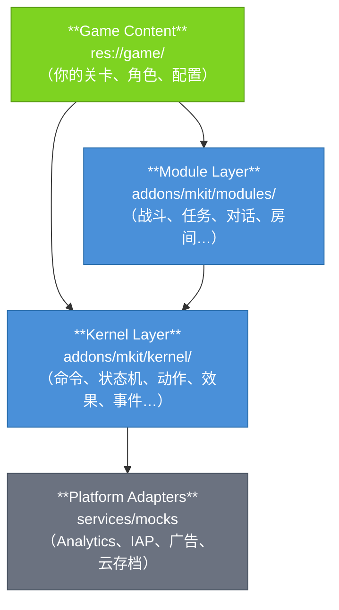
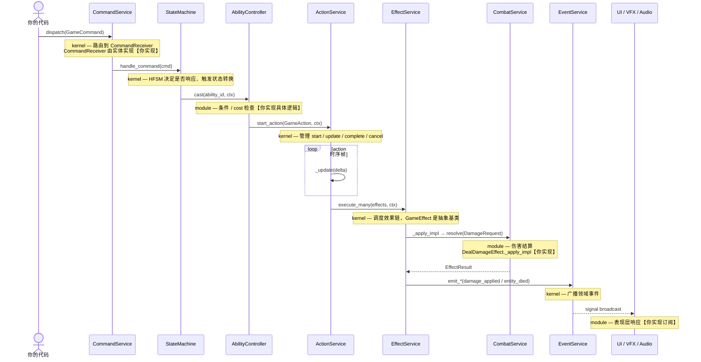

# Mkit

Mkit 是一个面向 Godot 4.x 的可复用游戏运行时框架，专为 2D roguelike / RPG 设计——提供完整的命令→状态→动作→效果→事件管线，以及战斗、对话、任务、存档、房间等即插即用的游戏系统。

---

## 层架构



🟢 绿色 = 你实现 / 🔵 蓝色 = mkit 负责

**依赖规则：** 依赖只能向下流动。`game/` 可以依赖 modules + kernel；modules 只依赖 kernel；kernel 不依赖任何上层。

---

## 标准管线

一次玩家输入或 AI 决策从触发到产生游戏效果的完整路径：



**kernel 是管线的全部骨架**（Command / HFSM / Action / Effect / Event 均在 kernel）。`GameEffect._apply_impl` 是 kernel 穿透到 module 组件的唯一正规接缝，没有"Domain System"这层抽象——effects 直接通过节点路径或 ServiceRegistry 访问 module 组件。

---

## 目录结构

```
addons/mkit/
  kernel/
    bootstrap/        # GameBootstrap — 启动编排，注册所有服务
    services/         # ServiceRegistry, TimeService, RandomService,
                      # SceneService, PoolService, AudioService,
                      # 平台适配器 (Analytics/IAP/Ads/CloudSave)
    events/           # DomainEvent, EventService
    commands/         # GameCommand, CommandService, CommandReceiver, BuiltinCommands
    context/          # GameplayContext, Blackboard, ActionContext
    registry/         # ContentDefinition, ContentService, ResourceDatabase
    state_machine/    # State, StateMachine (HFSM with LCA transitions)
    actions/          # GameAction, ActionService
    conditions/       # Condition, ConditionEvaluator, builtin conditions
    effects/          # GameEffect, EffectService, EffectResult, builtin effects
    save/             # Saveable, SaveableComponent, SaveService, SaveMigration
    debug/            # DebugOverlay
  modules/
    ai/               # Brain, SimpleAIEnemyBrain
    combat/           # CombatService, DamageRequest, HealthComponent, StatsComponent,
                      # AbilityController, HitboxComponent, StatusEffectController…
    entity/           # EntityRoot, EntityIdentity, EntitySpawner, EntityDefinition
    dialogue/         # DialogueService, DialogueDefinition, DialogueRuntime…
    quest/            # QuestService, QuestDefinition, QuestState…
    loot/             # LootService, LootTableDefinition, RewardSystem…
    inventory/        # InventoryController, InventoryModel, ItemDefinition…
    progression/      # ProgressionService, ExperienceComponent, ExperienceCurve…
    shop/             # ShopService, ShopDefinition…
    world/            # WorldService, ZoneDefinition, DungeonGenerator, RunDirector…
    interaction/      # Interactable, InteractionComponent
    ui/               # UIManager, FeedbackSystem, VFXSpawner, DamageNumberSystem…

res://game/           # 你的游戏内容（场景、配置 .tres、脚本）
```

---

## 快速导航

| 我想做… | 去看… |
|---------|-------|
| 第一次接触，跑起来 | [getting_started.md](getting_started.md) |
| 理解三层架构和依赖规则 | [architecture.md](architecture.md) |
| 理解整条管线的"为什么" | [concepts.md](concepts.md) |
| 查某个类的字段/方法 | [ref/kernel/](ref/kernel/GameBootstrap.md) 或 [ref/modules/](ref/modules/AbilityDefinition.md) |
| 按步骤做一个完整 RPG | [cookbook/index.md](cookbook/index.md) |
| 系统不按预期运行 | [debugging.md](debugging.md) |
| 查所有管线调用序列 | [pipeline.md](pipeline.md) |
| 查术语定义 | [glossary.md](glossary.md) |
