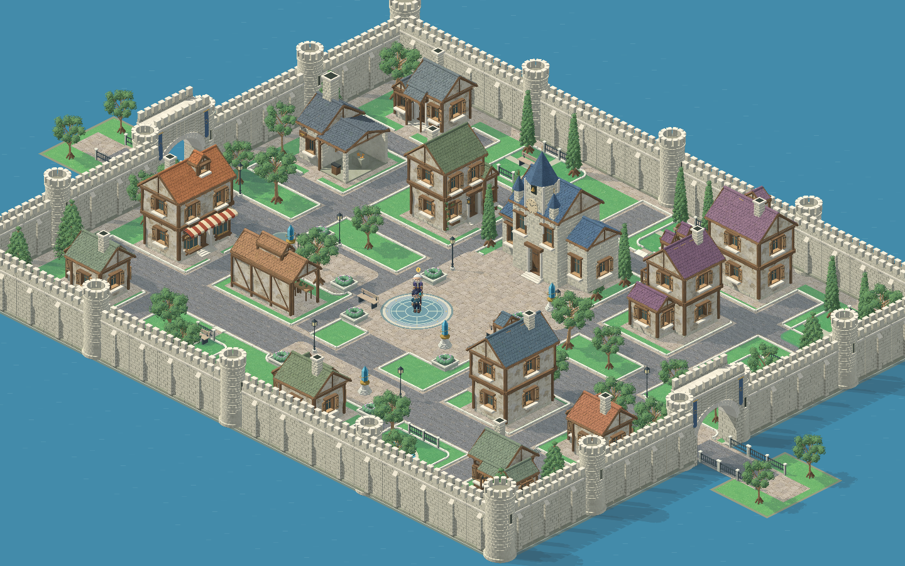
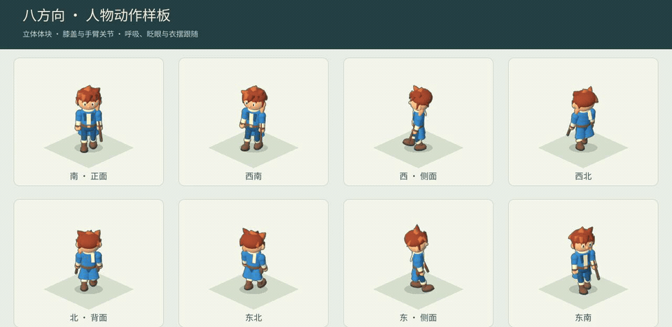
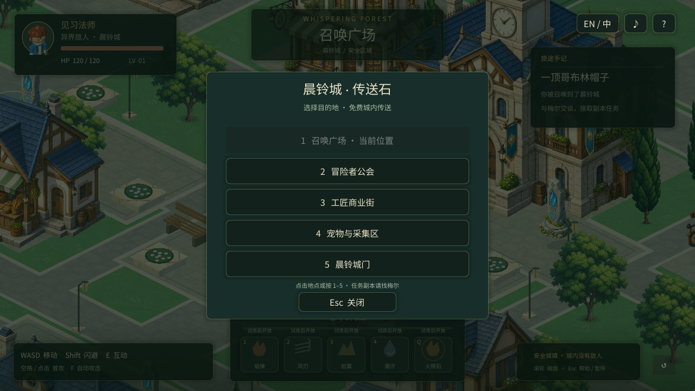

# 晨铃城可玩样板 · Bellwake Playable Sample

2026-09-06 · City Art v0.7 / Shared Daylight v3 · Project Whispering Forest

**素材制作规范**：制作与集成前阅读根目录 [GUIDANCE.md](../../GUIDANCE.md)，统一遵循三维模型、固定正交相机、比例、左上光源、材质细节及实机验收流程。该规范不代表现有资产已全部完成迁移。

玩家被召唤到晨铃城，在安全主城熟悉环境、使用五个传送站；与梅尔接任务后进入独立哥布林副本，带帽子回城交付，再进入四元素练习副本。使用2:1斜视地图，已接入mkit实体、指令、战斗、任务事件和存档服务。

**一级魔法外观修订（2026-09-06）**：[圆形爆炸、薄风带、灰色陨石与渐隐实机录像](preview/elemental-combat-v3.mp4)。火爆术从空中小球向外膨胀，龙卷平滑直行／转弯／绕圈，陨石改成六种冷灰圆／椭圆多面旧石，四种魔法放慢并连续淡出。

**四元素与怪潮更新（上一版机制演示）**：[1级／10级实机对比、怪潮与Boss录像](preview/elemental-combat-v2.mp4)。火爆术在敌人周围爆炸，龙卷持续伤敌并反弹，土系陨石使用六种脏旧碎岩，冰柱从敌人脚下升起。标准远征为五波、每波三分钟，第五波Boss；波次之间有白／金／紫强化卡三选一。实现规格见 [四元素动画与十五分钟远征](<../../game-design/Combat Animation and Waves.md>)。

本轮城市已接入 Blender 制作的独立素材：30 个可编辑 `.blend`、48 个三维源模型、168 张方向精灵。陶红面包房、灰绿药草店、灰紫旅馆与蓝灰工坊使用不同轮廓和朝向；浅石城墙连接门桥，宽街道带浅色人行道、曲线路沿、坡道与排水细节。城市布局保留 198 个独立对象，另由玩法层创建五个传送石。

四向建筑来自同一模型旋转，地基、门前通路和碰撞使用真实模型数据；共用相机、光照与像素密度。下面是实际引擎截图，不是概念图。技术验证与最终美术观感分开记录，完整方法见[统一投影标准](<art/city/Projection Standard.md>)。

本次返修重做了 26 个建筑、树木和墙塔门主体模型。墙体采用绕转角衔接的砌块，屋顶有实体搭接瓦片，木纹沿构件走向；补充石材、旧木、灰泥、铺路石与石板纹理。太阳方向及天空补光共用 `bellwake-daylight-v3`，168 个模型方向额外输出实际三角形投影遮罩，地面可见树叶与城垛的阴影。当前运行时加载 `assets/city-reference-remake/`。



[公会前庭](preview/city-daylight-live.png) · [商业街](preview/city-daylight-market.png) · [城门与桥](preview/city-daylight-gate.png) · [新材质与日光制作记录](art/city/reference-remake/README.md)

完整布局、资产来源与编辑方式见[城市重建说明](art/city/README.md)。Godot中可打开 `city_layout.tscn` 查看独立物件；正常试玩打开 `bootstrap.tscn` 按F6。

## 主城与战斗配乐

已接入两首原创采样乐器配乐：主城《晴日回廊》约 1:51，战斗《裂隙交锋》约 1:47。进入副本和返回主城时平滑换曲，支持完整循环、回城续播、原有静音与战斗冲击时的短暂音乐压低。[试听、编排、制作源文件与验证范围](art/audio/README.md)。重新启动本样板即可使用。

## 人物动态更新

玩家、梅尔和哥布林已更换为简洁立体造型，支持八方向、每向8帧的行走，以及呼吸/眨眼、攻击与结印。源模型与动作参数保存在项目中，方向切换保持人物和右手武器一致。完整制作与复验方法见[人物动态说明](art/characters/README.md)。



[完整人物动作演示](preview/character-motion.mp4) · [房屋对齐前的城市巡览](preview/city-tour.mp4)

双击本目录`Character Animation Studio.command`可并排查看八个方向、切换人物和动作；正常试玩继续使用晨铃城样板入口。

## 启动

在Finder中双击 **晨铃城样板.app** 或 **Play Bellwake Sample.command**。原“晨铃村”启动入口保留兼容，同样运行更新后的场景。如果旧窗口仍开着，请关闭该试玩窗口后重新启动。

`.app`为本机启动器，依赖此仓库与`/Applications/Godot.app`，不是可独立分发的导出游戏。已验证本机Godot **4.7.dev5.official.a8643700c**、Apple M3 Pro、Compatibility渲染；其他版本与平台尚未验收。新检出的仓库需先用编辑器打开并等待资源导入。

也可在仓库根目录运行：

```sh
make forest-sample
```

编辑器中打开`game/whispering_forest/bootstrap.tscn`后按F6运行当前场景。项目默认主场景保留原mkit demo，F5仍会启动默认场景。

## 试玩流程

1. 新档在召唤广场苏醒，按E推进梅尔的接应对白。引导结束后可自由走城，不会自动接受试炼。
2. 靠近蓝色传送石，按E打开菜单，点击地点或按1–5免费移动。Esc/E关闭。五个目的地为召唤广场、冒险者公会、工匠商业街、宠物与采集区、晨铃城门。
3. 回召唤广场找紫袍梅尔，按E接取帽子试炼；最后一句确认准备后自动传送到独立哥布林副本。
4. 使用普攻和闪避击败60 HP哥布林，自动记录任务帽子。按E或B回城，靠近梅尔交付。
5. 交付后仍在安全城内。再次与梅尔交谈，传送到四元素练习副本。普通攻击/技能的命中与击杀积怒，怒气满100时按Q结印召唤火陨石。
6. 副本中随时按B或点右上角“返回城内”。未完成的帽子任务保留，可找梅尔重新进入；拿到帽子后退出不会丢失任务进度。



| 操作 | 按键 |
|---|---|
| 移动 | WASD / 方向键；右键点地面移动，城内自动绕障 |
| 互动、下一句 | E；对话中空格也可继续 |
| 城内传送 | 靠近传送石按E，再点击地点或按1–5 |
| 退出副本 | B / 右上角回城按钮；副本入口或取得帽子后也可按E |
| 闪避 | Shift |
| 普攻附近最近敌人 | 空格 / 鼠标左键 |
| 开关自动普攻 | F |
| 火、风、地、水 | 1、2、3、4 / 点击技能按钮 |
| 结印火陨石 | Q，需100怒气 |
| 中英切换 | L / 右上角EN/中 |
| 暂停与帮助 | Esc / ?；传送菜单中Esc仅关闭菜单 |
| 静音 | M / 音符按钮 |
| 缩放 | 鼠标滚轮 |
| 重置本样板进度 | 右下角重来按钮，5秒内点两次 |

城内右键点击使用绕障寻路，无法到达的目标会提示；键盘输入可打断自动行走。副本右键仍为直线移动。对话、帮助与传送选择暂停玩家行动。技能在城内禁用；倒下后回安全城市恢复，可重新接入副本。

## 当前实现与范围

- 围墙内约56×46逻辑格，另有东西桥及前庭；五街区、召唤台、13栋/9类建筑、44棵规划树木、68段墙、18座塔、2座门、两座桥、五个可操作传送站。
- 人形约72px、哥布林56/74px；建筑与树木按统一米制比例渲染，以模型地面原点记录锚点；建筑使用矩形地基碰撞，物件独立 Y 排序，环境遮挡人物时保持不透明。
- 召唤接应、帽子就职任务、回城交付、未完成任务重入和独立练习地图。切换时卸载旧地图实体，城市与副本不共用敌人列表。
- 法师四元素、冷却、暴击、击退、闪避、敌人红圈蓄力、怒气与结印火陨石。
- 标准远征5波×3分钟，连续分批补怪，普通阶段最多96个活敌人。第12分钟Boss入场，15分钟超时；击败Boss可提前完成。普通怪HP=`40×1.6^(波数−1)`，精英为3倍，BossHP=`5000×2.4^(远征层级−1)`；样板输出倍率仍为`1.5^(波数−1)`，后续需实战调数。
- 四魔法1–10级参数、冷却与面积/数量变化；龙卷反弹次数由技能等级及通用强化卡共同决定。白/金/紫卡概率68%/24%/8%，支持范围、速度、数量、反弹、移速、生命、暴击、技能伤害与怒气收集。
- 中英界面/对白、两首完整原创配乐、合成音效、独立进度存档及旧样板存档兼容。

**这是美术、城镇流程与战斗样板，尚未达到首章完整切片。** 五街区已有分型服务建筑外观；室内场景、公会委托面板、制作商店、宠物与矿工/猎人服务仍待实现。地下灵堂、剧情首章Boss、随机装备、技能石合成界面和其他章节按完整设计继续开发。

为方便试玩，交帽后一次开放四元素与终极。正式版按设计通过技能石取得技能，正式自动槽数量仍是设计待定项。帽子在本样板以任务状态记录，尚未接入通用任务背包。

人物当前已有八向待机、行走、攻击与结印序列；受击、闪避、倒地和拾取仍需独立动作，尚未完成全部正式动画。人物为关节模型烘焙的样板，环境笔触还需与新角色统一。城市布局已保存为可在Godot编辑的独立场景实例；道路与地块以city.gd规划，地面绘制后续可迁入TileMapLayer。池水与VFX为程序绘制，需要后续统一细节精度。

## 素材与地图数据

- `scripts/city.gd`：城市规划、建筑地块、道路、花园、门桥边界与五站固定ID。
- `city_layout.tscn`：198个独立对象；`city_builder.gd`：可重建布局；`city_ground.gd`：城市地面；`architecture.gd`：门墙与家具；`city_sprite.gd`：素材与地基；`city_navigation.gd`：城内寻路。
- `scripts/maps.gd`加载城市/副本；`terrain.gd`与旧`prop.gd`继续用于独立森林副本。
- [Art Revision.md](assets/Art%20Revision.md)：参考图、尺标、校色与生成提示词。
- `assets/manifest.json`：源图来源、尺寸、SHA256、当前使用/替代状态。

当前城市的建筑、树木、墙门、家具和传送石使用独立三维模型，通过 Blender 修整及共享 Godot 相机导出；路沿、围栏保留原生三维模块。imagegen 用于已确认的概念板与表面纹理，旧二维城市图保留为历史记录。本轮人物由可编辑的3D关节模型统一渲染为RGBA动画图集；旧人物图与去品红着色器保留作历史版本，已停止加载。参考游戏截图没有被拆成游戏素材。基础音效由`tools/make_audio.py`原创合成；主城与战斗配乐由`tools/compose_music.py`编曲、GeneralUser GS采样库渲染，完整音源授权随附，参考音乐未被采样。Noto Sans CJK SC字体及OFL授权文件随素材提供。

## 保存与验证

正常游玩保存到`user://whispering_forest_sample_v1.json`，与原demo隔离。当前profile schema为v3，保存引导、任务阶段、波次、四技能等级、怒气、语言和音效偏好，兼容旧v1/v2。每次启动回安全主城并恢复生命，随后可找梅尔交付或重入；不保存完整战斗现场或上次城内站点。本次远征的卡片和倒计时在退出副本后清除。

```sh
make forest-test
make layering contract-check
```

2026-09-06 城市 v0.6 集成检查：城市各传送点、13栋建筑门前、两座桥和外侧前庭可达；实际模拟右键寻路到商业区，地基防穿透与墙/水边界正确。引擎输入与素材检查验证八方向、实际行走帧、固定脚底、停步/受阻回待机、768个透明帧，以及传送石E开菜单、鼠标/1–5选站、Esc取消，五个落点均可走；验证中英按钮、回城按钮、L/E/B/Esc/D输入、任务往返和重入、城内不生成敌人、碰撞、冷却、怒气/陨石、mkit存读档与v1迁移。日志为`preview/verification.log`。框架分层与契约检查通过；这不是全项目或所有平台验收。

开发用`--wf-city-tour`、`--wf-smoke`、`--wf-review`、`--wf-capture=绝对路径`、`--wf-showcase`、`--wf-walk-showcase`隔离正常存档。截图可附加`--wf-en`、`--wf-dialogue`、`--wf-dungeon`、`--wf-travel`、`--wf-station=0..4`、`--wf-overview`。

## 实机预览

- [一级冰音效来源修正 v8：独立的冰1.wav，峰顶播放](preview/ice-v8.mp4) / [来源核对](assets/ice-audio-v8/README.md)
- [多重元素 v7：冰、陨石、风、火各 5 枚在 0.8 秒内依次释放](preview/volley-v7.mp4) / [释放窗口和动画规则](assets/combat-vfx/Multi%20Release.md)
- [一级冰柱 v6：长到最高时命中、冻结并播放指定音效](preview/ice-v6.mp4) / [声音来源与峰顶事件](assets/ice-audio-v6/README.md)
- [一级火焰 v5：参考指导的新爆音、8 帧及约 1.13 秒音画同步收尾](preview/fire-v5.mp4) / [音效与同步规则](assets/fire-audio-v5/README.md)
- [龙卷 v4：宽弧风带、8 帧 / 8 fps、一级与十级命中录音](preview/wind-v4.mp4) / [八帧原点图](preview/wind-eight-v4.png) / [来源与声音规则](assets/wind-audio-v4/README.md)
- [陨石音效 v3：一级、十级四颗与火陨终极](preview/meteor-audio-v3.mp4) / [声音规格与可编辑音轨](assets/meteor-audio-v3/README.md)

- [八帧魔法综合预览：固定冰区、旋转旧石（风带及部分声音已更新，见上方）](preview/elemental-combat-v4.mp4)
- [冰柱八帧原点对照](preview/ice-eight-fixed-pivot.png) / [动画制作与防回归规范](assets/combat-vfx/Animation%20Standard.md)
- [一级魔法旧版 v3](preview/elemental-combat-v3.mp4)
- [四元素1级／10级、怪潮与Boss（v2旧特效）](preview/elemental-combat-v2.mp4)

- [主城中文画面](preview/city-zh.png) / [English](preview/city-en.png)
- [传送石菜单](preview/waystones-zh.png) / [城门街区](preview/city-gate.png)
- [独立战斗副本](preview/dungeon-zh.png)
- [历史城市巡览（旧美术）](preview/city-tour.mp4)
- [城镇传送与四元素演示（v0.4旧城市画面）](preview/skills-showcase.mp4)

旧版约17.6秒四元素演示录像由引擎录制，使用隔离的演示状态：先展示城内传送，再进入练习副本；技能预先开放，终极前填满怒气并暂时保护玩家，以连续展示效果。正常试玩仍需通过帽子任务并在战斗中积怒。

最新修订录像使用隔离展示状态与固定敌人，集中展示一级法术的完整生长和淡出。引擎运行参数 `--wf-combat-review --wf-spell-refinement` 可重放。

上一版约58秒录像同样使用隔离展示状态：前半固定敌人位置比较两档魔法，随后直接展示密集刷怪，并跳到第12分钟检查选卡和Boss。它不代表已经完整打完一局15分钟。重放引擎展示可双击`Review Elemental Combat.command`；机制验证运行`python3 game/whispering_forest/tools/verify_combat.py`，结果在`preview/combat-verification.log`。生成提示词及资产来源见`assets/combat-vfx/prompts.md`。

完整九章设计与开发阶段见`game-design/Design Full.md`和`game-design/Development Plan.md`。
