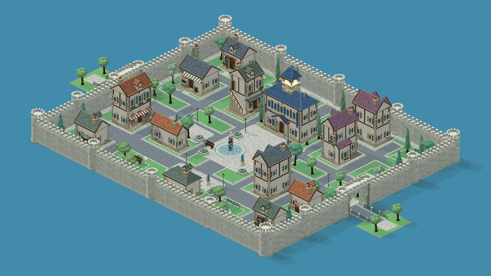

# 晨铃城 · Blender 城市资产与布局

**当前版本为日光与材质返修 v0.7。** 运行时已经切到 `assets/city-reference-remake/`。26 个主体模型重新制作；4 个小道具和 18 个路沿/围栏模块保留几何，全部重新渲染。新一轮源文件、五种绘制纹理、168 份独立投影与导出入口见 [当前制作记录](reference-remake/README.md)。以下 v0.6 索引与旧截图作为前一轮记录，不能用旧 `bake_city.gd` 输出代替当前资产包。

2026-09-06 · 城市美术迭代 v0.6。用户已确认 A/B 概念方向，现有建筑、树木、墙塔门及家具已通过 Blender 几何往返，使用共享相机导出并接入实际城市。**技术检查通过不等于用户已验收最终模型的审美质量。**

[商业街](../../preview/city-blender-market.png) · [公会前庭](../../preview/city-blender-guild.png) · [花园](../../preview/city-blender-garden.png) · [城门与桥](../../preview/city-blender-gate.png)

## 本轮内容

| 类别 | 独立源模型与输出 | 实际改动 |
| --- | --- | --- |
| 建筑 | 9 类功能造型＋4 个住宅屋顶变体；13 个源模型×4 向＝52 张 | 加宽原窄地基；面包房橱窗和陶瓦、药草店外楼梯与檐廊、旅馆阳台和低翼、公会钟楼与屋顶小塔；四向均转同一模型 |
| 植物与传送石 | 7 种树形＋1 个传送石＝8 张 | 阔叶树、幼树、偏冠老树、白桦、云杉、细柏、庭院树；树冠分层、露枝和适度色差 |
| 城市模块 | 27 个源模块×4 向＝108 张 | 三种精确长度墙段、两种塔、厚门洞、长椅、路灯、花盆、围栏和路沿模块 |
| 布局 | 198 个直接场景对象，5 个传送石由玩法层创建 | 13 栋房屋、44 棵树、68 段墙、18 座塔、2 座门；宽主街、浅色步道、圆角路沿、2 个花园坡道与排水格栅 |

屋顶按街区使用陶红、灰绿、蓝灰、灰紫，钟楼保留蓝色。墙面和檐口保持正直，瓦层加入搭接、局部修补色差和小幅边缘磨损。城墙改为浅灰石灰岩，保留灰缝、墙基、墙顶步道和局部污痕。

主体资产的 **30 个 `.blend` 文件** 在 [Blender 模型索引](<Blender Models.md>)，每个文件只有一件独立模型及预览相机/灯光；并非整城模型。其余 18 个路沿/围栏模块保留可编辑 Godot 三维源场景。共 48 个源模型，168 张透明方向精灵。未放入当前地图的备用方向和转角模块只算已导出，不算已摆放。

## 布置原则

北侧公会—召唤广场—南侧伙伴之家形成公共轴，东西大道接到两座有连续墙体的城门与桥。店铺按道路轴线和临街线摆放；模型旋转后的实际门位连接对应街道。树木沿街道绿带、城墙内侧和院落种植，路灯、花坛和长椅避开门口及传送落点。

`city_layout.tscn` 可在 Godot 中逐件选择。`scripts/city.gd` 是道路、地块、花园、城门和传送站的规划来源；`city_builder.gd` 生成场景。手工调整布局前决定是回写规划，还是保留场景为人工编辑源；再次运行生成器会重建该场景。

## 制作与导出

规范以项目根目录 [GUIDANCE.md](../../../../GUIDANCE.md) 为准。唯一渲染配置是 `render_config.gd`：30° 俯视、45° 方位、2:1 地面、32 逻辑单位/米、2 倍烘焙、固定左上光源；正式 PNG 最后在 Godot Forward+ 中渲染，游戏运行使用 Compatibility。

1. 修改 `building_model.gd`、`environment_model.gd`、`civic_model.gd` 后，用 `tools/prepare_blender_city.gd` 准备源场景和 GLB 输入。
2. `tools/optimize_city_blender.py` 使用 Blender 4.1.1 增加磨损倒角、石材顶点色、木构件、招牌与陈设，保存独立 `.blend` 并导出 GLB。可用 `--asset baker_house,inn` 选择批次；不传参数会重建全部 30 件，**会覆盖对应脚本生成的 Blender 源文件，手工精修前请另存版本**。
3. `blender_source.gd` 按源节点恢复共享表面着色器。GLB 只交换模型，不带预览相机/灯光进入正式渲染场景。
4. Godot 导入新 GLB 后，`tools/bake_city.gd` 在共享设置下导出；可用 `-- --asset=baker_house,inn` 选择资产。四向通过模型旋转得到，禁止图片旋转、镜像、拉伸。
5. 再次导入新 PNG，运行 `tools/build_city_scene.gd` 同步地基、门位、碰撞及布局；启动 `bootstrap.tscn` 按 F6 查看实际效果。

`assets/city-built/frames.json` 记录裁切、地面原点、旋转、门位、地基、模型/Blender/GLB 哈希、表面依赖签名与共享配置哈希。`surface-dependencies.json` 同时追踪纹理与着色器，修改表面后旧像素不能冒充最新版本。地面影子由统一运行时层绘制，精灵不重复烘焙地面影子；体积自身阴影保留。人物被环境遮住时按最新 Guidance 保持环境不透明。

## 检查与边界

- `tools/verify_city_assets.gd` 读取实际 168 张 PNG：检查 RGBA、边缘裁切、比例、四向地基、投影锚点、源文件与表面哈希、30 个 Blender 源、实际场景引用、墙段/围栏长度和碰撞尺寸。结果：[技术检查报告](../../preview/city-asset-verification.json)。
- `make forest-test layering contract-check` 检查五站/十三门/两座桥通行、真实输入、任务往返、碰撞、动画与存读档，并执行 mkit 分层和契约检查。日志：[游戏验证](../../preview/verification.log)。
- 上面的五张图均来自真实游戏。`city-aligned-*`、`city-tour.mp4` 等旧截图录像是历史版本，不代表本轮美术。

这次交付是城市资产、布局与接入；室内、店铺交易、装备制作、宠物和挂机采集等系统仍按开发计划推进。当前模型的手绘感、屋顶自然程度和装饰密度仍须以实机观感继续评估，不用素材数量代替美术验收。
