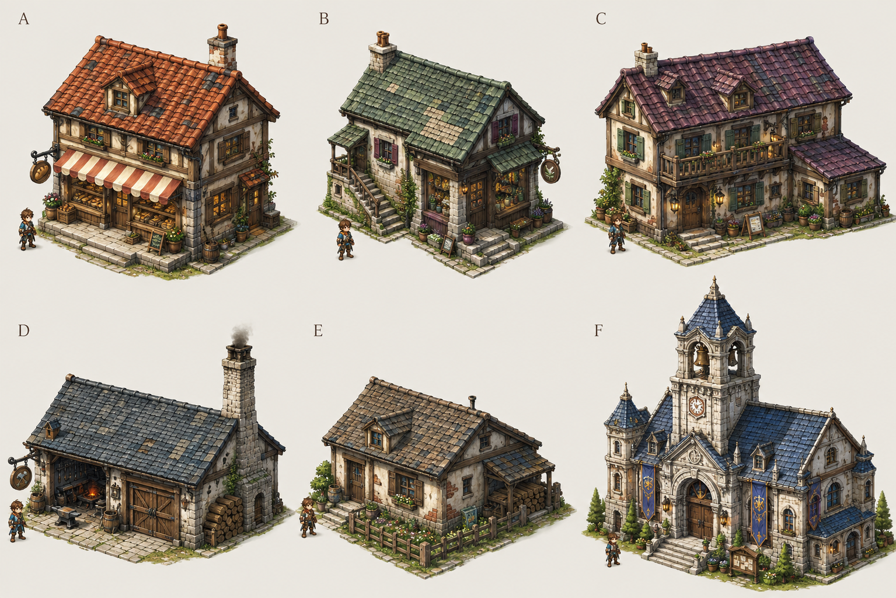
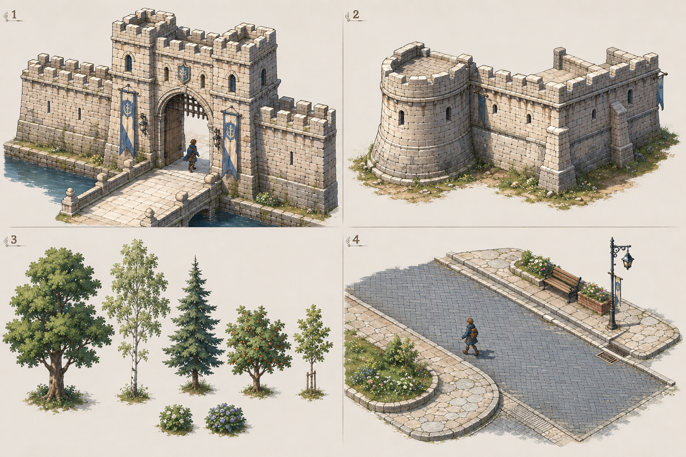

# 晨铃城 · 怀旧日式幻想概念评估

2026-09-06 · 状态：用户已确认方向（“可以”“go”）。以下为图像生成工具制作的概念板，不是游戏截图或已完成的三维素材。已恢复逐件 Blender 制作和实机集成；概念方向获准不等于最终模型已经通过美术验收。

## 建筑

A 陶红面包房；B 灰绿药草店；C 灰紫旅馆；D 蓝灰铁匠铺；E 暖灰庭院住宅；F 浅石色钟楼公会。

## 城市模块

1 城门与相接墙段；2 塔楼和转角墙；3 不同树种、树龄与灌木；4 宽路、小尺度铺砖、浅色人行道、曲线路沿和街道家具。

## 确认后的制作方式

先逐件制作可编辑 Blender 模型；同一个建筑旋转导出四个方向，所有资产使用 `GUIDANCE.md` 中的共用相机、尺度和光照。墙、塔、门、路沿与树木保留独立模块，再按道路、街区、入口与院落进行布局。小范围实机检查通过后才扩展到全城。

概念图中的人物仅用于视觉比例判断。实际世界尺寸、门位、碰撞、模块接缝与投影仍须在三维模型和引擎中验证。来源与完整提示词保存在 `generation-record.json`。
