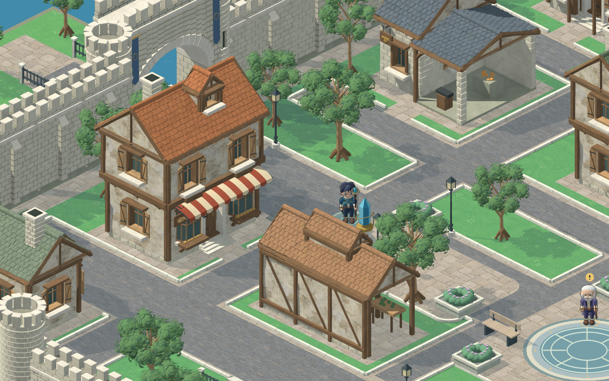

# 城市结构、材质与日光返修 · v0.9

2026-09-06。根据用户指定的城墙、房屋、树木和道路参考重做，补充有使用痕迹的材质；随后统一主角质感。已接入 `scripts/city_art.gd` 指向的 `assets/city-reference-remake/`。旧 `city-built/` 留作上一轮记录与未重做小模块的几何来源。



[召唤广场与主角](../../../preview/city-daylight-live.png) · [城门、桥和连续墙体](../../../preview/city-daylight-gate.png) · [全城](../../../preview/city-daylight-overview.png) · [v0.7 巡览，墙面已被本轮更新](../../../preview/city-daylight-tour.mp4)

## v0.9 建筑深度与瓦面

根据用户提供的旅馆、面包房近景和蓝瓦建筑材质参考，13 种房屋/变体改为组合体块。`architecture_depth.py` 是当前房屋作者模块，由 `build_assets.py` 调用；旧 `building()` 留作上一轮实现记录，不再用于正式房屋导出。

- 面包房：退进门厅、三面凸橱窗、挑出二楼、条纹篷和横向阁楼窗；旅馆：主楼、较低附屋、带侧栏杆及斜撑的阳台和双阁楼窗。
- 公会：石砌中央大厅与较低侧翼；药草店和庭院住宅：主屋/侧室组合；民居：凸窗与横向山墙；工坊：较高工作房和较低开放作业棚；市场：开放拱廊式木架和抬高的采光顶。
- 门窗从厚墙几何中真实开洞，玻璃及门板退入 20–28 cm，门窗侧壁、外挑窗台、雨帽和框架分别建模。每个墙洞做两条独立网格射线检查，防止仅在实心墙前贴一个深色窗框。
- 瓦片采用较密的错缝排列，实心弧面、搭接唇口、少量磨边/缺口、尺寸和颜色差异；屋檐含厚檐板与外露椽尾。新瓦面由内置 imagegen 生成，原文件、完整提示词及实际参考记录于 `materials/roof-generation-record.json`，最终使用 `materials/roof-mineral-painted.png`。
- 表面纹理开启缩小过滤，微小凹凸与成片颜色变化分开控制；保留共享相机、明亮日光和原有屋顶配色。公会/工坊采用浅色实体砌石，木构房屋保留较克制的旧灰泥。
- 记录真实门槛与独立接近距离。退进的门厅仍连接街道，交互落脚点留在碰撞边界外；`city.gd` 按导出距离绘制完整门前步道。

[结构与瓦面前后对比](../../../preview/architecture-depth-comparison.png) · [网格检查](review/structure-mesh-audit.json) · [本轮验证](review/structure-validation.json)

## v0.8 历史：房屋墙面返修

用户指出 v0.7 的房屋墙面仍然太光滑、太新。本轮更新 13 种房屋/变体的模型和材质，正式城市继续引用原有素材路径。灰泥墙增加可见的成片修补、剥落、浅起伏，以及少量有实际厚度的露石边缘；石砌墙、墙脚和烟囱改用边角不齐、表面有浅凹凸的实体砌块。完整重导出素材包，沿用 `bellwake-daylight-v3`，不修改城市布局、入口、碰撞或人物动作。

新灰泥贴图由 imagegen 根据用户提供的参考板生成，只贴到独立三维房屋表面。原图、提示词和用途见 `materials/wall-weathering-record.json`。几何保存在各房屋 `.blend` 中，四向仍由同一个三维模型旋转导出。

同时修复 Blender 导出器的一处材质映射错误：创建顶点颜色层后，旧 UV 引用失效，写入时污染了颜色数据，纹理退化为逐面重复或细碎噪点。现在先分配图层，再重新取得 UV/颜色引用。13 个更新后的 GLB 已检查连续墙面 UV 和实际导出颜色，记录于 `review/wall-mesh-audit.json`。材质强度配置也纳入导出依赖哈希。

[实际显示比例的前后对比](../../../preview/wall-weathering-comparison.png) · [本轮验证记录](review/wall-weathering-validation.json)

## 实际改动

- 重新制作 26 个独立主体模型：13 个功能房屋/屋顶变体、7 种树形、3 种精确长度城墙、2 种塔楼和 1 座门。每个模型保存独立 `.blend` 与 GLB，建筑/城墙按真实三维旋转输出四向。
- 石墙有厚度、凹灰缝、错缝砌块、磨损倒角、墙基及顶面；侧墙接缝绕转角连续。屋顶由有厚度的搭接瓦片构成，窗、门、阁楼窗、檐口与木构件有实际深度。木纹沿梁、柱和门板长轴布置。
- 面包房有条纹布篷、面包陈列和阁楼窗；药草店有花槽和攀藤；旅馆有阳台；铁匠铺有凹入的工作间、铁砧及炉台；公会保留钟塔。不同方向来自同一个模型，门前通路沿真实门位连接。
- 树冠由树干、主枝、细枝与叶片构成，留出透光空隙。没有不透明球形树冠核心。不同树种使用不同高度、分枝结构和冠幅，沿用城市的规划种植位置。
- imagegen 生成五种平面材质：石灰岩、旧橡木、灰泥、小块铺石、人行石板。仅用于模型表面与地面铺装，未生成整座城市背景。提示词与原文件位置记录于 `materials/generation-record.json`。
- 纹理明暗先按材质平均色归一化，再调制所选底色，修复两次相乘把墙和木梁压暗的问题。旧化包含低对比表面变化、墙脚积色、少量苔色、磨边和瓦片色差；避免全屏脏污滤镜。

## 光照与投影

唯一配置为上一级 `render_config.gd`，版本 `bellwake-daylight-v3`。正交俯角 30°、方位 45°、2:1 地面、32 逻辑单位/米、2× 烘焙和 0.5 倍运行时显示保持一致。

太阳方向从偏背面调到能照亮可见左侧立面的角度。太阳强度 1.20，环境补光 0.42，偏冷方向补光 0.16，曝光 1.0。保留自身阴影和环境遮蔽；模型以哑光为主。

`projected_shadow.gd` 把真实网格三角形沿共享太阳方向投到地面，额外导出 168 份透明遮罩，保留叶簇和城垛缺口。地面原点、像素密度与主体相同，运行时用 `city_shadows.gd` 统一绘制并轻微软化边缘。主体 PNG 不重复包含地面阴影。

这套光照通过三维模型烘焙到独立二维精灵，地面影子是独立运行时层；当前没有可动态改变太阳方向的昼夜系统。人物、导师、哥布林及立体法术已按同一配置重导出。主角新增低对比布料/皮革材质并降低金属光泽，动作时序、稳定脚底和竖握长法杖保持原有实现。

## 源文件与导出

| 文件 | 用途 |
| --- | --- |
| `build_assets.py` | 独立主体 Blender 网格作者脚本 |
| `editable/*.blend` | 26 份可单独编辑的 Blender 模型 |
| `models/*.glb`、`models/*.tscn` | 模型交换文件和正式渲染材质场景 |
| `registry.json`、`baseline.json` | 尺寸、用途、门位、几何来源和精确模块长度 |
| `painted_surface.gdshader`、`materials/` | 材质与绘制纹理 |
| `bake_assets.gd` | 读取唯一共享配置，输出主体、投影、原点及来源哈希 |
| `review_street.gd -- --wf-review --live` | 实际游戏运行时截图，不替换游戏素材、不写存档 |

共 48 个可编辑模型：26 个重做主体，4 个保留的 Blender 小道具，以及 18 个保留的精确路沿/围栏三维模块。小道具和路沿重新赋材质与渲染；保留来源在每条方向元数据中标记 `retained_geometry`。备用方向只标记为已导出，当前地图未必逐一摆放。

在项目根目录执行：

```sh
/Applications/Blender.app/Contents/MacOS/Blender --background --python game/whispering_forest/art/city/reference-remake/build_assets.py
/Applications/Godot.app/Contents/MacOS/Godot --headless --editor --path . --import
/Applications/Godot.app/Contents/MacOS/Godot --path . --rendering-method forward_plus --script res://game/whispering_forest/art/city/reference-remake/bake_assets.gd
/Applications/Godot.app/Contents/MacOS/Godot --headless --editor --path . --import
```

Blender 可用 `-- --assets baker_house,guild` 选择重建对象，导出器可用 `-- --assets=baker_house,guild`。脚本重建会覆盖对应生成模型，手工精修应另存版本或回写生成器。共享光照或材质改动后需要完整重导出，不能保留混合配置的旧帧。

## 检查与范围

v0.9 对 13 种建筑执行 128 处墙洞、256 条独立网格射线检查，验证实际开洞；重新执行城市素材及通行检查，结果与五处实机截图见 `review/structure-validation.json`。本轮更新了门前接近距离，未修改人物动作或战斗逻辑。

v0.8 重新运行城市素材检查及 `make forest-test`，并重新截取实际运行时街景。完整结果见 `review/wall-weathering-validation.json`。下列人物、战斗及巡览结果是 v0.7 的验证记录，本轮没有改动或重新认证这些系统。

- `verify_city_assets.gd`：168 个方向、30 个 Blender 来源、198 个场景对象；RGBA、边界、地面原点、尺寸、真实引用、几何/表面/配置哈希和投影遮罩通过检查。
- `make forest-test`：五个传送站、十三个入口、两座桥、实际点击导航、城门碰撞、任务副本往返与存档检查通过。
- `verify_performance.py`：2,368 帧人物、28 张图集、八方向序列与共享配置一致；音效文件的起音和峰值检查通过。
- `check_character_motion.gd`：落脚、八向、竖握法杖与头部稳定性检查通过；最大相邻帧头部位移约 0.253 px，法杖最大偏斜约 1.76°。
- `verify_feel.py`：44 项命中反馈检查以及四元素、怪潮、Boss、怒气与回城隔离回归通过。

实际审阅修复了初版纹理过密、木梁发黑、侧墙横条接缝、阁楼窗被主屋顶掩埋和公会钟面被檐口遮挡的问题。最终游戏截图与巡览作为本轮观感证据；技术检查不代表用户已经确认最终美术质量。
