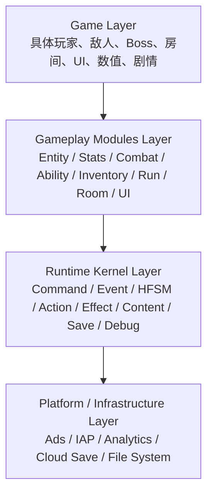
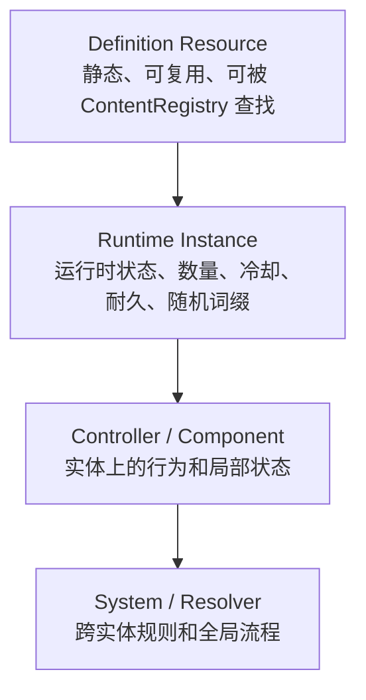
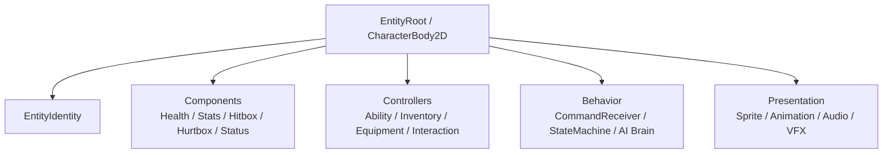
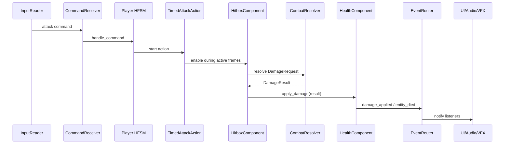
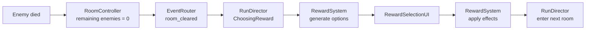

# Godot Mkit 用户手册

Mkit 是一个面向 Godot 4.x 的 2D RPG、roguelike、roguelite、action RPG、dungeon crawler 和 survivor-like 游戏运行时框架。它不是一个固定游戏模板，而是一套可复用的 gameplay kit。

核心原则：

```text
Mkit 提供可复用机制。
具体游戏提供内容、规则、数值、关卡、UI 风格和商业逻辑。
```

本手册按照目标设计说明 Mkit 的使用方式，不以当前代码实现进度为边界。实现细节和接口草案见文末附录。

## 适用对象

这份手册面向三类用户：

| 用户 | 你应该关注 |
| --- | --- |
| Gameplay programmer | Command、HFSM、Action、Effect、Combat、Ability、Run 等核心流程 |
| Game designer | Resource 定义、Content Registry、Stats、Ability、Loot、Reward、Progression |
| Technical artist / UI engineer | EventRouter、UIManager、FeedbackSystem、Audio、VFX、DamageNumber |

## 快速开始

### 1. 安装 addon

把 Mkit 放到 Godot 项目的 addon 目录：

```text
res://addons/mkit/
```

推荐项目结构：

```text
res://addons/mkit/     # kit 本体，保持可复用，不写具体游戏内容
res://game/            # 当前游戏的实体、关卡、内容资源、UI、音频、美术
res://project.godot
```

### 2. 启用插件

在 Godot 编辑器中打开：

```text
Project > Project Settings > Plugins
```

启用 `Mkit` 插件。插件只应该注册一个全局 autoload：

```text
ServiceRegistry
```

不要把每个系统都做成 Autoload。其他系统由 `GameBootstrap` 创建并注册到 `ServiceRegistry`。

### 3. 创建 Bootstrap 场景

创建一个最小启动场景，例如：

```text
res://game/bootstrap.tscn
```

场景结构：

```text
Bootstrap
  GameBootstrap
```

在 Inspector 中配置 `GameBootstrap`：

| 字段 | 配置 |
| --- | --- |
| `resource_databases` | 你的内容数据库资源数组，例如 items、abilities、rooms、upgrades |
| `initial_scene_path` | 启动后进入的主菜单、测试场景或第一张 gameplay 场景 |

然后设置 Godot 主场景：

```text
Project > Project Settings > Application > Run > Main Scene
```

选择：

```text
res://game/bootstrap.tscn
```

不要把 `initial_scene_path` 指向 bootstrap 场景本身，否则会造成重复启动循环。

### 4. 配置 Input Map

在：

```text
Project > Project Settings > Input Map
```

建议添加这些输入动作：

| Action | 建议按键 | 用途 |
| --- | --- | --- |
| `move_left` | A / Left | 移动输入，转成 `move` command |
| `move_right` | D / Right | 移动输入，转成 `move` command |
| `move_up` | W / Up | 移动输入，转成 `move` command |
| `move_down` | S / Down | 移动输入，转成 `move` command |
| `attack` | Space / J | 转成 `attack` command |
| `dash` | Shift / K | 转成 `dash` command |
| `cast_ability_1` | Q | 转成 `cast_ability` command |
| `interact` | E | 转成 `interact` command |
| `open_inventory` | I | 转成 `open_inventory` command |
| `pause` | Escape | 转成 `pause` command |

输入代码不要直接改 HP、状态、背包或场景。输入只负责创建 command。

### 5. 配置物理碰撞

至少规划这些 Collision Layer / Mask：

| Layer | 名称 | 用途 |
| --- | --- | --- |
| 1 | World | 墙、障碍、地形 |
| 2 | Player | 玩家身体 |
| 3 | Enemy | 敌人身体 |
| 4 | PlayerHitbox | 玩家攻击判定 |
| 5 | EnemyHitbox | 敌人攻击判定 |
| 6 | PlayerHurtbox | 玩家受击判定 |
| 7 | EnemyHurtbox | 敌人受击判定 |
| 8 | Pickup | 掉落物和可拾取物 |
| 9 | Interaction | NPC、门、宝箱、机关 |

`HitboxComponent` 检测 `HurtboxComponent`，然后创建 `DamageRequest`。不要让动画、UI 或输入直接计算伤害。

### 6. 创建内容数据库

创建 ResourceDatabase，例如：

```text
res://game/content/db_items.tres
res://game/content/db_abilities.tres
res://game/content/db_enemies.tres
res://game/content/db_rooms.tres
res://game/content/db_rewards.tres
```

每个 definition 都必须有稳定 ID：

```text
item.sword_iron
ability.fireball_basic
enemy.goblin_basic
room.dungeon_small_01
upgrade.attack_plus_20
status.burn
loot.goblin_common
```

稳定 ID 用于 lookup、存档、掉落、奖励、分析和调试。不要依赖临时节点名或 Resource 路径作为长期数据标识。

### 7. 创建玩家实体

推荐玩家场景结构：

```text
PlayerEntity.tscn
  CharacterBody2D
    EntityIdentity
    Components
      StatsComponent
      HealthComponent
      HurtboxComponent
      HitboxComponent
      StatusEffectController
    Controllers
      AbilityController
      InventoryController
      EquipmentController
      InteractionComponent
    Behavior
      CommandReceiver
      StateMachine
        Player
          Alive
            Locomotion
              Idle
              Move
              Dash
            Combat
              BasicAttack
              Cast
          Dead
    Presentation
      SpriteRoot
      AnimationPlayer
      AudioEmitter
      VFXAnchor
    InputReader
```

关键配置：

| 节点 | 必须配置 |
| --- | --- |
| `EntityIdentity` | `entity_id`、`definition_id`、`faction = player`、tags |
| `CommandReceiver` | receiver id，通常等于 entity id |
| `StateMachine` | initial state path，例如 `Player/Alive/Locomotion/Idle` |
| `StatsComponent` | 基础属性，例如 max_hp、move_speed、attack_power |
| `HealthComponent` | 当前 HP，监听 max_hp |
| `HitboxComponent` | 伤害、目标 faction、active frame 开关 |
| `HurtboxComponent` | owner path、damage multiplier、damage tags |

### 8. 创建敌人实体

推荐敌人场景结构：

```text
Goblin.tscn
  CharacterBody2D
    EntityIdentity
    Components
      StatsComponent
      HealthComponent
      HurtboxComponent
      HitboxComponent
      StatusEffectController
    Controllers
      AbilityController
      LootController
    Behavior
      CommandReceiver
      EnemyBrain
      StateMachine
        Enemy
          Alive
            Idle
            Chase
            Attack
            Stunned
          Dead
    Presentation
      SpriteRoot
      AnimationPlayer
      AudioEmitter
      VFXAnchor
```

AI 不应该直接调用 `HealthComponent.apply_damage()` 或修改玩家位置。AI 应该发出 command，比如 chase、attack、cast_ability，然后由 HFSM 和 Action 执行。

### 9. 创建房间和 Run

推荐启动玩法场景：

```text
RunScene.tscn
  RunDirector
  RoomContainer
  PlayerSpawnPoint
  Camera2D
  UI
    HUD
    RewardSelectionUI
  DebugOverlay
```

`RunDirector` 负责开始 run、进入房间、检测房间完成、触发奖励、推进到下一房间、处理失败或通关。

`RoomController` 负责单个房间内的刷怪、门、清场条件和奖励请求。

### 10. 验证第一条完整链路

先不要一次性做所有系统。优先验证：

```text
玩家输入
  -> GameCommand
  -> CommandRouter / CommandReceiver
  -> HFSM
  -> GameAction
  -> GameEffect / Hitbox
  -> CombatResolver
  -> HealthComponent
  -> EventRouter
  -> UI / Audio / VFX / Debug
```

最小验收：

```text
玩家可以移动。
玩家可以攻击。
敌人可以受伤。
敌人可以死亡。
死亡事件可以被房间监听。
房间清理后可以出现奖励。
玩家选择奖励后 run 可以推进。
DebugOverlay 能显示当前状态、最近 command、最近事件、伤害 trace。
```

## 高层架构

### 分层关系



依赖只能向下：

```text
game/ 可以依赖 addons/mkit/
addons/mkit/ 不能依赖 game/
```

允许：

```text
FireballAbility 使用 AbilityController。
Goblin 场景使用 HealthComponent。
RewardSelectionUI 监听 RewardSystem 事件。
```

禁止：

```text
CombatResolver 知道 Fireball 的特殊剧情规则。
LootSystem 知道 Goblin King 这个具体 Boss。
SaveManager 硬编码某个玩家场景路径。
AdService 直接发放某个 revive 奖励。
```

### 核心运行管线

```mermaid
flowchart LR
  Input["Input / AI / Script"]
  Command["GameCommand"]
  Router["CommandRouter"]
  Receiver["CommandReceiver"]
  HFSM["HFSM<br/>StateMachine / State"]
  Action["GameAction<br/>ActionRunner"]
  Effect["GameEffect<br/>EffectExecutor"]
  Domain["Domain System<br/>Combat / Inventory / Reward / Run"]
  Event["EventRouter"]
  Feedback["UI / Audio / VFX / Analytics"]

  Input --> Command --> Router --> Receiver --> HFSM --> Action --> Effect --> Domain --> Event --> Feedback
```



这条管线的价值是统一来源。玩家输入、AI、教程脚本、自动化测试、回放系统和未来网络输入都可以产生相同 command。

### 数据模型



例子：

| Definition | Instance | Controller / Component | System / Resolver |
| --- | --- | --- | --- |
| `ItemDefinition` | `ItemInstance` | `InventoryController` | `LootSystem` |
| `AbilityDefinition` | `AbilityInstance` | `AbilityController` | `EffectExecutor` |
| `StatusEffectDefinition` | `StatusEffectInstance` | `StatusEffectController` | `ConditionEvaluator` |
| `RoomDefinition` | `RoomRuntime` | `RoomController` | `RunDirector` |
| `UpgradeDefinition` | progression entry | `ProgressionState` | `ProgressionSystem` |

### 实体组成



实体不要靠继承膨胀成 `PlayerWithFireSwordAndPoisonAndDash`。使用组合，让玩家、敌人、召唤物、陷阱、可破坏物都共享组件。

## 核心概念

### Definition Resource

Definition 是静态内容数据，通常是 Godot Resource。

为什么需要：

```text
设计师可以在 Inspector 中配置。
同一份定义可以生成多个 runtime instance。
存档可以保存稳定 ID，而不是保存整个 Resource。
ContentRegistry 可以统一校验重复 ID 和缺失引用。
```

什么时候使用：

```text
物品、技能、状态、房间、敌人、升级、掉落表、奖励选项都应该用 definition。
```

场景用例：

```text
Iron Sword 的 ItemDefinition 写 attack_power +5。
游戏掉落 3 把 Iron Sword 时，生成 3 个 ItemInstance。
每个实例可以有不同耐久、词缀、绑定状态。
```

### Runtime Instance

Runtime Instance 是 definition 在一局游戏或一个存档中的可变实例。

为什么需要：

```text
技能有冷却。
物品有数量、耐久和词缀。
状态有效果剩余时间和层数。
房间有当前敌人数和是否清理。
Run 有当前层数、随机种子和奖励历史。
```

什么时候使用：

```text
只要数据会在运行时变化，就不要直接写回 definition。
```

场景用例：

```text
ability.fireball_basic 是定义。
玩家身上的火球技能有 3.2 秒剩余冷却，这是 AbilityInstance。
```

### Component

Component 是挂在实体上的局部能力和状态。

为什么需要：

```text
让实体组合出能力，而不是写深继承树。
HealthComponent 可用于玩家、敌人、箱子、召唤物。
StatsComponent 可用于单位、装备镜像、房间 buff。
```

什么时候使用：

```text
某个能力属于一个实体，并且需要跟随这个实体生命周期时，用 Component。
```

场景用例：

```text
敌人死亡时，HealthComponent 发出 died。
RoomController 监听事件后减少 active enemy count。
LootSystem 再根据死亡来源生成掉落。
```

### Controller

Controller 是挂在实体或系统节点上的流程协调器。

为什么需要：

```text
能力、背包、装备、状态这些功能需要管理多个 instance。
它们不只是一个数值，也不是纯全局系统。
```

什么时候使用：

```text
当一个实体拥有多项可管理能力时，用 Controller。
```

场景用例：

```text
AbilityController 管理玩家拥有的所有技能，检查冷却、消耗、条件，然后启动 CastAction 和 effects。
```

### System / Resolver

System 或 Resolver 负责跨实体规则。

为什么需要：

```text
伤害公式、掉落生成、奖励选择、存档、房间推进不是单个实体的私有逻辑。
这些规则需要集中，才能调试、替换和测试。
```

什么时候使用：

```text
当逻辑需要多个实体、全局配置、随机种子或跨模块协调时，用 System / Resolver。
```

场景用例：

```text
CombatResolver 读取攻击者 Stats 和目标 Stats，计算 DamageResult。
HealthComponent 只负责应用结果。
```

### Command

Command 表示意图，不表示结果。

为什么需要：

```text
统一玩家输入、AI、脚本、测试和回放。
让输入层不直接碰 gameplay 状态。
让 HFSM 判断当前状态是否允许这个意图。
```

什么时候使用：

```text
移动、攻击、释放技能、交互、选择奖励、暂停、打开背包都应该是 command。
```

场景用例：

```text
玩家按 Space，InputReader 发出 attack command。
如果玩家在 Dead 状态，HFSM 拒绝。
如果玩家在 Idle 状态，HFSM 进入 BasicAttack。
```

### HFSM

HFSM 是 hierarchical finite state machine，即层级有限状态机。

为什么需要：

```text
动作游戏和 roguelike 的状态会快速增长。
Alive、Dead、Stunned、Locomotion、Combat、Casting、Dashing 需要共享父状态逻辑。
层级状态可以做干净的全局打断，比如任何 Alive 子状态都能切到 Dead。
```

什么时候使用：

```text
实体行为模式、房间生命周期、run 生命周期都适合 HFSM。
```

场景用例：

```text
Player/Alive/Locomotion/Move 收到 attack command。
HFSM 用 LCA 转换退出 Move 和 Locomotion，进入 Combat 和 BasicAttack。
```

### Action

Action 表示随时间执行的过程。

为什么需要：

```text
攻击有 startup、active、recovery。
冲刺有持续时间。
施法有读条。
投射物可能延迟生成。
动画等待和 channel 都不是瞬时结果。
```

什么时候使用：

```text
任何需要 update、cancel、complete 的 gameplay 过程都应该是 Action。
```

场景用例：

```text
BasicAttackState 启动 TimedAttackAction。
Action 在 active frame 打开 hitbox。
Action 完成后通知 State 返回 Idle。
```

### Condition

Condition 是可复用条件检查。

为什么需要：

```text
技能、装备、奖励、AI、状态转换都需要条件。
把条件做成 Resource 后，可以组合、复用、在 Inspector 中配置。
```

什么时候使用：

```text
目标在范围内、冷却完成、魔法足够、拥有标签、生命低于比例、房间已清理。
```

场景用例：

```text
Fireball 的 AbilityDefinition 有 TargetInRangeCondition 和 HasEnoughManaCondition。
AbilityController.can_cast() 统一检查。
```

### Effect

Effect 表示声明式 gameplay 结果。

为什么需要：

```text
技能、物品、奖励、状态 tick 都会产生类似结果。
声明式 effect 可以复用、序列化、调试和组合。
```

什么时候使用：

```text
造成伤害、治疗、应用状态、生成场景、发放物品、修改属性、播放 VFX、启动冷却。
```

场景用例：

```text
PoisonStatus 每秒执行 DealDamageEffect。
HealingPotion 使用 HealEffect。
RewardOption 使用 ApplyStatModifierEffect。
```

### Event

Event 是已经发生的事实，不是请求。

为什么需要：

```text
UI、音频、VFX、分析、成就和任务系统都需要知道发生了什么。
它们不应该被 CombatResolver 或 InventoryController 直接调用。
```

什么时候使用：

```text
damage_applied、entity_died、item_collected、room_cleared、reward_selected、run_started、run_finished。
```

场景用例：

```text
HealthComponent 发现 HP 到 0 后发出 entity_died。
RoomController、FeedbackSystem、AnalyticsService 都可以监听。
```

### GameplayContext

GameplayContext 是一次行为执行时的上下文。

为什么需要：

```text
Effect 和 Condition 需要知道 source、target、position、direction、ability_id、item_id、payload。
比到处传 Dictionary 更安全、更清晰。
```

什么时候使用：

```text
Action 启动、Effect 执行、Condition 评估、Ability cast、Reward apply。
```

场景用例：

```text
FireballEffect 从 context.source 读取施法者，从 context.target 读取目标，从 context.position 生成投射物。
```

### Stable ID、Runtime ID、Tag、Faction

这些字段是 Mkit 的数据基础。

| 概念 | 用途 | 示例 |
| --- | --- | --- |
| Stable ID | 长期内容标识，可存档、可查表 | `item.sword_iron` |
| Runtime ID | 某个运行时实例标识 | `item_instance_000123` |
| Tag | 横向分类和条件判断 | `fire`、`boss`、`projectile` |
| Faction | 阵营和敌我判断 | `player`、`enemy`、`neutral` |

使用规则：

```text
Definition 用 stable ID。
Instance 用 runtime ID 加 definition ID。
战斗目标过滤优先用 faction。
机制分类、抗性、奖励条件、AI 判断优先用 tag。
```

## Component 手册

### Runtime Kernel

Runtime Kernel 是所有模块共同依赖的底层机制。

| Component | 概念解释 | 为什么需要 | 什么时候需要 | 场景用例 | 交互关系 |
| --- | --- | --- | --- | --- | --- |
| `GameBootstrap` | 游戏启动协调节点，创建服务、加载内容、进入初始场景 | 启动顺序明确，避免多个 Autoload 互相依赖 | 每个项目主场景都需要 | 启动后注册 EventRouter、ContentRegistry、CommandRouter、RunDirector | 写入 ServiceRegistry，读取 ResourceDatabase，调用 SceneRouter |
| `ServiceRegistry` | 单一全局服务定位器 | 允许系统按 ID 获取服务，方便 mock 和替换平台实现 | 获取 random、time、events、content、save、analytics 等服务时 | `ServiceRegistry.get_service("events")` | 被所有模块读取，但不应存放普通 gameplay 对象 |
| `ContentRegistry` | stable ID 到 Resource 的索引 | 大量 RPG 内容需要统一查找和校验 | 技能、物品、房间、敌人、奖励、升级都使用 ID 引用时 | 存档里保存 `item.sword_iron`，加载时查 Resource | 由 GameBootstrap 加载 ResourceDatabase，被各系统查询 |
| `ResourceDatabase` | 一组 Resource 的数据库资源 | 让设计师分批组织内容 | 每类内容可有一个或多个数据库 | `db_abilities.tres` 收集所有 AbilityDefinition | 被 ContentRegistry 加载 |
| `ContentValidationResult` | 内容校验结果 | 发现重复 ID、空 ID、缺失引用 | 编辑器校验、启动校验、CI 测试 | 启动时输出 duplicate content id | 由 ContentRegistry 产生 |
| `EventRouter` | 领域事件路由器 | UI、音频、VFX、分析可以解耦监听 gameplay | 当某件事已经发生，需要通知旁观系统 | `damage_applied` 后 DamageNumberSystem 显示数字 | Domain system 发事件，Feedback/UI/Analytics 监听 |
| `DomainEvent` | 通用事件数据结构 | 便于日志、调试、回放、遥测 | 需要统一事件流时 | DebugOverlay 显示最近 5 个 event type | 由 EventRouter 保存 recent events |
| `GameCommand` | 意图数据对象 | 统一输入、AI、脚本、测试来源 | 任何 gameplay 请求入口 | `cast_ability` 携带 ability_id 和 target_id | 由 InputReader/AI 创建，交给 CommandRouter |
| `CommandRouter` | command 分发器 | 按 target_id 找到对应 CommandReceiver | 多个实体都能接收 command 时 | AI 对 `goblin_01` 发 attack command | 维护 receiver map，发出 command_failed |
| `CommandReceiver` | 实体上的 command 接收节点 | 把外部意图交给实体 HFSM | 每个可被控制或被 AI 驱动的实体 | 玩家、敌人、RunDirector、UI 都可以有 receiver | 调用 StateMachine.handle_command |
| `StateMachine` | HFSM 运行器 | 管理当前状态、层级转换、update、transition guard | 实体、房间、run 的行为模式复杂时 | Player 从 Move 切到 BasicAttack | 持有 Blackboard，调用 State |
| `State` | 行为模式节点 | 封装 enter、exit、update、command 处理 | Idle、Move、Attack、Dead、RoomCombat 等模式 | AttackState 启动 TimedAttackAction | 可请求 StateMachine transition |
| `Blackboard` | 状态机共享临时数据 | sibling state 之间需要共享方向、目标、临时参数 | facing、move_direction、current_target | MoveState 写入 facing，AttackState 使用 facing 摆放 hitbox | 属于 StateMachine，被 State 读写 |
| `GameAction` | 可更新、可取消、可完成的过程 | 攻击、冲刺、施法、等待动画都需要时间 | 任何不是瞬时的行为 | DashAction 持续 0.2 秒 | 由 State 或 Controller 创建，交给 ActionRunner |
| `ActionRunner` | 更新所有 active action | 将 timed process 从 State 中抽离 | 需要统一暂停、time scale、cancel 时 | 暂停游戏后 action delta 变 0 | 读取 TimeService，发 action_completed |
| `ActionContext` | action 执行上下文 | Action 需要 source、target、direction、duration | 启动任意 action | CastAction 读取 ability_id 和 source | 继承 GameplayContext |
| `Condition` | 可配置条件 Resource | 减少重复规则判断 | 技能、装备、奖励、AI、transition guard | TargetInRangeCondition | 被 ConditionEvaluator 调用 |
| `ConditionEvaluator` | 条件组评估器 | 统一 all/any/failure reason 规则 | 检查多个条件时 | AbilityController 检查 cooldown、mana、range | 被 GameEffect、AbilityController、RewardSystem 使用 |
| `GameEffect` | 声明式 gameplay 结果 | 可复用、可配置、可调试 | 技能、物品、奖励、状态 tick | DealDamageEffect、HealEffect、GrantItemEffect | 被 EffectExecutor 执行 |
| `EffectExecutor` | effect 执行器和 trace 记录 | 集中记录成功、失败、child results | 一次执行一个或多个 effects 时 | RewardSystem apply selected option | 调用 ConditionEvaluator，返回 EffectResult |
| `EffectResult` | effect 执行结果 | 调试失败原因和下游逻辑 | effect 可能失败或需要返回数据时 | GrantItemEffect 返回 instance_id | 被 EffectExecutor 和 DebugOverlay 使用 |
| `GameplayContext` | 行为上下文 | 避免散乱 Dictionary 和 key 拼写错误 | effect、condition、ability、reward 都需要上下文 | `source=player,target=goblin,ability_id=fireball` | 贯穿 Action、Condition、Effect、Domain System |
| `RandomService` | 可种子的随机服务 | roguelike 需要可复现随机 | 掉落、房间生成、暴击、奖励权重 | 同 seed 生成同一条地牢路线 | 被 LootSystem、DungeonGenerator、CombatResolver 使用 |
| `TimeService` | gameplay 时间服务 | 支持暂停、慢动作、time scale | action、status tick、cooldown 都要受暂停影响 | 打开奖励选择时暂停 gameplay timer | 被 ActionRunner、StatusEffectController、RunDirector 使用 |
| `SceneRouter` | 场景切换服务 | 控制转场、避免重复切换 | 从菜单进 run、重开、回主菜单 | Run failed 后切到 GameOverScene | 被 GameBootstrap、RunDirector、UIManager 使用 |
| `ObjectPool` | 对象池 | 投射物、伤害数字、VFX 频繁创建销毁 | 高频 spawn/despawn 对象 | 火球 projectile 从 pool 获取 | 被 SpawnSceneEffect、VFXSpawner、ProjectileSystem 使用 |
| `DebugOverlay` | 调试显示层 | 可复用框架必须可观察 | 开发和 QA 验证 vertical slice | 显示 state path、last command、HP、recent events | 读取 StateMachine、CommandReceiver、EventRouter |

### Entity、Stats、Health、Combat

这些模块构成动作 RPG 的基础战斗闭环。

| Component | 概念解释 | 为什么需要 | 什么时候需要 | 场景用例 | 交互关系 |
| --- | --- | --- | --- | --- | --- |
| `EntityIdentity` | 实体身份、definition、faction、tags | 让系统稳定识别实体 | 所有可参与 gameplay 的实体 | `goblin_01`，faction enemy，tag melee | 被 CommandReceiver、Hitbox、EventRouter、Save 使用 |
| `EntityRoot` | 实体根节点和组件访问入口 | 统一查找 Components、Controllers、Identity | 玩家、敌人、召唤物、陷阱、NPC | `get_component("HealthComponent")` | 持有子组件，不承担具体规则 |
| `EntityDefinition` | 实体静态定义 | 数据驱动生成敌人、NPC、掉落物 | 需要从 ID 生成实体时 | `enemy.goblin_basic` 指向 goblin scene | 被 EntitySpawner 和 ContentRegistry 使用 |
| `EntitySpawner` | 实体生成器 | 统一 spawn、初始化 identity、挂接父节点 | 房间刷怪、召唤物、投射物、掉落物 | RoomController 根据 spawn rules 生成 enemy | 读取 EntityDefinition，可能使用 ObjectPool |
| `StatsComponent` | 基础属性和 modifier 计算 | RPG 数值都需要统一计算 | HP、攻击、防御、移速、暴击、冷却、幸运 | 装备剑后 attack_power 增加 | 被 CombatResolver、HealthComponent、AbilityController 使用 |
| `StatDefinition` | 属性定义 | 让属性有显示名、默认值、上下限、是否百分比 | 设计属性系统、UI 显示和校验 | `crit_chance` 是百分比 | 被 ContentRegistry 和 Stats UI 使用 |
| `StatModifierDefinition` | 静态 modifier 配置 | 装备、buff、升级都能复用 | 需要定义一个固定属性加成 | `upgrade.attack_plus_20` 给 attack_power +20% | 生成 StatModifier |
| `StatModifier` | 运行时 modifier | 有 source、duration、stacking rule | 临时 buff、装备加成、状态 debuff | burn 降低 defense 5 秒 | 被 StatsComponent 管理 |
| `HealthComponent` | HP 状态和死亡入口 | HP 是独立于伤害公式的实体状态 | 玩家、敌人、可破坏物 | apply DamageResult 后 HP 到 0，emit died | 读取 StatsComponent max_hp，发 EventRouter event |
| `DamageRequest` | 伤害请求 | 把攻击来源、目标、基础伤害、类型、tag 放在一起 | hitbox、projectile、damage effect 都可创建 | 火球命中敌人创建 fire damage request | 输入给 CombatResolver |
| `DamageResult` | 伤害计算结果 | 记录 final damage、crit、block、evade、trace | 需要应用伤害和显示反馈时 | UI 显示暴击 48，Debug 显示公式 trace | 输入给 HealthComponent 和 EventRouter |
| `CombatResolver` | 战斗公式解析器 | 集中处理攻击、防御、暴击、抗性、格挡、闪避 | 任意伤害发生前 | 读取 source attack_power 和 target defense | 输出 DamageResult，不播放 VFX，不发 loot |
| `HitboxComponent` | 攻击判定区域 | 动作帧和碰撞检测需要解耦 | 近战攻击、陷阱、范围技能 | active frame 打开 hitbox | 创建 DamageRequest，调用 CombatResolver |
| `HurtboxComponent` | 受击判定区域 | 目标受击区域可能和身体不同 | 玩家、敌人、弱点、盾牌 | Boss 头部 hurtbox 有 damage_multiplier 1.5 | 被 HitboxComponent 检测 |

推荐战斗交互：



### Ability 和 Status Effect

Ability 负责主动或被动技能，Status Effect 负责 buff、debuff、dot、hot 和临时机制。

| Component | 概念解释 | 为什么需要 | 什么时候需要 | 场景用例 | 交互关系 |
| --- | --- | --- | --- | --- | --- |
| `AbilityDefinition` | 技能静态数据 | 设计师可配置 cooldown、cost、range、effects | 主动技能、被动技能、怪物技能 | `ability.fireball_basic` | 被 ContentRegistry 查找，生成 AbilityInstance |
| `AbilityInstance` | 技能运行时状态 | 冷却、充能、等级、启用状态会变化 | 玩家拥有技能后 | 火球剩余冷却 2.4 秒 | 被 AbilityController 管理 |
| `AbilityController` | 实体技能控制器 | 集中检查条件、消耗、冷却和施法 | 玩家、敌人、Boss、召唤物可释放技能 | 收到 cast_ability command 后启动 CastAction | 调用 ConditionEvaluator、ActionRunner、EffectExecutor |
| `CastAction` | 施法过程 | 读条、动画、打断、施法完成时机 | 有 cast_time 或 channel 的技能 | 火球读条 0.4 秒，沉默可打断 | 由 AbilityController 或 State 启动 |
| `Projectile` | 投射物实体或场景 | 许多技能需要空间移动和碰撞 | 火球、箭、飞刀、弹幕 | SpawnSceneEffect 生成 projectile | 命中后创建 DamageRequest 或执行 effects |
| `StatusEffectDefinition` | 状态静态配置 | duration、tick、stack、modifier、effects 可配置 | burn、poison、slow、stun、shield、rage | `status.burn` 每秒伤害 | 被 ContentRegistry 查找 |
| `StatusEffectInstance` | 状态运行时实例 | 剩余时间、层数、tick timer 会变化 | 状态应用到实体后 | 毒有 3 层，剩余 4.5 秒 | 被 StatusEffectController 管理 |
| `StatusEffectController` | 实体状态控制器 | 处理 apply、remove、stack、tick、modifier | 任何可被 buff/debuff 的实体 | 敌人被 burn，tick 执行 DealDamageEffect | 调用 StatsComponent 和 EffectExecutor |
| `CooldownReadyCondition` | 冷却条件 | 技能和物品使用需要冷却限制 | 能力或道具有 cooldown | 火球 cooldown 未完成则不能施放 | 被 AbilityController 检查 |
| `TargetInRangeCondition` | 距离条件 | 技能、AI、交互都需要范围判断 | 近战攻击、法术、NPC 对话 | 敌人在 64 px 内才可攻击 | 被 ConditionEvaluator 使用 |

Ability cast flow：

```text
CastAbilityCommand
  -> HFSM 检查当前状态是否允许施法
  -> AbilityController.can_cast()
  -> 检查 cooldown、cost、conditions、range
  -> CastAction 开始
  -> 到达 effect timing
  -> EffectExecutor 执行 effects
  -> 启动 cooldown
  -> EventRouter 发 ability_cast / cooldown_started
  -> UI 更新技能图标和冷却
```

Status flow：

```text
ApplyStatusEffect
  -> StatusEffectController.apply_status()
  -> 按 stack rule 合并或替换
  -> 执行 effects_on_apply
  -> 添加 stat_modifiers
  -> tick_interval 到达时执行 effects_on_tick
  -> duration 结束时执行 effects_on_remove
  -> 移除 stat_modifiers
```

### Inventory、Equipment、Loot、Reward

这些模块支持长期成长、局内奖励和玩家选择。

| Component | 概念解释 | 为什么需要 | 什么时候需要 | 场景用例 | 交互关系 |
| --- | --- | --- | --- | --- | --- |
| `ItemDefinition` | 物品静态定义 | 名称、图标、稀有度、效果、装备加成都应数据化 | 装备、消耗品、材料、货币、钥匙 | `item.potion_small` 有 HealEffect | 被 ContentRegistry、LootSystem、Inventory 使用 |
| `ItemInstance` | 物品运行时实例 | 数量、耐久、词缀、升级等级会变化 | 背包中实际拥有的物品 | 一把 +12% crit 的铁剑 | 保存 definition_id 和 runtime metadata |
| `InventorySlot` | 背包格子 | slot-based inventory 需要位置和堆叠 | 格子背包、快捷栏、仓库 | slot 3 有 5 个 potion | 属于 InventoryModel |
| `InventoryModel` | 背包数据模型 | UI 和 Controller 都需要纯数据结构 | 需要序列化或预览背包 | 保存 slots 数组 | 被 InventoryController 修改 |
| `InventoryController` | 背包操作控制器 | 添加、移除、堆叠、移动、保存、发事件 | 玩家、宝箱、商店库存 | 拾取药水后 add_item | 发 inventory_changed，供 UI 刷新 |
| `EquipmentController` | 装备控制器 | 校验槽位、装备、卸下、应用属性 | 武器、防具、饰品、符文 | 装备 Iron Sword 后 attack_power +5 | 调用 StatsComponent 添加 modifier |
| `LootEntry` | 掉落条目 | 定义权重、数量、条件 | 敌人掉落和宝箱奖励 | goblin 有 20% 掉 potion | 属于 LootTableDefinition |
| `LootTableDefinition` | 掉落表 | 数据化掉落池 | 敌人、Boss、房间、商店库存 | `loot.goblin_common` | 被 LootSystem 读取 |
| `LootRollResult` | 掉落结果 | 掉落生成不应立刻修改背包 | 需要先生成再决定落地或直接发放 | 宝箱打开生成 3 个选项 | 传给 PickupSpawner 或 RewardSystem |
| `LootSystem` | 掉落生成系统 | 集中处理权重、幸运、条件、随机种子 | 击杀、开箱、商店刷新 | Boss 死亡 roll 稀有装备 | 使用 RandomService 和 ContentRegistry |
| `RewardDefinition` | 奖励池定义 | 房间奖励、升级奖励、广告奖励需要配置 | 三选一、宝箱、商店、通关奖励 | room clear reward pool | 被 RewardSystem 使用 |
| `RewardOption` | 玩家可选奖励 | UI 需要显示和执行一组选项 | 选择升级、选择物品、选择技能 | `+20% attack` 作为一张卡 | 包含 display data、conditions、effects、weight |
| `RewardSystem` | 奖励生成和应用系统 | 选择逻辑不能写在 UI 里 | 房间清理后、升级时、商店购买时 | 生成三选一并 apply selected option | 调用 EffectExecutor，发 reward_selected |

Room reward flow：



### Room、Run、Procedural Generation、Progression

这些模块构成 roguelike 局内循环。

| Component | 概念解释 | 为什么需要 | 什么时候需要 | 场景用例 | 交互关系 |
| --- | --- | --- | --- | --- | --- |
| `RoomDefinition` | 房间静态定义 | 房间场景、类型、难度、大小、spawn rules 数据化 | 地牢房间、Boss 房、商店、事件房 | `room.dungeon_small_01` | 被 DungeonGenerator 和 RoomController 使用 |
| `RoomRuntime` | 房间运行时状态 | 当前是否清理、敌人实例、奖励状态会变化 | 进入房间后 | active enemy count = 3 | 被 RoomController 持有 |
| `RoomController` | 单房间生命周期控制器 | 管理刷怪、门、清场、奖励请求 | 每个 gameplay room | 清理敌人后打开门并通知 RunDirector | 监听 entity_died，发 room_cleared |
| `Room HFSM` | 房间状态机 | 房间从加载到完成有明确生命周期 | 复杂房间、Boss 房、事件房 | Unloaded -> Loading -> Active -> Cleared -> Completed | 被 RoomController 驱动 |
| `RunState` | 一局 run 的状态 | seed、层数、房间历史、局内升级都属于 run | roguelike run 开始后 | current_floor = 2，temporary_upgrades 有 4 个 | 被 RunDirector 和 SaveManager 使用 |
| `RunDirector` | Run 流程总控 | 开始、进房、奖励、失败、通关必须集中协调 | roguelike 主循环 | 房间清理后进入 ChoosingReward | 使用 RoomController、RewardSystem、SceneRouter |
| `Run HFSM` | Run 状态机 | run 有 NotStarted、Active、Paused、Completed、Failed | run 流程复杂时 | Active/InCombat -> ChoosingReward -> Exploring | 被 RunDirector 驱动 |
| `DungeonGenerator` | 地牢生成器 | 同 seed 可复现房间路径和奖励结构 | 程序化地牢 | 生成线性路径和 Boss room | 使用 RandomService 和 RoomDefinition |
| `RoomGraph` | 房间拓扑 | 支持分支、商店、事件、Boss | Slay-the-Spire-like 地图或 dungeon graph | 玩家选择左路或右路 | 被 DungeonGenerator 和 UI 地图使用 |
| `GenerationRules` | 生成规则数据 | 难度曲线和房型权重需要配置 | 不同 biome、floor、run mode | floor 3 更高概率 elite room | 被 DungeonGenerator 读取 |
| `UpgradeDefinition` | 升级静态定义 | 局内和局外成长都可用同一模型 | +攻击、+投射物、解锁技能 | `upgrade.projectile_plus_1` | 被 RewardSystem 和 ProgressionSystem 使用 |
| `ProgressionState` | 长期进度状态 | 永久升级、解锁、货币需要持久化 | meta progression | 已解锁 fireball，金币 120 | 被 SaveManager 保存 |
| `ProgressionSystem` | 长期成长系统 | 购买升级、解锁内容、应用永久加成 | roguelite meta | 通关后发放 currency 并解锁新物品池 | 使用 SaveManager、ContentRegistry、EffectExecutor |

推荐 Room HFSM：

```text
Room
  Unloaded
  Loading
  Entering
  Active
    Spawning
    Combat
    WaitingForClear
  Cleared
    GeneratingReward
    RewardAvailable
  Completed
```

推荐 Run HFSM：

```text
Run
  NotStarted
  Starting
  Active
    Exploring
    InCombat
    ChoosingReward
    Paused
  Completed
  Failed
```

### AI、Interaction、UI、Feedback

这些模块把 gameplay 和玩家体验连接起来，但不应该破坏核心边界。

| Component | 概念解释 | 为什么需要 | 什么时候需要 | 场景用例 | 交互关系 |
| --- | --- | --- | --- | --- | --- |
| `EnemyBrain` | AI 决策入口 | 敌人需要根据环境产生意图 | 敌人、Boss、召唤物、NPC | 看到玩家后发 chase command | 创建 GameCommand，不直接改状态 |
| `SimpleAI` | 简单规则 AI | 快速验证战斗循环 | 追玩家、近身攻击、低血逃跑 | goblin if in range attack else chase | 使用 Condition 和 CommandRouter |
| `BehaviorTreeAI` | 行为树 AI | Boss 和复杂敌人需要结构化决策 | 多阶段、巡逻、技能组合 | Selector: attack if in range else chase | 叶子节点发 command |
| `UtilityAI` | 效用 AI | 高级动态选择行为 | 后期复杂 Boss 或策略敌人 | 在逃跑、攻击、召唤中选最高效用 | 不应早于核心循环实现 |
| `InteractionComponent` | 交互能力组件 | 玩家和世界对象需要统一交互入口 | NPC、门、宝箱、祭坛、拾取物 | 玩家按 E 发 interact command | 调用 Interactable 或发 domain request |
| `Interactable` | 可交互对象接口 | 世界对象需要暴露交互条件和结果 | 门、宝箱、商店、NPC | 宝箱打开后请求 LootSystem | 使用 Condition 和 Effect |
| `UIManager` | UI 流程管理 | 弹窗、暂停、输入阻挡、screen stack 需要集中处理 | inventory、reward、pause、shop | 打开奖励界面并阻止 gameplay input | 监听 events，发送 commands 或调用 domain API |
| `RewardSelectionUI` | 奖励选择界面 | 三选一奖励是 roguelike 核心体验 | 房间清理、升级、Boss 奖励 | 显示 3 张 RewardOption 卡 | 用户点击后通知 RewardSystem |
| `HUD` | 局内状态展示 | 玩家需要 HP、技能冷却、资源、run 进度 | 所有 gameplay 场景 | 显示 HP bar 和 cooldown icons | 监听 Health、Ability、Run events |
| `FeedbackSystem` | 反馈协调器 | gameplay 不应直接播放所有 VFX/audio | 命中、暴击、死亡、拾取、奖励 | damage_applied 后播放 hit feedback | 监听 EventRouter，调用 Audio/VFX/DamageNumber |
| `AudioManager` | 音频服务 | 音量、bus、随机音效、优先级需要集中 | hit、death、ui click、reward | 播放 sword_hit_01 | 由 FeedbackSystem 或 UIManager 调用 |
| `VFXSpawner` | VFX 生成器 | VFX 需要 pooling、anchor、layer 管理 | 命中、爆炸、治疗、拾取 | 在 hurtbox position 生成 hit spark | 使用 ObjectPool |
| `DamageNumberSystem` | 伤害数字系统 | 战斗反馈需要统一格式和 pooling | damage_applied、heal、crit | 暴击数字更大更亮 | 监听 EventRouter，读取 DamageResult |

UI flow：

```text
玩家点击装备按钮
  -> InventoryUI 发送 EquipItemCommand 或调用 EquipmentController API
  -> EquipmentController 校验槽位并装备
  -> StatsComponent 重新计算属性
  -> EventRouter 发 inventory_changed / equipment_changed / stat_changed
  -> UI 从 view model 刷新
```

Feedback flow：

```text
Combat event emitted
  -> FeedbackSystem receives event
  -> VFXSpawner spawns hit effect
  -> AudioManager plays hit sound
  -> DamageNumberSystem displays number
```

### Save、Progression、Platform Services

这些模块让游戏从 demo 变成可发布产品。

| Component | 概念解释 | 为什么需要 | 什么时候需要 | 场景用例 | 交互关系 |
| --- | --- | --- | --- | --- | --- |
| `Saveable` | 可保存对象契约 | SaveManager 不应了解每个系统内部结构 | 需要持久化的系统 | InventoryController 实现 to_save_data | 被 SaveManager 扫描或注册 |
| `SaveManager` | 存档协调器 | 统一写文件、读文件、版本、profile | 任何需要持久化的游戏 | 保存 player、inventory、progression、settings | 调用 Saveable，使用 File System 和 SaveMigration |
| `SaveMigration` | 存档迁移 | 游戏更新后旧存档结构可能变化 | 版本升级 | save_version 1 升到 2 | 被 SaveManager 在 load 时调用 |
| `AnalyticsService` | 分析接口 | 记录 run、死亡、奖励选择、留存事件 | 需要产品数据时 | track `run_finished` | 监听 EventRouter 或由 systems 调用 |
| `AnalyticsServiceMock` | 分析 mock | 本地开发不能依赖外部 SDK | 开发、测试、CI | print analytics payload | 注册到 ServiceRegistry |
| `AdService` | 广告接口 | 移动端 rewarded ad、interstitial | 需要广告变现 | 看广告复活或双倍奖励 | UI 调用服务，RewardSystem 发放结果 |
| `AdServiceMock` | 广告 mock | 本地验证广告流程 | Editor 和测试 | 立即返回 rewarded success | 替换真实 AdService |
| `IAPService` | 内购接口 | 商品、购买、恢复购买 | 有付费商品时 | 购买 starter pack | 调用平台 SDK，发 purchase event |
| `IAPServiceMock` | 内购 mock | 不接 SDK 也能开发商城 | Editor 和测试 | 假购买成功 | 替换真实 IAPService |
| `CloudSaveService` | 云存档接口 | 跨设备保存和冲突解决 | 移动端或平台账户 | 上传 profile save | 被 SaveManager 可选调用 |

Save 规则：

```text
存 stable ID，不存脆弱节点路径。
存长期状态，不存短暂动画帧。
mid-run save 只存能安全恢复的 run state。
读取后把实体行为恢复到安全状态，例如 Idle。
```

推荐存档结构：

```json
{
  "save_version": 1,
  "game_version": "0.1.0",
  "timestamp": "2026-05-30T18:00:00",
  "profile_id": "profile_001",
  "payload": {
    "player": {},
    "inventory": {},
    "equipment": {},
    "meta_progression": {},
    "run": {},
    "settings": {}
  }
}
```

## 常见玩法流程

### 玩家攻击

```text
InputReader 读取 attack
  -> 创建 AttackCommand
  -> CommandRouter 派发给 Player CommandReceiver
  -> Player HFSM 检查当前状态
  -> 进入 Alive / Combat / BasicAttack
  -> BasicAttackState 启动 TimedAttackAction
  -> active frame 打开 Hitbox
  -> Hitbox 命中 Hurtbox
  -> CombatResolver 计算 DamageResult
  -> HealthComponent 应用伤害
  -> EventRouter 发 damage_applied / entity_died
  -> Audio / VFX / UI / Analytics 响应
```

### 释放技能

```text
InputReader 或 AI 创建 CastAbilityCommand
  -> HFSM 检查状态是否允许施法
  -> AbilityController 检查 cost、cooldown、conditions
  -> CastAction 播放动画和读条
  -> EffectExecutor 执行技能 effects
  -> Projectile / Damage / Status 发生
  -> cooldown 开始
  -> UI 更新技能图标
```

### 敌人 AI

```text
EnemyBrain 评估距离、视线、HP、cooldown
  -> 创建 ChaseCommand 或 AttackCommand
  -> CommandRouter 派发给敌人
  -> Enemy HFSM 进入 Chase 或 Attack
  -> Action 执行移动或攻击
  -> Combat 系统解析结果
```

### 房间清理和奖励

```text
敌人死亡
  -> HealthComponent 发 entity_died
  -> RoomController 更新敌人计数
  -> 计数为 0 时发 room_cleared
  -> RunDirector 进入 ChoosingReward
  -> RewardSystem 生成 RewardOption
  -> UIManager 打开奖励选择界面
  -> 玩家选择奖励
  -> RewardSystem 执行 effects
  -> RunDirector 进入下一房间
```

### 物品拾取和装备

```text
玩家碰到 Pickup
  -> Pickup 创建 CollectItemRequest
  -> InventoryController 检查容量和堆叠
  -> 创建或合并 ItemInstance
  -> 发 inventory_changed
  -> 玩家在 UI 中装备物品
  -> EquipmentController 校验 slot
  -> StatsComponent 应用 stat modifiers
  -> UI 刷新属性和装备槽
```

### 死亡

```text
DamageResult 标记 lethal
  -> HealthComponent HP 到 0
  -> HealthComponent 发 died
  -> EntityDeathSystem 或对应 Controller 处理死亡流程
  -> Enemy HFSM 进入 Dead
  -> LootSystem 生成掉落
  -> RoomController 更新清场条件
  -> FeedbackSystem 播放死亡反馈
```

## 内容制作指南

### 命名和 ID

推荐 stable ID 命名：

```text
item.sword_iron
item.potion_small
ability.fireball_basic
ability.dash_shadow
status.burn
status.poison
enemy.goblin_basic
enemy.goblin_elite
room.forest_small_01
loot.goblin_common
reward.room_common
upgrade.attack_plus_20
```

规则：

```text
ID 一旦进入存档或发布版本，不要随意改名。
显示名可以本地化，ID 不要本地化。
ID 不要包含随机后缀。
Runtime instance 另有 instance_id。
```

### 创建一个新技能

步骤：

```text
创建 AbilityDefinition。
设置 ability_id、display_name、cooldown、cost、cast_time、range。
添加 conditions，例如 cooldown ready、mana enough、target in range。
添加 effects，例如 SpawnSceneEffect、DealDamageEffect、ApplyStatusEffect。
把 AbilityDefinition 加入 ResourceDatabase。
在玩家或敌人的 AbilityController 中注册该 ability。
在 InputReader 或 AI 中发 cast_ability command。
在 HUD 中监听 cooldown 和 ability events。
```

适合场景：

```text
主动技能、怪物技能、被动触发技能、装备附带技能。
```

不适合场景：

```text
纯动画表现不要做成 Ability。
一次性的剧情脚本不一定需要 AbilityController，除非它也遵循 cost、cooldown、effect。
```

### 创建一个新状态效果

步骤：

```text
创建 StatusEffectDefinition。
设置 status_id、duration、tick_interval、max_stacks、stack_rule。
配置 stat_modifiers，例如 slow 降低 move_speed。
配置 effects_on_apply、effects_on_tick、effects_on_remove。
把 StatusEffectDefinition 加入 ResourceDatabase。
用 ApplyStatusEffect 或 DamageRequest.on_hit_statuses 应用状态。
在 UI 中监听 status events 显示图标和层数。
```

适合场景：

```text
燃烧、中毒、减速、眩晕、护盾、狂暴、流血、易伤、免疫。
```

### 创建一个新物品

步骤：

```text
创建 ItemDefinition。
设置 item_id、type、rarity、icon、stackable、max_stack。
消耗品配置 use_conditions 和 use_effects。
装备配置 equipment slot 和 stat_modifiers。
把 ItemDefinition 加入 ResourceDatabase。
把 item_id 加入 LootTableDefinition 或 RewardDefinition。
实现 UI 显示和使用入口。
```

适合场景：

```text
武器、防具、饰品、药水、钥匙、材料、货币、遗物。
```

### 创建一个新敌人

步骤：

```text
创建敌人 scene。
配置 EntityIdentity，faction = enemy。
添加 StatsComponent、HealthComponent、HurtboxComponent、HitboxComponent。
添加 CommandReceiver、EnemyBrain、StateMachine。
实现 Idle、Chase、Attack、Dead 状态。
创建 EntityDefinition，指向该 scene。
配置 loot table 和 spawn weight。
把 EntityDefinition 加入 ResourceDatabase。
在 RoomDefinition.spawn_rules 中引用敌人 ID。
```

适合场景：

```text
普通怪、精英怪、Boss、召唤物、机关陷阱、可破坏物。
```

### 创建一个新房间

步骤：

```text
创建 room scene。
添加 RoomController、spawn points、doors、reward anchor。
创建 RoomDefinition，设置 room_id、scene_path、room_type、difficulty、size、tags。
配置 spawn_rules 和 reward_rules。
把 RoomDefinition 加入 ResourceDatabase。
在 DungeonGenerator 的 generation rules 中允许该 room type。
```

适合场景：

```text
战斗房、Boss 房、商店房、事件房、奖励房、休息房、教程房。
```

### 创建一个奖励池

步骤：

```text
创建 RewardDefinition。
配置候选 RewardOption 或引用 upgrade/item/ability pools。
给每个 option 设置 weight、rarity、conditions、effects。
把 RewardDefinition 加入 ResourceDatabase。
RoomController 或 RunDirector 在 room clear 后请求 RewardSystem 生成 choices。
RewardSelectionUI 展示 choices。
玩家选择后 RewardSystem 应用 effects。
```

适合场景：

```text
三选一升级、Boss 奖励、宝箱奖励、商店商品、广告奖励、通关奖励。
```

## 调试要求

Mkit 的调试能力不是可选项。建议 DebugOverlay 至少显示：

```text
当前 HFSM state path
上一个 state path
最后收到的 command
最后 transition reason
失败 transition reason
active actions
active status effects
当前 stat values
active stat modifiers
最近 damage calculation trace
当前 room state
当前 run state
random seed 和 stream state
最近 domain events
```

战斗 trace 示例：

```text
Player
  State: Player / Alive / Locomotion / Move
  Last Command: move
  Active Action: None
  HP: 82 / 100
  Attack: 15.0
  Modifiers:
    sword_iron_attack +5 flat
    upgrade_attack_20 +20% additive

Combat Trace
  Source: player
  Target: goblin_01
  Base Damage: 10
  Attack Modifier: +5
  Crit: false
  Defense Reduction: -3
  Final Damage: 12
```

常见问题排查：

| 现象 | 优先检查 |
| --- | --- |
| command 没反应 | target_id 是否匹配 CommandReceiver receiver_id |
| 状态没有切换 | State path 是否正确，can_enter/can_exit 是否返回 false |
| 攻击打不到 | collision layer/mask、hitbox active frame、hurtbox owner_path |
| 伤害为 0 | DamageRequest source/target、StatsComponent、defense、damage tags |
| UI 不刷新 | 是否监听 EventRouter 或对应 component signal |
| 存档读不回内容 | stable ID 是否还存在于 ContentRegistry |
| 随机结果不可复现 | 是否所有随机都走 RandomService |
| 暂停后 action 还在跑 | action 是否通过 TimeService scaled delta 更新 |

## 设计边界和反模式

必须保持的边界：

```text
Mkit 只提供机制。
game/ 提供具体内容和规则。
```

Mkit 应该知道：

```text
AbilityDefinition
ItemDefinition
DamageRequest
RewardOption
RunState
RoomDefinition
Condition
Effect
Command
State
```

Mkit 不应该知道：

```text
Red Mage 的 Fireball 剧情特效
Goblin King Boss 的具体掉落剧情
第二章 Iron Sword 的文案
Forest Dungeon Room 3 的特殊脚本
某个广告复活经济规则
某个商店具体定价策略
某条故事线进度
```

反模式：

| 反模式 | 问题 | 替代方案 |
| --- | --- | --- |
| InputReader 直接改 HP | 绕过状态和战斗系统 | 发 command，由 HFSM 和 Combat 处理 |
| CombatResolver 播放音效 | 战斗和表现耦合 | 发 event，FeedbackSystem 播放 |
| Reward UI 直接改 Stats | UI 和规则耦合 | RewardSystem apply effects |
| SaveManager 硬编码 Player scene | 无法复用和迁移 | Saveable contract |
| 所有系统都 Autoload | 启动顺序混乱，难测试 | 只 Autoload ServiceRegistry |
| Definition 存运行时状态 | 多实例互相污染 | Definition + Runtime Instance 分离 |
| AI 直接调用状态函数 | 绕过 command pipeline | AI 只产生 GameCommand |

## 推荐开发顺序

按 vertical slice 开发，不要按系统孤岛开发。

| Phase | 目标 | 验收 |
| --- | --- | --- |
| 0 | Kernel prototype | command 进入 HFSM，action 执行，effect 记录，debug 可见 |
| 1 | Combat vertical slice | 玩家移动攻击，敌人受伤死亡，事件发出 |
| 2 | Ability and status | 火球、冷却、投射物、burn/poison tick |
| 3 | Inventory and equipment | 掉落、拾取、背包、装备、属性变化 |
| 4 | Room and run | 进入房间、清场、奖励、下一房间、失败或通关 |
| 5 | Save and progression | 通关获得货币，购买永久升级，重启后保留 |
| 6 | Platform services | analytics、ads、iap、cloud save 先接 mock，再接 SDK |

第一阶段不要追求所有系统完整。先证明这条管线：

```text
Command -> HFSM -> Action -> Effect -> Combat -> Event -> UI/VFX
```

## 附录

详细设计和接口草案：

```text
spec/implementation_spec.md
spec/architecture/high_level_design_summary.md
spec/architecture/high_level_design.md
spec/combined/00_foundation_and_folder_structure.md
spec/combined/01_runtime_kernel.md
spec/combined/02_content_registry.md
spec/combined/03_hfsm_and_actions.md
spec/combined/04_conditions_and_effects.md
spec/combined/05_entity_stats_health_combat.md
spec/combined/06_ability_and_status_effects.md
spec/combined/07_inventory_equipment_loot_rewards.md
spec/combined/08_room_run_and_generation.md
spec/combined/09_ai_and_interaction.md
spec/combined/10_ui_feedback.md
spec/combined/11_save_and_platform_services.md
spec/combined/12_core_flows_mvp_debug_and_agent_instructions.md
```
