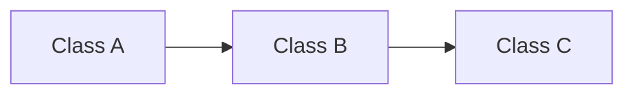

# Section Detailed Design Guide

This guide explains how to generate a **section detailed design** from
`udemy/README.md`.

It is not the section detailed design itself. Do not pre-fill every class
contract in this guide. Use this guide to produce a separate detailed design
document for one section at a time.

## Progress Tracker

- [x] Define the required format for section detailed design documents.
- [x] Define the source-of-truth workflow.
- [x] Map each README section to required and optional class coverage seeds.
- [x] Define the class contract template.
- [x] Define the read-aloud implementation script template.
- [x] Require a high-level class design talk for every section.
- [ ] Generate individual section detailed design documents only when requested.

## Source Of Truth Rule

`udemy/README.md` defines the course sections and learning goals. The live repo
defines implementation truth.

Before writing a section detailed design:

1. Read the target section in `udemy/README.md`.
2. Inspect the current source files for every class in that section.
3. Use live `class_name`, `extends`, exported fields, signals, public variables,
   and public functions from source code.
4. If README wording disagrees with source code, use source code and note the
   naming correction.
5. If a class is planned but not implemented, mark it as `planned` and do not
   present it as a current runtime fact.
6. Keep `addons/mkit/` reusable and game-agnostic. Game-specific examples,
   scenes, enemies, quests, and UI glue belong under `game/`.
7. Do not use stale old demo-directory paths. Current demo content lives under
   `game/`.

Current naming corrections to preserve when generating detailed designs:

| README wording | Current source wording |
| --- | --- |
| `Mkit typed facade` | `Mkit` |
| `PlayerInputController` | `PlayerInputReader` |
| `DamageEffect` | `DealDamageEffect` |
| `LootTable` | `LootTableDefinition` |
| `RewardChoice` | `RewardOption` plus `RewardDefinition` |
| `Health` | `HealthComponent` |
| `Enemy AI` | `Brain` plus `SimpleAIEnemyBrain` |

## Core Generation Rule

Every section detailed design must start with one high-level class design talk.
This is required even when the section later has many class-by-class videos.

The high-level talk must include:

1. `What You Will Build`
2. `High-Level Design`
3. A Mermaid diagram showing class relationships, ownership, or runtime flow.
4. A responsibility table that defines each class's job and main capability.
5. A concrete gameplay or runtime example that explains how the classes work
   together.

The high-level talk is a concept/support video. It does not replace the
class-by-class implementation videos.

For implementation lessons:

```text
One class = one video.
```

Each class video must focus on exactly one required class. It may mention other
classes only as short context for how this class is used. It must not implement,
design, or explain optional classes.

Optional coverage belongs in the `Optional Coverage` section only. If optional
content is later approved, give it its own optional/support video after the
required class videos. Do not fold optional content into a required class video.

If a video creates or edits a scene, resource, input map, test, or demo setup
without introducing a class, mark it as a `support` video.

Each required class video in a section detailed design must define:

- class purpose;
- source path;
- `extends`;
- implementation status: `current`, `planned`, or `course-only`;
- public fields, exported fields, public variables, and signals;
- public functions students must implement;
- private helpers only when needed to understand this class;
- what the class must not own;
- exact read-aloud implementation script.

## Detailed Design Output Template

Create one file per requested section. Use a stable filename such as:

```text
udemy/section-02-runtime-kernel-foundation-design.md
```

Use this structure:

```text
# Section NN - Section Title Detailed Design

## Source Check

- README section:
- Source files checked:
- Naming corrections:
- Runtime assumptions:

## Section Goal

## Student-Visible Result

## What You Will Build

Describe the concrete system students will finish in this section. Use gameplay
language first, then name the classes that make it possible.

## High-Level Class Design

### Mermaid Diagram



### Class Responsibilities

| Class | Responsibility | Main capability | Does not own |
| --- | --- | --- | --- |

### Concrete Example

Explain one real example from the course demo. The example must show how data or
control flows through the classes in the Mermaid diagram.

## Video Plan

| Video | Type | Class or artifact | Source path | Result |
| --- | --- | --- | --- | --- |
| 1 | support | High-level class design | README + live source | Students understand what will be built and how the classes connect. |

## Required Class Contracts

### ClassName

- Status:
- Source path:
- Extends:
- Public fields/signals:
- Public functions:
- Private helpers:
- Does not own:

### Read-Aloud Script

```text
Write a script specific enough that the instructor can read it while building
the class. The script should describe field-by-field and function-by-function
implementation, but it should not invent APIs that are not in source or in the
accepted plan.
```

## Optional Coverage

Optional coverage is not part of required class videos. Put optional classes or
artifacts here only as future extension candidates. If one is included in the
course, create a separate optional/support video for it.

| Optional class/artifact | Why optional | When to include |

## Demo Integration

## Tests Or Verification

## Suggested Commit
```

## Class Contract Template

Use this template inside each generated section detailed design.

```text
### ClassName

Purpose:
Explain the one job of this class in the section.

Status:
current / planned / course-only

Source path:
res://...

Extends:
Exact live source `extends`.

Public fields/signals:
- field_or_signal: type - why students implement it

Public functions:
- function_name(args) -> ReturnType - what it must do

Private helpers:
- helper_name - only include when needed to explain this class's own behavior

Does not own:
- List responsibilities that belong to another class or game content.

Read-aloud script:
Write the actual teaching script for this class. Keep it simple. Explain every
necessary technical term in plain language, and attach the explanation to a
concrete example from the section.
```

## High-Level Class Talk Rules

Every section detailed design must include a high-level class talk before
implementation videos.

This talk should answer three questions:

```text
1. What are we building in this section?
2. Which classes participate?
3. How does a real example move through those classes?
```

The high-level talk must not be abstract only. It must use a concrete example
from the section, such as:

- Section 2: boot the game and access `Mkit.combat()`.
- Section 3: press WASD and move through command plus state machine.
- Section 4: press attack and resolve an action into an effect.
- Section 5: hit an enemy and produce a `DamageResult`.
- Section 6: press Q and cast Firebolt from an `AbilityDefinition`.
- Section 7: receive a combat event and show damage feedback.
- Section 8: enemy AI issues an attack command and drops loot on death.
- Section 9: elder dialogue accepts a quest and combat progresses it.
- Section 10: clear a room and select one reward option.
- Section 11: save player state, load it, and verify it with a test.
- Section 12: move the kit into a new project without game-specific content.

Mermaid diagram requirements:

- Use `flowchart`, `sequenceDiagram`, or `classDiagram`.
- Show class relationships, ownership, or runtime chain.
- Use current source class names.
- Keep the diagram small enough to explain in one video.
- Do not invent classes just to make the diagram look complete.

Class responsibility table requirements:

```text
| Class | Responsibility | Main capability | Example in this section |
| --- | --- | --- | --- |
```

The table should explain each class in plain teaching language. It should not
copy source comments or become a full API reference.

## Read-Aloud Script Rules

Each class script must be concrete enough to follow while coding:

- Use simple, direct language first.
- If a technical term is necessary, define it immediately in plain language.
- Explain terms with a concrete example from the course demo.
- Prefer "when the player presses Q..." over abstract system descriptions.
- Start with the class responsibility.
- Name the source path.
- State the `extends`.
- Add fields before functions.
- Explain each public field and function in implementation order.
- Explain how the class connects to the section's visible result.
- State what the class deliberately does not own.
- Use current source names and paths.

Terminology rule:

```text
Do not introduce a term and move on.
When using a term, explain it in the same paragraph and connect it to a real
example.
```

Examples:

```text
Good:
The command is an intent message. In this lesson, when the player presses Q,
the input script creates a command that says "cast Firebolt". The command does
not cast the spell by itself; it only carries the request to the player entity.

Bad:
The command layer decouples input from domain execution.
```

```text
Good:
The service registry is a shared lookup table. During boot, GameBootstrap puts
CombatService into the table with the id "combat". Later, when a Firebolt effect
needs combat rules, it can ask Mkit.combat() instead of searching the scene tree.

Bad:
The registry provides inversion of control for service dependencies.
```

Avoid abstract-only explanations:

- Do not explain a class only with architecture terms.
- Do not stack multiple terms before showing a gameplay example.
- Do not say a class "manages domain behavior" without naming the behavior.
- Do not say a class "improves decoupling" without showing what no longer calls
  what.

Avoid scripts that only say:

```text
Implement the service.
Add the fields.
Write the functions.
Connect it to the demo.
```

Use scripts shaped like:

```text
Create ClassName at res://path/to/class.gd and extend BaseClass. First add the
public field foo because other systems need to configure it from the inspector.
Then add public function bar(). This function validates the input, updates the
runtime state, emits the signal, and returns whether the operation succeeded.
Do not put UI behavior here; UI listens through EventService in a later lesson.
```

## Section Coverage Seeds

The lists below are seeds for future detailed design documents. They are not
final class contracts. When generating a section detailed design, refresh every
field and function from live source.

Every section below must include Video 1:

```text
Video 1: High-Level Class Design
Type: support
Must include: What You Will Build, Mermaid diagram, class responsibility table,
and one concrete example.
```

After Video 1, each required class gets its own focused class video. Optional
coverage listed below is only a future-extension list; do not put it inside
those required class videos.

### Section 1 - Course Setup and Final Demo Preview

Required class videos:

- None.

Support videos:

- Project source-of-truth tour.
- Final demo preview.
- Godot setup and run.

Optional coverage:

- `project.godot`
- `game/bootstrap.tscn`
- `game/resources/village_rpg_content.tres`
- current auto-run verifier under `game/`

### Section 2 - Runtime Kernel Foundation

Required class videos:

- `ServiceRegistry`
- `GameBootstrap`
- `ModuleBootstrap`
- `Mkit`

Optional coverage:

- `ContentDefinition`
- `ResourceDatabase`
- `ContentService`
- `RandomService`
- `TimeService`
- `SceneService`
- `PoolService`
- `AudioService`

Minimum detailed design expectation:

- Four required class videos.
- One class per video.
- Each class contract must define public fields/signals and public functions
  from live source.
- Scripts must explain service registration, bootstrap order, module service
  extension, and typed facade access.

### Section 3 - Entity, Command, and State Machine

Required class videos:

- `EntityRoot`
- `EntityIdentity`
- `EntityContract`
- `GameCommand`
- `CommandService`
- `CommandReceiver`
- `State`
- `StateMachine`
- `PlayerInputReader`
- `PlayerIdleState`
- `PlayerMoveState`

Optional coverage:

- `PlayerAttackState`
- `PlayerCastAbilityState`
- `PlayerDashState`
- `Blackboard`
- `EntityDefinition`
- `EntitySpawner`

Minimum detailed design expectation:

- Show how input becomes `GameCommand`.
- Show how `CommandReceiver` routes commands into `StateMachine`.
- Show how movement remains game-owned state behavior, not a generic action.

### Section 4 - Action and Effect Pipeline

Required class videos:

- `GameplayContext`
- `ActionContext`
- `GameAction`
- `ActionService`
- `GameEffect`
- `EffectService`
- `TimedAttackAction`
- `DealDamageEffect`

Optional coverage:

- `EffectResult`
- `LogEffect`
- `SpawnSceneEffect`
- `PlayerAttackState`

Minimum detailed design expectation:

- Separate timing from world changes.
- Explain why actions own timing and effects describe world changes.
- Do not make input or state directly damage an enemy.

### Section 5 - Combat System

Required class videos:

- `StatsComponent`
- `HealthComponent`
- `DamageRequest`
- `DamageResult`
- `CombatService`
- `HitboxComponent`
- `HurtboxComponent`
- `CombatEvents`

Optional coverage:

- `StatModifier`
- `StatDefinition`
- `ApplyStatModifierEffect`
- `HealEffect`
- `StatusEffectController`
- `StatusEffectDefinition`
- `ApplyStatusEffect`

Minimum detailed design expectation:

- Define the combat request/result boundary.
- Keep health mutation in `HealthComponent`.
- Keep combat math in `CombatService`.
- Publish combat events for UI, audio, VFX, loot, and quest systems.

### Section 6 - Data-Driven Abilities

Required class videos:

- `AbilityDefinition`
- `AbilityInstance`
- `ResourcePoolComponent`
- `AbilityController`
- `CastAction`
- `CooldownReadyCondition`

Optional coverage:

- `SpawnSceneEffect`
- `TargetInRangeCondition`
- `ApplyStatusEffect`
- status effect classes needed for Firebolt burn

Minimum detailed design expectation:

- Static ability data belongs in `AbilityDefinition`.
- Runtime cooldown and charges belong in `AbilityInstance`.
- Cost validation and payment belong in `AbilityController` plus
  `ResourcePoolComponent`.
- Pay ability cost only after the cast can validly start.

### Section 7 - Events, UI, Audio, and VFX

Required class videos:

- `DomainEvent`
- `EventService`
- `UIManager`
- `AudioDefinition`
- `AudioService`
- `DamageNumberSystem`
- `VFXSpawner`
- `FeedbackSystem`

Optional coverage:

- HUD health display script
- ability cooldown UI script
- `QuestLogUI`
- `RewardSelectionUI`

Minimum detailed design expectation:

- Gameplay systems emit events.
- Presentation systems subscribe and react.
- Combat must not directly play audio, spawn VFX, or update UI.

### Section 8 - Enemy AI and Loot

Required class videos:

- `Brain`
- `SimpleAIEnemyBrain`
- `EntityDefinition`
- `EntitySpawner`
- `LootEntry`
- `LootTableDefinition`
- `LootRollResult`
- `LootDropResult`
- `LootService`
- `LootEvents`

Optional coverage:

- `DeathLootRuleDefinition`
- `DeathLootService`
- enemy-specific game state classes
- `RewardDefinition`
- `RewardSystem`

Minimum detailed design expectation:

- AI should issue commands, not directly move or attack through a parallel path.
- Entity spawning should be definition-driven.
- Loot should be rolled by reusable services and announced through events.

### Section 9 - Quest and Dialogue

Required class videos:

- `DialogueNode`
- `DialogueChoice`
- `DialogueDefinition`
- `DialogueRuntime`
- `DialogueService`
- `QuestObjectiveDefinition`
- `QuestDefinition`
- `QuestState`
- `QuestLog`
- `QuestService`
- `QuestEvents`
- `DialogueEvents`

Optional coverage:

- `DialogueInteractable`
- `InteractionComponent`
- `QuestLogUI`
- `DialogueUI`
- `AcceptQuestEffect`
- `AdvanceObjectiveEffect`
- `CompleteQuestEffect`

Minimum detailed design expectation:

- Dialogue content is data-driven.
- Quest progress listens to events.
- Quest state is saveable runtime state.
- Dialogue UI displays service state; it does not own quest rules.

### Section 10 - Room Loop and Rewards

Required class videos:

- `RoomDefinition`
- `RoomRuntime`
- `RoomController`
- `RewardDefinition`
- `RewardOption`
- `RewardCoordinator`
- `RunState`
- `RunDirector`
- `WorldEvents`
- `RewardSelectionUI`

Optional coverage:

- `RoomGraph`
- `RoomNode`
- `DungeonGenerator`
- `RoomLoader`
- `WorldService`
- `ZoneDefinition`
- `Portal`
- `SpawnPoint`

Minimum detailed design expectation:

- Room definitions are static data.
- Room runtime and run state are mutable runtime state.
- Room clear and reward selection should be event/service driven.
- Reward UI shows options; it does not apply reward effects directly.

### Section 11 - Save, Load, and Testing

Required class videos:

- `Saveable`
- `SaveableComponent`
- `EntitySaveAgent`
- `SaveService`
- `PlayerPositionSaveComponent`
- GUT unit test class
- integration smoke test

Optional coverage:

- current demo save payload verifier
- save migration helpers
- save/load UI buttons

Minimum detailed design expectation:

- Save service owns the save envelope.
- Saveable systems own their own serialization.
- Entity save agent owns entity-level records.
- Direct bootstrap save/load tests must use a dedicated save path.

### Section 12 - Packaging the Kit

Required class videos:

- None.

Support videos:

- Addon boundary audit.
- Public API docs pass.
- Starter template assembly.
- Verification gate.
- Course wrap-up.

Optional coverage:

- None unless live source adds a real packaging class.

Minimum detailed design expectation:

- Do not invent packaging runtime classes.
- Audit that `addons/mkit/` does not depend on `game/`.
- Explain plugin enablement, `ServiceRegistry` autoload, bootstrap scene,
  resource databases, and starter project setup.

## Section 2 Mini Example

This is only an example of the expected guide output shape. It is not the full
Section 2 detailed design.

```text
Video 1: High-Level Class Design
Type: support
What You Will Build:
Students will build the runtime boot path that registers services and lets game
code access them through Mkit typed helpers.

Mermaid direction:
Show GameBootstrap registering services into ServiceRegistry, ModuleBootstrap
adding gameplay services, and Mkit reading typed services from ServiceRegistry.

Class responsibility direction:
Define ServiceRegistry as the service table, GameBootstrap as kernel startup,
ModuleBootstrap as module startup extension, and Mkit as typed access.

Concrete example:
The game boots, registers combat, then a game script calls Mkit.combat() instead
of manually searching for a node or hardcoding a game-specific service path.

Video 2: ServiceRegistry
Type: class
Source path: res://addons/mkit/kernel/services/service_registry.gd
Detailed design must include:
- exact live public API;
- service id validation rules;
- replacement warning behavior;
- get_port missing-service behavior;
- debug list behavior;
- clear/unregister behavior.

Script direction:
Explain that ServiceRegistry is the only autoload-backed service table. Then
walk through implementing register, has, get, list, unregister, and clear. End
by saying game/module code should prefer Mkit typed access.
```

## Verification For The Guide Itself

For this guide file, a docs-only check is enough:

```text
1. Confirm the guide stays generic and does not become a full section design.
2. Confirm every README course section has a coverage seed.
3. Confirm source-of-truth rules are explicit.
4. Confirm class contract and script templates are present.
5. Confirm no stale old demo-directory paths appear.
6. Run a markdown whitespace sanity check.
```

For generated section detailed designs, use the source and runtime checks
required by that section.
